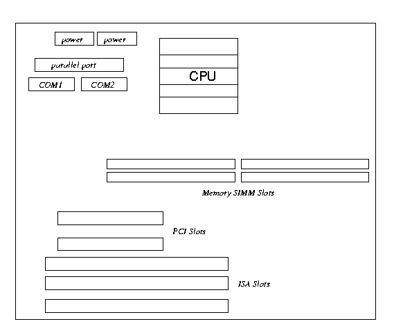

#  第一章 硬件基础

操作系统必须与基本硬件系统密切协作。它需要那些仅仅能够由硬件提供的服务。为了全面理解Linux操作系统，你必须要懂得一些有关硬件的知识。本章将对硬件：现代PC做一个简要的介绍。 当1975年一月的"Popular Electronics"杂志以Altair 8080的图片作为封面时，一场革命开始了。 家用电器爱好者能独立组装出来的Altair 8080，当时价格仅仅为397美圆。这种带有256字节内存的8080处理器还没有显示器与键盘，以今天的标准来看，它是微不足道的。它的创造者， Ed Roberts，发明了"personal computer"来描叙他的新发明。但现在PC这一术语已被用来称呼那些自己就可以携带的计算机。在这个定义上，非常强劲的计算机如Alpha AXP 也可称为PC。 狂热的HACKER们看到了Altair的巨大潜力，于是他们开始为它编写软件和设计硬件。对早期的先驱来说这意味者某种自由；一种从顽固的超级批处理主机中解放出来的自由。滚滚而来的财富让许多着迷于此（一台可以放在厨房餐桌上的计算机）的大学生纷纷退学。许多五花八门的硬件开始出现，软件 HACKER们忙着为这些新机器编写软件。有意思的是IBM首先坚定的进行现代PC的设计和制造并于1982 年推出产品。该产品的构造是：8080 CPU、64K字节主存、两个软盘驱动器以及25行80列的彩色CGA 显示器。虽然以现在观点看那些都不是多么先进的东西但当时销售情况却很好。紧接着，1983年，带有昂贵的10MB硬盘驱动器的IBM PC-XT出现了。在IBM PC体系结构成为事实上的标准不久之后，大量仿制者如COMPAQ公司出现了。由于这种事实标准的存在，多个硬件公司在这一快速增长的市场上进行了激烈竞争。 但用户却从低价中获益。许多早期PC中的结构特征还保留在现代PC系统中。比如Intel公司最先进的Pentium Pro处理器还保留着Intel 8086的寻址模式。当Linus Torvalds开始写Linux时，他选择了当时最广泛使用同时价格合理的Intel 80386 PC。 [图1.1](http://www.embeddedlinux.org.cn/linuxkernel/basics/board.gif) 典型的PC主板示意图。 从PC的外部来看，最引人注目的是机箱，键盘，鼠标以及显示器。在机箱前部有一些按钮，一个微型显示器显示着一些数字，此外还有一个软驱。今天的大多数机器还包含一个CD ROM，另外，如果想保护你的数据，还可以添加一个磁带机作为备份用。这些设备统称为外部设备。 尽管CPU是系统的总管，但是它仅仅是一个智能设备。所有的这些外设控制器都具有某种层度的智能，如IDE控制器。在PC内部，你可以看到一个包括CPU或者微处理器，主存和许多ISA或PCI外设控制器插槽的主板（图1.1）。有些控制器，如IDE磁盘控制器必须建立在系统板上。

图 1.1: 典型的PC主板.

 

## 1.1 CPU

CPU，或者微处理器，是计算机系统的核心。微处理器进行计算或者逻辑操作并且管理来自主存的指令并执行它。在计算机的早期时代，微处理器的功能部件使用的是分立元件（外型很大）。 这就是中央处理单元这一名词的由来。现代微处理器将部件结合到小型硅片上的集成电路中。在本书中CPU和微处理器及处理器有相同的意义。 微处理器的操作对象是二进制数据；数据由0和1组成。 1和0对应着电子开关的开路与断路状态。正如十进制的42表示有4个10和一个2一样，一个二进制数是一系列表示2的次幂的二进制数字组成。二进制0001对应十进制的1，二进制的0010对应十进制 的2，二进制的0011表示3，而0100对应4。十进制42的二进制表示为101010。但是在计算机程序中， 人们常用十进制来表示数而不是直接使用二进制。 在需要使用二进制数时，人们往往使用16进制数。如十进制数只能从0到9一样，16进制数可以从 0疏导15，其中10到15分别用字母A、B、C、D、E及F来表示。这样16进制的2A的十进制表示为42- 2*16+10=42。在C程序语言中，16进制数的前缀为"0x"；16进制的2A写成0x2A。 微处理器可以执行如加、乘和除以及象"X是否比Y大"这种逻辑运算。 处理器的执行由外部时钟来监控。这个时钟称为系统时钟，它每隔相同的时间间隔就向CPU发送一个脉冲。在每个时钟脉冲上，处理器都会做一些工作。比如，处理器每个时钟脉冲上执行一条指令。处理器的速度一般以系统时钟的速率来描叙。一个100MHz的处理器每秒将接收100,000,000 个时钟滴答。但是用CPU的时钟频率来描叙CPU的工作能力是不正确的，因为它们执行的指令不相同。 然而，快速的时钟可以在某种程度上代表高性能的CPU。处理器执行的指令是非常简单的；例如"将内存X处的内容读入寄存器Y"。寄存器是微处理器的内部存储部件，用来存储数据并对数据执行某些指令。有些指令有可能使处理器停止当前的工作而跳转到内存中另外一条指令执行。现代微处理器的紧凑设计使得它有可能每秒执行上百万甚至亿条指令。 指令执行前必须从内存中取出来。指令自身要使用的数据也必须从内存中取出来并放置在适当的地方。 微处理器中寄存器的大小、数量以及类型都取决于微处理器的类型。Intel 80486处理器和Alpha AXP 有迥然不同的寄存器，最明显的区别在于Intel 寄存器为32位而Alpha AXP为64位。一般来说，任何处理器都有许多通用寄存器和少量专用寄存器。许多微处理器有以下几种特定的寄存器。

- 程序计数器(PC)

此寄存器包含下条指令执行的地址。每当取回一条指令时，PC的内容将自动增加。

- 堆栈指针(SP)

微处理器经常需要访问存储临时数据的外部RAM。堆栈是一种便捷的存放临时数据的方法，处理器提供了特殊指令来将数值压入堆栈然后将其从堆栈中弹出。 堆栈以后进先出(LIFO)的方式工作。换句话说，如果你压入两个值X和Y，然后执行弹栈操作，你将取到Y的值。 有些处理器的堆栈从内存顶部向下增长而有些相反。但有的处理器同时支持这两种方式，如ARM。

- 处理机状态字(PS)

指令的执行将得到执行结果；比如"寄存器X中的内容要大于寄存器Y中的内容？"将得到正确或错误作为结果。PS寄存器包含着这些信息及有关处理器当前状态的其他信息。例如大多数处理器至少有两种执行方式，核心（或管态）与用户方式。PS寄存器包含表示当前执行方式的信息。

## 1.2 内存

所有计算机系统都有一个由不同速度与大小的存储器组成的层次结构。最快的的存储器是高速缓存，它被用来暂存主存中的内容。这种存储器速度非常快但非常昂贵，大多数处理器都有少量的片上高速缓存或者将其放在主板上。有些处理器的高速缓存既包含数据也包含指令，但有些将其分成两部分。 Alpha AXP处理器有两个内部高速缓存，一个用来缓存数据（D-Cache）而另一个用来缓存指令（I- Cache）。而外部高速缓存（B-Cache）将两者混合。这样，相对外部高速缓存存储器，主存的速度非常慢。 高速缓存与主存中的内容必须保持一致。换句话说，对应于地址空间的同一个位置，如果该位置的数据被缓存入高速缓存，则其内容必须和主存中的一致。保证高速缓存一致性的工作由硬件和操作系统共同分担。 这就是在系统中硬件和软件必须紧密协作的原因。

## 1.3 总线

主板上分立的部件通过称为总线的线路连接在一起。系统总线的功能在逻辑上被划分为三部分： 地址总线、数据总线和控制总线。地址总线为数据传输指明内存位置（地址）。数据总线包含传输的数据。数据总线是双向的；它允许数据读入CPU也支持从CPU读出来。控制总线则包含几条表示路由分时和系统的控制信号。当然还有其他一些总线存在，例如ISA和PCI总线是将外设连接到系统的常用方式。

## 1.4 控制器与外设

外设是一些物理设备，比如说图象卡或者磁盘，它们受控于位于主板或者主板上插槽中的控制芯片。 IDE磁盘被IDE控制器芯片控制而SCSI磁盘由SCSI磁盘控制器芯片控制。这些控制器通过各种总线连接到CPU上或相互间互连。目前制造的大多数系统使用PCI和ISA总线来连接主要系统部件。控制器是一些类似CPU的处理器，它们可以看做CPU的智能帮手。CPU则是系统的总控。 虽然所有这些控制器互不相同，但是它们的寄存器的功能类似。运行在CPU上的软件必须能读出或者写入这些控制寄存器。其中有一个寄存器可能包含指示错误的状态码。另一个则用于控制目的，用来改变控制器的运行模式。在总线上的每个控制器可以被CPU所单独寻址，这是软件设备驱动程序能写入寄存器并能控制这些控制器的原因。

## 1.5 地址空间

系统总线将CPU与主存连接在一起并且和连接CPU与系统硬件外设的总线隔离开。一般来说，硬件外设存在的主存空间叫I/O空间。I/O空间还可以进一步细分，但这里我们不再深究。CPU既可以访问系统内存空间又可以访问I/O空间内存，而控制器自身只能在CPU协助下间接的访问系统内存。从设备的角度来看，比如说软盘控制器，它只能看到在ISA总线上的控制寄存器而不是系统内存。典型的CPU使用不同指令来访问内存与I/O空间。例如，可能有一条指令"将I/O地址0x3F0的内容读入到寄存器X"。这正是CPU控制系统硬件设备的方式：通过读写I/O地址空间上的外设寄存器。在I/O空间中通用外设(IDE控制器、串行口、软盘控制器等等)上的寄存器经过多年的PC体系结构发展基本保持不变。I/O地址空间0x3f0是串行口(COM1)的控制寄存器之一。 有时控制器需要直接从系统主存中读写大量数据。例如当用户将数据写入硬盘时。在这种情况 下，直接内存访问(DMA)控制器将用来允许硬件外设直接访问系统主存，不过这将处于CPU的严格监控下。

## 1.6 时钟

所有的操作系统都必须准确的得到当前时间，所以现代PC包含一个特殊的外设称为实时时钟(RTC)。它提供了 两种服务：可靠的日期和时间以及精确的时间间隔。RTC有其自身的电池这样即使PC掉电时它照样可以工作，这就是PC总是"知道"正确时间和日期的原因。而时间间隔定时器使得操作系统能进行准确的调度工作。
