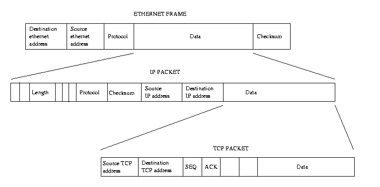
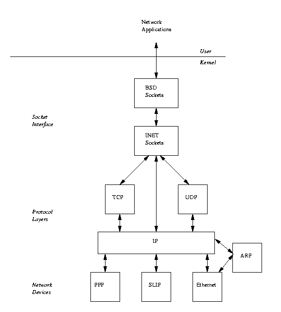
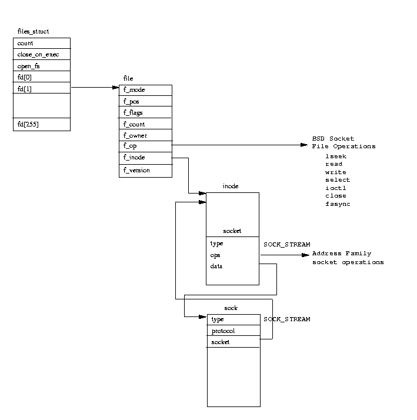
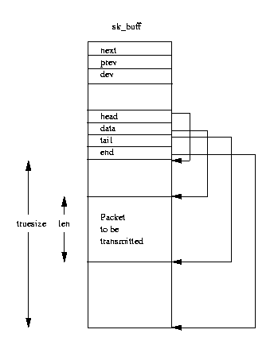
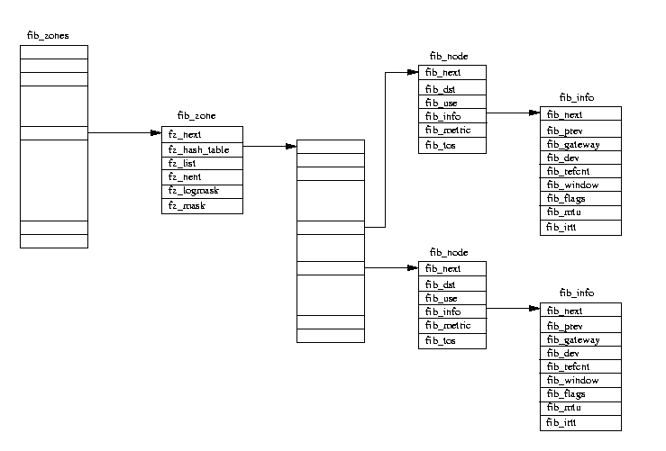

# 第十章 网络

网络和Linux是密切相关的。从某种意义来说Linux是一个针对Internet和WWW的产品。它的开发者和用户用Web来交换信息思想、程序代码，而Linux自身常常被用来支持各种组织机构的网络需求。这一章讲的是Linux如何支持如TCP/IP等网络协议的。

TCP/IP协议最初是为支持ARPANET（一个美国政府资助的研究性网络）上计算机通讯而设计的。ARPANET 提出了一些网络概念如包交换和协议分层（一个协议使用另一个协议提供的服务）。ARPANET于1988年隐退，但是它的继承人(NSF[1](http://www.embeddedlinux.org.cn/linuxkernel/net/net.html#tthFtNtAAB) NET和Internet）却变得更大了。现在我们所熟知的万维网World Wide Web就是从ARPANET演变过来的，它自身支持TCP/IP协议。Unix `T`M 被广泛应用于ARPANET，它的第一个网络版本是4.3 BSD。Linux的网络实现是以4.3 BSD为模型的，它支持BSD sockets(及一些扩展)和所有的TCP/IP网络。选这 个编程接口是因为它很流行，并且有助于应用程序从Linux平台移植到其它Unix `T`M 平台。

## 10.1 TCP/IP网络简介

  这一部分简单介绍一下TCP/IP网络的主要原理，而不是进行详细地讲述。在IP网络中，每台机器都有一个 IP 地址，一个32位的数字，它唯一地标识这台机器。WWW是一个非常巨大并且迅速增长的网络，每台连在上面的机器都必须有一个独立的IP地址。IP地址由四个用点分开的数字表示，如16.42.0.9。这个IP地址实际上分成两个部分：网络地址和主机地址，每部分的长度是可以变化的（有好几类IP地址）。以16.42.0.9为例，网络地址是16.42，主机地址是0.9。主机地址又进一步分为子网地址和主机地址。还是以16.42.0.9为例，子网地址是16.42.0，主机地址是16.42.0.9。这样的子划分可以允许某部门划分他们自己的子网络。例如，如果16.42是ACME计算机公司的网络地址，则16.42.0可能是子网0，16.42.1可能是子网1。 这些子网可以是分别建立的，可能租用电话线或用微波进行相互间通讯。IP地址由网络管理员分配，用IP 子网可以很好地管理网络。IP子网的管理员可以自由分配子网内的IP地址。

  通常，IP地址是比较难记的，而名称则容易多了，象linux.acme.com就比16.42.0.9要好记一些。但是必须有一些机器来将网络名称转变为IP地址。这些名称被静态地定义在 `/etc/hosts` 文件中或者Linux能请求域名服务器(DNS)来解析它。这种情况下，本地主机必须知道一个或一个以上的DNS服务器并且这些服务器要将其名称指定到 `/etc/resolv.conf` 中。

  当你想要与另一台计算机连接时，比如说你想阅读一个Web页，你的IP地址就会被用来与那台机器交换数据。这些数据被包含在一些IP包中，每个IP包都有一个IP头用来包含源机器的IP地址和目的机器的IP地址，校验和以及其它的有用信息。IP包的校验和用来让IP包的接收端判断IP包是否在传输过程中发生错误，譬如说由于电话线路的问题而引起的错误。应用程序想要传输的数据可能被分成很多个容易处理的小包。IP数据包的大小是根据传输媒体的变化而不同的；以太网包通常比PPP包要大一些。目的主机在将数据送给接收端应用程序前需要将这些包重新拚装起来。如果你从一个比较慢的站点访问一个有大量图象的Web页，就会看到数据的分割与重组。

  同一子网内的主机之间可以直接发送IP包，而其它的IP包将被送到一个特定的主机：网关。网关（或路由器）是用来连接多个IP子网的，它们会转发送从子网内来的IP包。例如，如果子网16.42.1.0和16.42.0.0之间通过一个网关相连，那么任何从子网0发往子网1的包必须由网关指引，网关可以帮这些包找到正确的路线。本地主机建立路由表用以为IP包找到正确的机器。每一个目的IP都有一个条目在路由表中，用以告诉Linux将IP包送到哪一台主机。这些路由表是随网络的拓扑结构变化而动态变化的。

图 10.1: TCP/IP 协议层

  IP协议是一个传输层的协议，其它协议可以用它来传输数据。传输控制协议（TCP）是一个可靠的端对端的协议，它用IP来传送和接收它自己的包。正如IP包有它自己的头一样，TCP也有它自己的头。TCP是一个面向连接的协议，两个网络应用程序通过一个虚连接相连，即使它们之间可能隔着很多子网、网关、路由器。TCP可靠地传送和接收两应用程序间的数据，并保证数据不会丢失。当用IP来传输TCP包时，IP包的数据段就是TCP包。每一个通讯主机的IP层负责传送和接收IP包。用户数据报协议（UDP）也用IP层来传输它的包，不象TCP，UDP不是一个可靠的协议，但它提供了一种数据报服务。有多个协议可以使用IP层，接收IP包的时候必需知道该IP包中的数据是哪个上层协议的，因此IP包头中有个一字节包含着协议标识符。例如，当TCP请求IP层传输一个IP包时，IP包的包头中用标识符指明该包包含一个TCP包，IP接收层用该标识符决定由哪一协议来 接收数据，这个例子中是TCP层。当应用程序通过TCP/IP进行通讯时，它们不仅要指定目标的IP地址，而且还 要指定应用的端口地址。一个端口地址唯一地标识一个应用，标准的网络应用使用标准的端口地址；如，Web 服务使用80端口。这些已登记的端口地址可在 `/etc/services` 中看到。

  这一层的协议不仅仅是TCP、UDP和IP。IP协议层本身用很多种物理媒介将IP包从一个主机传到其它主机。这些媒介可以加入它们自己的协议头。以太网层就是一个例子，但PPP和SLIP不是这样。一个以太网络允许很个主机同时连接到同一根物理电缆。传输中的每一个以太网帧可以被所有主机看见，因此每一以太网设备有个唯一的地址。任何传送给该地址的以太网帧被有该地址的以太网设备接收，而其它主机则忽略该帧。这个唯一的地址内置于每一以太网设备中，通常是在网卡出厂时就写在SROM[2](http://www.embeddedlinux.org.cn/linuxkernel/net/net.html#tthFtNtAAC)中了。以太网地址有6个字节长，如： `08-00-2b-00-49-A4` 。一些以太网地址是保留给多点传送用的，送往这些地址的以太网帧将被网上所有的主机接收。以太网帧可以携带很多种协议（作为数据），如IP包，并且也包括它们头中的协议标识符。这使得以太网层能正确地接收IP包并将它们传给IP层。

  为了能通过象以太网这样的多连接协议传送IP包，IP层必须找到每一IP主机的以太网地址。IP地址仅仅是一个地址概念，以太网设备有它们自身的物理地址。从另一方面说，IP地址是可以被网络管理员根据需要来分配和再分配的，而网络硬件只对含有它们自己的物理地址或多点传送地址的以太网帧作出响应。Linux用地址 解析协议（ARP）来允许机器将IP地址转变成真正的硬件地址，如以太网地址。如果一个主机想知道某一IP地址对应的硬件地址，它就用一个多点传送地址将一个包含了该IP地址的ARP请求包发给网上所有节点，拥有该IP地址的的目标主机则响应一个包含物理硬件地址的ARP应答。ARP不仅仅局限于以太网设备，它能够用来在其它一些物理媒介上解析IP地址，如FDDI。那些不支持ARP的网络设备会被标记出来，Linux将不会用ARP。还有一个提供相反功能的反向地址解析协议（RARP），用来将物理网络地址转变为IP地址。这一协议常常被网关用来响应包含远程网络IP地址的ARP请求。

## 10.2 Linux TCP/IP 网络层

图 10.2: Linux 网络层

  正如网络协议本身，图 [10.2](http://www.embeddedlinux.org.cn/linuxkernel/net/net.html#layers-figure) 显示出Linux用一系列相互连接层的软件实现Internet协议地址族。BSD套接字（BSD sockets）由专门处理BSD sockets通用套接字管理软件处理。它由INET sockets层来支持，这一层为基于IP的协议TCP和UDP管理传输端点。UDP（用户数据报协议）是一个无连接协议而TCP（传输控制协议）是个可靠的端对端协议。传输UDP包时，Linux不知道也不关心是否它们安全到达目的地。TCP包则被TCP连接两端编号以保证传输的数据被正确接收。IP层包含了实现Internet协议的代码。这些代码给要传输的数据加上IP头，并知道如何把传入的IP包送给TCP或UDP。在IP层以下，是网络设备来支持所有Linux网络工作，如PPP和以太网。网络设备不总是物理设备；一些象loopback这样的设备是纯软件设备。标准的Linux设备用mknod命令建立，网络设备要用底层软件发现并初始化它。建立一个有适当的以太网设备驱动在内的内核后，你就可以看到 `/dev/eth0` 。ARP协议位于IP层与支持ARP的协议之间。

## 10.3 BSD Socket 接口

  这是一个通用的接口，它不仅支持各种网络工作形式，而且还是一个交互式通讯机制。一个套接字描述一个通讯连接的一端，两个通讯程序中各自有一个套接字来描述它们自己那一端。套接字可以被看成一个专门的管道，但又不象管道，套接字对它们能容纳的数据量没有限制。Linux支持多种类型的套接字。这是因为每一类型的套接字有它自己的通信寻址方法。Linux支持下列套接字地址族或域：

 

| UNIX      | Unix 域套接字                          |
| --------- | -------------------------------------- |
| INET      | Internet地址族支持通过TCP/IP协议的通信 |
| AX25      | Amateur radio X25                      |
| IPX       | Novell IPX                             |
| APPLETALK | Appletalk DDP                          |
| X25       | X25                                    |

  有一些套接字类型支持面向连接的服务类型。并非所有的地址族能支持所有的服务类型。Linux BSD 套接字支持下列套接字类型：

- **Stream**

  这些套接字提供可靠的双工顺序数据流，能保证传送过程中数据不丢失，不被弄混和复制。Internet地址中的TCP协议支持流套接字。

- **Datagram**

  这些套接字提供双工数据传送，但与流套接字不同，这里不保证信息的到达。即使它们到达了，也不能保其到达的顺序，甚至不能保证被复制和弄混。这类套接字由Internet地址族中的UDP协议支持。

- **Raw**

  允许直接处理下层协议(所以叫“Raw”)。例如，有可能打开一个raw套接字到以太网设备，看 raw IP数据传输。

- **Reliable Delivered Messages**

  与数据报很象，但它能保证数据的到达。

- **Sequenced Packets**

  与流套接字相似，但的数据包大小是固定的。

- **Packet**

  这不是一个标准的BSD套接字类型，而是一个Linux特定的扩展，它允许在设备级上直接处理包。

  客户服务器模式下使用套接字进行通信。服务器提供一种服务，客户使用这种服务。Web服务器就是一个例子，它提供网页，而客户端，或者说浏览器，来读这些网页。服务器要使用套接字，首先要建立套接字并将它与一个名称绑定。名称的格式由套接字的地址族来定，是服务器的本地有效地址。套接字的名称或地址用结构sockaddr来指定。一个INET套接字还与一个端口地址绑定。已注册的端口号可在 `/etc/services` 中找到；例如，Web服务的端口号是80。将套接字与地址绑定以后，服务器不可以监听指定的绑定了的地址上的引入连接请求。请求的发起者，客户端，建立一个套接字并通过它来发出一个连接请求到指定的目标服务器地址。对于一个INET套接字，服务器地址是它的IP地址和它的端口号。这些引入请求必须通过各种协议层找到目的地址，然后等待服务器的监听套接字。服务器收到引入请求后可以接收或拒绝它。如果决定接收，服务器必需建立一个新一套接字来接收请求。当一个套接字被用来监听引入连接请求时，它就不能用来支持连接了。连接建立后两端就可以自由地发送和接收数据了。最后，当不再需要连接时，就将之关闭。要注意保证在传输过程正确处理数据包。

  对BSD socket进行准确操作要依赖于它下面的地址族。设置TCP/IP连接与设置amateur radio X.25连接有很大不同。象虚拟文件系统一样，Linux从BSD socket层抽象出socket接口，应用程序和BSD socket由每个地址族的特定软件来支持。内核初始化时，地址族被置入内核中并将自己注册到BSD socket接口。之后，当应用程序建立用使用BDS sockets时，在BSD socket与它支持的地址族之间将产生一个联接。这一联接是由交叉链接数据结构和地址族表特定支持程序产生。例如，每当应用程序建立一个新的socket，就会有一个BSD socket接口用的地址族特定 socket建立程序。

  构造内核时，一些地址族和协议被置入 `protocols` 向量。每个由它的名称来表征，例如，“INET”和它的初始程序地址。当套接口启动时被初始化时，要调用每一协议和初始程序。对socket地址族来说，这会导致它们注册一套协议操作。这是一套例程，其中的每一例程执行一个特定的针对那一地址族的操作。已注册的协议操作被存在 `pops` 向量，一个指向 `proto_ops` 数据结构的向量中。

`  proto_ops` 结构由地址族类型和一系列指向与特定地址族对应的socket操作例程的指针组成。`pops` 向量通过地址族标识符来索引，如Internet地址族标识符（AF_INET是2）。

图 10.3: Linux BSD Socket 数据结构

## 10.4 INET Socket 层

  INET socket层支持包括TCP/IP协议在内的internet地址族。如前所述，这些协议是分层的，一个协议使用另一个协议的服务。Linux的TCP/IP代码和数据结构反映了这一分层模型。它与BSD socket层的接口要通过一系列Internet地址族socket操作，这一操作是在网络初始化时就已经注册到BSD socket层的。这些都与其它已注册的地址族一起保存在 `pops` 向量中。BSD socket层从已注册的INET `proto_ops` 数据结构中调用INET层 socket支持例程来为它执行工作。例如，一个地址族为INET的BSD socket建立请求，将用到下层的INET socket的建立函数。在这些操作中，BSD socket层把用来描述BSD socket的 `socket` 结构传构到INET层。为了不把BSD `socket` 与TCP/IP的特定信息搞混，INET socket层使用它自己的数据结构，`sock` ，它与BSD `socket` 结构相连。这一联接关系可以从图 [ 10.3](http://www.embeddedlinux.org.cn/linuxkernel/net/net.html#sockets-figure) 中看出。它用BSD socket的 `data` 指针来连接 `sock` 结构与BSD socket结构。这意味着后来的INET socket调用能够很容易地重新找到 `sock` 结构。 `sock` 结构的协议操作指针也在初始化时建立，它依赖与被请求的协议。如果请求的是TCP，那么 `sock` 结构的协议操作指针将指向TCP连接所必需的TCP协议操作集。

### 10.4.1 建立BSD socket

  系统建立一个新的socket时，通过标识符来确定它的地址族，socket类型和协议。

  首先，从 `pops` 向量中搜索与被请求的地址族相匹配的地址族。它可能是一个作为核心模块来实现的一个特定的地址族，这样，在其能继续工作前， `kerneld` 守护进程必须加载这一模块。分配一个新的 `socket` 结构来代表BSD socket。实际上 `socket` 结构是 VFS `inode` 结构的一部分，分配一个socket实际上就是分配一个 VFS `inode` 。除非你认为socket操作能和普通的文件操作一样，否则会觉得这好象很奇怪。所有的文件用VFS inode结构来表示，为了支持文件操作，BSD socket必须也用 VFS `inode` 来表示。

  最新建立的 BSD `socket` 结构包含一个指向地址族特定socket例程的指针，可以用来从 `pops` 向量中找到 `proto_ops` 结构。它的类型被设置成被请求的socket类型：SOCK_STREAM，SOCK_DGRAM等等之一。调用地址族特定创建例程使用保存在 `proto_ops` 结构中的地址。

  从当前过程 `fd` 向量中分配一个自由的文件描述符，对 `file` 结构所指向的进行初始化。包括将文件操作指针设置为指向由BSD socket接口支持的BSD socket文件操作集。任何操作将被引到socket接口，通过调用它的地址族操作例程将它们传到支持的地址族。

### 10.4.2 将地址与INET BSD socket绑定

  为了能监听输入的internet连接请求，每个服务器必须建立一个INET BSD socket，并将地址与其绑定。绑定操作主要在INET socket层内处理，下面的TCP和UDP协议层提供一些支持。与一个地址绑定了的socket不能用来进行任何其它的通讯工作，也就是说：`socket`的状态必须是 `TCP_CLOSE` 。 `sockaddr` 结构包含了与一个任意的端口号绑定的IP地址。通常绑定的IP地址已经分配给了一个网络设备，该设备支持INET地址族且其接口是可用的。可以在系统中用ifconfig命令来查看哪一个网络接口是当前激活的。IP地址也可以是广播地址，全1或全0。这是些特定的地址，用以表示发送给任何人[3](http://www.embeddedlinux.org.cn/linuxkernel/net/net.html#tthFtNtAAD)。如果机器充当一个透明的代理或防火墙，则IP地址可被指定为任一个IP地址，但只有有超级用户权限的进程能绑定到任何一个IP地址。绑定的IP地址被存在sock结构中的 `recv_addr` 和 `saddr` 字段。端口号是可选的，如果没有指定，将任意指定一个。按惯例，小于1024的端口号不能被没有超级用户权限的进程使用。如果下层网络没有分配端口号，则分配一个大于1024的端口号。

  下层网络设备接收的包必须由经正确的INET和BSD socket才能被处理。因此，UDP和TCP维护了一些hash表用来在输入IP消息内查找地址并将它们导向正确的 `socket`/`sock` 对。TCP是一个面向连接的协议，因而涉及处理TCP包的信息比用于处理UDP包的信息多。

UDP维护着一张已分配UDP端口表， `udp_hash` 表。由指向 `sock` 数据结构的指针组成，通过一个基于端口号的hash函数来索引。UDPhash表比允许的端口号的数目小得多（`udp_hash` 为128 或者说是 `UDP_HTABLE_SIZE` ）表中的一些项指向一个 `sock` 结构链，该链用每个` sock` 结构中的 `next` 指针来将每个 `sock` 连接起来。

  TCP是十分复杂的，它包括几个hash表。但实际上TCP在绑定操作时没有将 `sock` 结构与其hash表绑定，它仅仅检查被请求的端口号当前没被使用。 `sock` 结构是在 *listen* 操作时被加入TCP的hash表的。

复习提要: *What about the route entered?*

### 10.4.3 在INET BSD Socket上建立连接

  建立一个socket，如果没有用它来监听连入请求，那么就能用它来发连出请求。对于面向无连接的协议如UDP来说，这一socket操作并不做许多事，但对于面向连接的协议如TCP来说，这一操作包括了在两个应用间建立一个虚连接。

  一个连出连接操作只能由一个在正确状态下的INET BSD socket来完成；换句话说，socket不能是已建立连接的，并且有被用来监听连入连接。这意味着BSD `socket` 结构必须是 `SS_UNCONNECTED` 状态。UDP协议没有在两个应用间建立虚连接，任何发出的消 息都是数据报，这些消息可能到达也可能不到达目的地。但它不支持BSD socket的 *connect* 操作。建立在UDP的INET BSD socket上的连接操作简单地设置远程应用的地址：IP地址和IP端口号。另外，它还设置路由表入口的cache以便这一BSD socket在发用UDP包时不用再次查询路由数据库（除非这一路由已经无效）。INET `sock` 结构中的 `ip_route_cache` 指针指向路由缓存信息。如果没有给出地址信息，缓存的路由和IP地址信息将自动地被用来发送消息。UDP将 `sock` 的状态改为 `TCP_ESTABLISHED` 。

对于基于TCP BSD socket的连接操作，TCP必须建立一个包括连接信息的TCP消息，并将它送到目的IP。TCP消息包含与连接有关的信息，一个唯一标识的消息开始顺序号，通过初始化主机来管理的消息大小的最大值，及发送与接收窗口大小等等。在TCP内，所有的消息都是编号的，初始的顺序号被用来作为第一消息号。Linux选用一个合理的随机值来避免恶意协议冲突。每一从TCP连接的一端成功地传到另一端的消息要确认其已经正确到达。未确认的消息将被重传。发送与接收窗口的大小是第一个确认到达之前消息的个数。消息尺寸的最大值与网络设备有关，它们在初始化请求的最后时刻确定下来。如果接收端的网络设备的消息尺寸最大值更小，则连接将以小的一端为准。应用程序发出连接请求后必须等待目标应用程序的接受或拒绝连接的响应。TCP `sock` 期望着一个输入消息，它被加入 `tcp_listening_hash` 以便输入TCP消息能被指向这一 `sock` 结构。TCP同时也开始计时，当目标应用没有响应请求，则连出连接请求超时。

### 10.4.4 监听 INET BSD Socket

  socket与地址绑定后，能监听指定地址的连入连接请求。一个网络应用程序能监听socket而不用先将地址 与之绑定；在这个例子中，INET socket层找到一个未用的端口号（对这一协议）并自动将它与socket绑定。 监听socket函数将socket状态设成 `TCP_LISTEN` ，并做其它连入连接所需要的工作。

  对于UDP sockets，改变socket的状态就足够了，而TCP现在加了socket的 `sock` 数据结构到两个hash表中并激活， `tcp_bound_hash` 表和 `tcp_listening_hash` 表。这两个表都通过一个基于IP端口号的hash函数来索引。

  无论何时，一个激活的监听socket接收一个连入的TCP连接请求，TCP都要建立一个新的 `sock` 结构来描述它。最终接收时，这个 `sock` 结构将成为TCP连接的底层。它也复制包含连接请求的 `sk_buff` ，并将它放到监听 `sock` 结构的 `receive_queue` 中排队。复制的 `sk_buff` 包含一个指向新建立的 `sock` 结构的指针。

### 10.4.5 接收连接请求

  UDP不支持连接的概念，接收INET socket连接请求只适用于TCP协议，一个监听socket接收操作从原始的监听socket中复制新的socket结构。接收操作透过支持的协议层，本例是INET，来接收任何连入连接请求。如果下层协议，如UDP，不支持连接，INET协议层接收操作将失败。否则接收操作透过真实协议层，本例是TCP。接收操作可以是阻塞或非阻塞。在非阻塞情况下，如果没有连入连接可接收，则接收操作失败，新建的socket 结构被废弃。在阻塞情况下，网络应用程序执行接收操作将加上一个等待队列并将之挂起，直到接收到TCP连接请求。当接收一个连接请求后，包含请求的 `sk_buff` 被废弃，并且 `sock` 数据结构返回到INET socket层，在那与一个新的更早建立的socket结构连接。新socket文件描述符(`fd`)号返回给网络应用程序，然后，应用程序就能在socket操作中将这一文件描述符用于新建立的INET BSD socket。

## 10.5 IP层

### 10.5.1 Socket 缓存

  每一层协议用另外层提供的服务，这样使用多层网络协议会有一个问题：每个协议都要在传送数据时都要 加上协议头和协议尾，而数据到达时又要将之去掉。这样，在不同的协议间要有数据缓存，每一层需要知道特 定协议的头和尾放在哪个位置。一个解决办法就是在每一层中都拷贝缓存，但这样做效率就很低。Linux用 socket缓存或者说 `sk_buffs` 来在协议层与网络设备驱动之间交换数据。 `sk_buffs` 包括指针和字段长度，这样每 个协议层就可以通过标准的函数或“方法”来操作应用程序数据。

图 10.4: Socket 缓存 (sk_buff)

  图 [ 10.4](http://www.embeddedlinux.org.cn/linuxkernel/net/net.html#skbuff-figure) 显示了 `sk_buff` 数据结构；每个 `sk_buff` 有一个数据块与之相连。 `sk_buff` 有四个指针，这些指针 用来操作和管理socket缓存的数据：

- **head**

  指向内存中数据区的开头。这一指针在 `sk_buff` 和其相关的数据块分配时就固定了。

- **data**

  指向当前协议数据的开头。这一指针是随当前拥有 `sk_buff` 的是哪个协议层而变化的。

- **tail**

  指向当前协议数据的结尾。同样，这一指针也是随当前拥有 `sk_buff` 的是哪个协议层而变化的。

- **end**

  指向内存中数据区的结尾。这一指针在 `sk_buff` 和其相关的数据块分配时固定。

   `len` 和 `truesize` 这两个字段分别用来描述当前协议包长度和数据缓存总体长度。 `sk_buff` 处理代码提供标准的操作来向应用程序增加和移除协议头和协议尾。这就可以安全地操作 `sk_buff` 中的 `data` , `tail` 和 `len` 字段。

- **push**

  它把 `data` 指针指向数据区的开始并增加 `len` 。用于在要传输的数据开始处增加协议头。

- **pull**

  它把 `data` 指针从数据区的开始处移到数据区的结尾处，并减小 `len` 。用于在已接收的数据开始处移除协议头。

- **put**

  它把 `tail` 指针指向数据区的结尾处，并增加 `len` 。用于在要传输的数据结尾处增加数据或协议信息。

- **trim**

  它把 `tail` 指针指向数据区的开始处，并减小 `len` 。用于在已接收的数据尾移除数据或协议信息。

  `sk_buff` 结构还包含了用于一些指针，用于在处理过程中存入 `sk_buff` 的双连接环路列表。通用sk_buff例 程可以将 `sk_buff` 加入到这些列表的前面或后面，也可以删除它们。

### 10.5.2 接收IP包

  第 [ dd-chapter](http://www.embeddedlinux.org.cn/linuxkernel/dd/drivers.html) 章描述了Linux的网络设备是如何置入内核并初始化的。一系列 `device` 数据结构在 `dev_base` 表中相互连接起来。每个 `device` 结构描述了它的设备并提供回调例程，当需要网络驱动来执行工作时，网络协议层调用这些例程。这些函数与传输的数据及网络设备地址紧密相关。当一个网络设备从网上接收包时，它必须将接收的数据转换成` sk_buff` 结构。这些` sk_buff` 则被网络驱动加入到了 `backlog` 队列中。

  如果 `backlog` 队列太长，则丢弃接收的 `sk_buff`。准备好要运行时，网络底层将被设置标志。

  当网络底层按计划开始运行后，处理 `backlog` 队列之前，任何等待着被传输的网络包都由它来处理。 `sk_buff` 决定哪些层处理被接收的包。

  Linux网络层初始化时，每一协议通过将 `packet_type` 结构加入到 `ptype_all`列表或ptype_base hash表中来 注册它自己。`packet_type` 结构包含了协议类型，一个指向网络设备的指针，一个指向协议的接收数据处理例程的指针，最后还包括一个指向列表链或hash链中下一个 `packet_type` 结构的指针。`ptype_all` 链用于监听从网络设备上接收的所有包，通常不使用它。`ptype_base` hash表是被协议标识符弄乱的，用于决定哪个协议将接收传入的网络包。网络底层通过两个表中的一个或多个 `packet_type` 项来匹配传入 `sk_buff` 的协议类型。协议可以和多于一个的项相匹配，如在监听网上所有的传输时要复制多个 `sk_buff` 。 `sk_buff` 将通过被匹配协议处理例程。

### 10.5.3 发送IP包

  应用程序交换数据时要传输包，否则由网络协议在建立连接或支持一个已建立的连接时来生成。无论数据 是由哪种方法生成的，都要建立一个 `sk_buff` 来包含数据，当通过协议层时，这些协议层会加上各种头。

`  sk_buff` 需要通过网络设备传输。首先协议，如IP，需要确定是哪个网络设备在用。这有赖于包的最佳路 由。对于通过modem连入一个简单网络，如通过PPP协议，的计算机来说，路由的选择是很简单的。包应该通过 本地环路设备发送给本地主机，或发送给PPP modem连接的网关。对于连在以在网上的计算机来说，连接在网 络上的计算机越多，路由越复杂。

  对于每一个被传输的IP包，IP用路由表来为目的IP地址解析路由。从路由表中成功地找到目的IP时将返回一个描述了要使用的路由的 `rtable` 结构。这包括要用到的源IP地址，网络 `device` 结构的地址，有时还有预建立的硬件头。这些硬件头是网络设备特定的，包含了源和目的的物理地址和其它的特定媒体信息。如果网络设备是一个以太网设备，硬件头则应如图 [ 10.1](http://www.embeddedlinux.org.cn/linuxkernel/net/net.html#protocols-figure) 所示，并且源和目的地址应是物理的以太网地址。硬件头在路由的时候会缓存起来，因为必须将它加到每一个要传输的IP包中。硬件头包含的物理地址要用ARP协议来解析。传出的包在地址被解析后才会发出。解析了地址后，硬件头被缓存起来以便以后的IP包在使用这一接口时不需要再使用ARP。

10.5.4 数据分块

  每个网络设备都有一个包大小的最大值，发送或接收数据包不能比这一值大。IP协议允许将数据分成更小单元以便网络设备能处理。IP协议头有分块字段，它里面包含了一个标志和分割偏移量。

  当IP包准备要传输时，IP找到网络设备来将IP包发送出去。这个设备是从IP路由表中找到的。每一 `device` 结构中有一项 `mtu` ，用来描述最大传输单元（以字节为单位）。如果设备的 `mtu` 比要传输的IP包的包大小要小，则IP包必须被分割成更小的单元。每一单元用一个 `sk_buff` 结构来表征；它的IP头会被做上标记以标识它是一个分块了的包，其中还包含分割偏移量。最后一个包被标识为最后IP单元。如果在分块过程中，IP不能分配 `sk_buff` ，则传输失败。

  接收IP分块单元要比发送它们要麻烦一些，因为这些IP单元可能以任何顺序到达，必须所有的单元都接收 到了以后才能重新将它们组装起来。每接收一个IP包都要检查其是否是IP分割单元。在第一个IP分割单元到达 时，IP会建立一个新的 `ipq` 结构，这一结构与用于IP单元重组的 `ipqueue` 列表相连。当接收到更多的IP单元时，先找到正确的 `ipq` 结构，并为每个单元新建立一个 `ipfrag` 结构。每个 `ipq` 结构唯一地描述一个接收IP分割单元的，包括它的源和目的IP地址，上层协议标识和本IP帧的标识。当接收到所有的IP分割单元后，将它们重新组成一个 `sk_buff` ，然后交给上层协议处理。每个 `ipq` 中包含一个定时器，它在每接收到一个合法的单元后重新时。如果定时器到时， `ipq` 结构和它的一些 `ipfrag` 结构将被丢弃，传送的信息则被假定为丢失。然后提交给层协议来重传该信息。

## 10.6 地址解析协议 (ARP)

  地址解析协议担当了一个把IP地址翻译成物理硬件地址如以太网地址的角色。IP在将数据（以 `sk_buff` 的形式)通过设备驱动传送时需要这一转换。

  它执行各种检查，来看是否这一设备需要硬件头，是否需要重建包的硬件头。Linux缓存了硬件头，这样可以避频繁重建。如果需要重建硬件头，则调用设备指定的硬件头重建例程。所有的以太网设备使用相同的头重例程，这些例程将目的IP地址转换成物理地址。

  ARP协议本身是很简单的，它包括两个消息类型，ARP请求与ARP应答。ARP请求包含了需要解析的IP地址，ARP应答（希望它）包含被解析的IP地址，硬件地址。ARP请求向连接在网络上的所有主机广播，因此，对于以网，所有连在网上的机器都能看到ARP请求。拥有ARP请求中的IP地址的机器将发出包含了它自己的物理地址ARP应答。

  ARP协议在Linux中是围绕 `arp_table` 结构表来建立的，每个结构描述一个IP到物理地址的转换。这些表项 在需要进行IP地址解析时生成，在随时间变旧时被删除。每个 `arp_table` 结构有如下字段:

 

| last used        | 本ARP项最近一次使用的时间                         |
| ---------------- | ------------------------------------------------- |
| last updated     | 本ARP项最近一次更新的时间                         |
| flags            | 描述本项的状态，如是否完成等                      |
| IP address       | 本项描述的IP地址                                  |
| hardware address | 要解析的硬件地址                                  |
| hardware header  | 指向缓存硬件头的指针                              |
| timer            | 是个 `timer_list` 项，用于ARP请求没有响应时的超时 |
| retries          | ARP请求重试的次数                                 |
| `sk_buff` queue  | 等待IP地址解析的sk_buff项列表                     |

  ARP表包括了指向 `arp_table` 链的指针（ `arp_table` 向量）。缓存这些表项可以加速对它们的访问，每个表项用IP地址的最后两个字节来生成索引，然后就可以查找表链以找到正确的表项。Linux也以 `hh_cache` 结构的形式来缓存 `arp_table` 项的预建的硬件头。

  请求一个IP地址解析并且没有相应的 `arp_table` 项时，ARP必须发送一个ARP请求。它在表和sk_buff队列中 生成一个新的 `arp_table` 项， `sk_buff` 包含了需要进行地址解析的网络包。发送ARP请求时运行ARP定时器。如果没有响应，ARP将重试几次，如果仍然没有响应，ARP将删除该 `arp_table` 项。同时会通知队列中等待IP地址解析的 `sk_buff` 结构，传送它们的上层协议将处理这一失败。UDP不关心丢包，而TCP则会建立TCP连接进行重传。如果IP地址的所有者返回了它的硬件地址，则 `arp_table` 项被标记为完成，队列中的sk_buff将被删除，传输动作继续。硬件地址被写到每个sk_buff的硬件头中。

  ARP协议层必须响应ARP请求。它注册它的协议类型(`ETH_P_ARP`)，生成一个 `packet_type` 结构。这表示它将检查网络设备收到的所有ARP包。与ARP应答一样，这包括ARP请求。用保存在接收设备的 `device` 结构中的硬件地址来生成ARP应答。

  网络拓扑结构会随时间改变，IP地址会被重新分配不同的硬件地址。例如，一些拨号服务为每一次新建的连接分配一个IP地址。为了使ARP表包含这些数据项，ARP运行一个周期性的定时器，用来查看所有的 `arp_table` 项中哪一个超时。要注意不要移除包含一个或多个缓存硬件头的项。移除这些项是很危险的，因为其它的数据结构要用到它们。一些 `arp_table` 项被标记为永久的，它们不会被释放。ARP表不能太大；每个 `arp_table` 项会消耗一些核心内存。要分配一个新的表项而ARP表的大小已经到达它的最大值时，就要查找并删除最老的表项。

## 10.7 IP 路由

  IP路由函数决定了将预定的有指定IP地址的IP包送到哪。在传送IP包时有很多种选择。能最终到达目标吗？如果能，要用到哪个网络设备呢？如果有多于一个的网络设备可被使用，哪一个是较好的呢？IP路由数据库里存的信息给出了这些问题的答案。有两个数据库，最重要的一个是Forwarding Information Database。这是一个有关已知的目的IP和它们的最佳路由的祥细列表，route cache则用来快速找到目的IP的路由。和其它的缓一样，它包含的只是常用的路由；它的内容来自Forwarding Information Database。

  通过IOCTL请求可将路由加入到BSD socket接口或从中删除。这些是通过协议来实现的。INET协议层只允许 处理有超级用户权限的IP路由的添加与删除。这些路由可以是固定的，也可以随时间而动态改变。大多数系统使用固定路由。路由器运行路由协议，路由协议持续地检查所有已知目的IP的可得到的路由。没有路由器的系统是端系统。路由协议是作为一个守护进程来实现的，如GATED，它们也用IOCTL来向BSD socket接口添加和删除路由。

### 10.7.1 路由缓存

  无论什么时候查找IP路由，首先都要在路由缓存中检查是否有匹配的路由。如果路由缓存里没有匹配的路由，则要从Forwarding Information Database中查找路由。如果那里也没有找到路由，则IP包发送失败并通知应用程序。如果在路由缓存中没有而在Forwarding Information Database中找到路由，则会为些路由生成一个新项，并添加到路由缓存中。路由缓存是一个表(`ip_rt_hash_table`)，它包括指向rtable数据结构链的指针。hash函数利用IP地址中最小最重要的两个字节来从路由表中进行索引。这两个字节是在目的与提供的最佳hash值间是不同的。第个rtable项包含路由信息，目的IP地址，用于到达那个IP地址的网络设备，信息大小的最大值等等。它还有一个reference count，一个usage count和一个最近一次被用的时间信息（在 `jiffies` 里）。reference count在每次路由后增加，用于显示该次路由的网络连接数。它在应用程序停止使用路由时减小。useage count在每次查找路由时增加，用于将 `rtable` 项在它的hash链中排序。路由缓存中的对于所有项的最后被用时间信息将被周期性地检查，以确定是否 `rtable` 已经旧了。如果某一路由最近没有被使用，则从路由缓存中将之丢弃。由于路由缓存中的路由在有序的，所以常用的路由会排在hash链的前面。这意味着能更快地找到这些路由。

### 10.7.2 The Forwarding Information Database

图 10.5: The Forwarding Information Database

  Forwarding Information Database（如图 [ 10.5](http://www.embeddedlinux.org.cn/linuxkernel/net/net.html#fib-figure) 所示）包含对当前系统当前时间可得到的IP路由。它是一个 很复杂的数据结构，尽管进行了合理有效的安排，它仍然不是一个快速的数据库。特别是要在这个数据库中为每一要传送的IP包查找目的地时将会非常慢。这就是要用路由缓存的原因：可以用已知的好的路由来加速IP包的传送。路由缓存中的路由来源于Forwarding Information Database。

  每个IP子网用一个 `fib_zone` 结构来描述。 `fib_zone` hash表指向着这些结构。hash索引来源于IP子网掩码。所有通向同一子网的路由由 `fib_node` 和 `fib_info` 结构来描述，这两结构在每个 `fib_zone` 结构的` fz_list` 中排队。如果这个子网中的路由数增大，则生成一个hash表，以使查找 `fib_node` 结构更加容易。

  通向同一子网可以有多个路由，这些路由可能通过多个网关中的一个。IP路由层不允许用同一个网关对一个子网有多于一个的路由。换言之，如果通向同一子网有多个路由，则每个路由要保证使用一个不同的网关。与每个路由相关的有一个 *metric* 结构。它用来测量该路由有多优。一个路由的 *metric* 实质上是它在到达目的子网前所经过的IP子网数。 *metric* 越大，路由越差。

 

------

### 脚注:

[1](http://www.embeddedlinux.org.cn/linuxkernel/net/net.html#tthFrefAAB) National Science Foundation

[2](http://www.embeddedlinux.org.cn/linuxkernel/net/net.html#tthFrefAAC) Synchronous Read Only Memory

[3](http://www.embeddedlinux.org.cn/linuxkernel/net/net.html#tthFrefAAD) duh? What used for?

