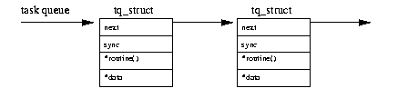
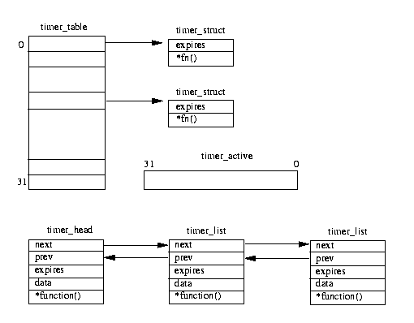

# 第十一章 核心机制

``本章主要描叙Linux核心为使核心其他部分能有效工作而提供的几个常用任务与机制。

## 11.1 底层部分处理机制

图11.1 底层部分处理机制数据结构

某些特殊时刻我们并不愿意在核心中执行一些操作。例如中断处理过程中。当中断发生时处理器将停止当前的工作, 操作系统将中断发送到相应的设备驱动上去。由于此时系统中其他程序都不能运行, 所以设备驱动中的中断处理过程不宜过长。有些任务最好稍后执行。Linux底层部分处理机制可以让设备驱动和Linux核心其他部分将这些工作进行排序以延迟执行。图11.1给出了一个与底层部分处理相关的核心数据结构。

系统中最多可以有32个不同的底层处理过程；bh_base是指向这些过程入口的指针数组。而bh_active和 bh_mask用来表示那些处理过程已经安装以及那些处于活动状态。如果bh_mask的第N位置位则表示bh_base的 第N个元素包含底层部分处理例程。如果bh_active的第N位置位则表示第N个底层处理过程例程可在调度器认 为合适的时刻调用。这些索引被定义成静态的；定时器底层部分处理例程具有最高优先级（索引值为0）， 控制台底层部分处理例程其次（索引值为1）。典型的底层部分处理例程包含与之相连的任务链表。例如 immediate底层部分处理例程通过那些需要被立刻执行的任务的立即任务队列（tq_immediate）来执行。

有些核心底层部分处理过程是设备相关的，但有些更加具有通用性：

- **TIMER**

  每次系统的周期性时钟中断发生时此过程被标记为活动，它被用来驱动核心的定时器队列机制。

- **CONSOLE**

  此过程被用来处理进程控制台消息。

- **TQUEUE**

  此过程被用来处理进程tty消息。

- **NET**

  此过程被用来做通用网络处理。

- **IMMEDIATE**

  这是被几个设备驱动用来将任务排队成稍后执行的通用过程。

当设备驱动或者核心中其他部分需要调度某些工作延迟完成时，它们将把这些任务加入到相应的系统队列中去，如定时器队列，然后对核心发出信号通知它需要调用某个底层处理过程。具体方式是设置bh_active中的某些位。如果设备驱动将某个任务加入到了immediate队列并希望底层处理过程运行和处理它,可将第8位置1。每次系统调用结束返回调用进程前都要检查bh_active。如果有位被置1则调用处于活动状态的底层处理过程。检查的顺序是从0位开始直到第31位。

每次调用底层处理过程时bh_active中的对应位将被清除。bh_active是一个瞬态变量，它仅仅在调用调度管理器时有意义；同时它还可以在空闲状态时避免对底层处理过程的调用。

## 11.2 任务队列

图 11.2: 一个任务队列

任务队列是核心延迟任务启动的主要手段。 Linux 提供了对队列上任务排队以及处理它们的通用机制。

任务队列通常和底层处理过程一起使用；底层的定时器队列处理过程运行时对定时器队列进行处理。任务队列的结构很简单，如图 [ 11.2](http://www.embeddedlinux.org.cn/linuxkernel/kernel/kernel.html#tq-figure) 所示，它由一个tq_struct结构链表构成，每个节点中包含处理过程的地址指针以及指向数据的指针。

处理任务队列上元素时将用到这些过程，同时此过程还将用到指向这些数据的指针。

核心的所有部分，如设备驱动, 都可以创建与使用任务队列。但是核心自己创建与管理的任务队列只有以下三个:

- **timer**

  此队列用来对下一个时钟滴答时要求尽快运行的任务进行排队。每个时钟滴答时都要检查此队列看是否为空，如果不为空则定时器底层处理过程将激活此任务。当调度管理器下次运行时定时器队列底层处理过程将和其他底层处理过程一道对任务队列进行处理。这个队列不能和系统定时器相混淆。

- **immediate**

  *i*mmediate 底层处理过程的优先级低于定时器底层处理过程，所以此类型任务将延迟运行。

- **scheduler**

  此任务队列直接由调度管理器来处理。它被用来支撑系统中其他任务队列，此时可以运行的任务是一个处理任务队列的过程，如设备驱动。

当处理任务队列时，处于队列头部的元素将从队列中删除同时以空指针代替它。这个删除操作是一个不可中断的原子操作。队列中每个元素的处理过程将被依次调用。这个队列中的元素通常使用静态分配数据。 然而并没有一个固有机制来丢弃已分配内存。任务队列处理例程简单的指向链表中下一个元素。这个任务才真正清除任何已分配的核心内存。

## 11.3 定时器（TIMER）

图11.3 系统定时器

操作系统应该能够在将来某个时刻准时调度某个任务。所以需要一种能保证任务较准时调度运行的机制。希望支持每种操作系统的微处理器必须包含一个可周期性中断它的可编程间隔定时器。这个周期性中断被称为系统时钟滴答，它象节拍器一样来组织系统任务。

Linux的时钟观念很简单：它表示系统启动后的以时钟滴答记数的时间。所有的系统时钟都基于这种量度，在 系统中的名称和一个全局变量相同-jiffies。

Linux包含两种类型的系统定时器，它们都可以在某个系统时间上被队列例程使用，但是它们的实现稍有区别。 图11.3画出了这两种机制。

第一个是老的定时器机制，它包含指向timer_struct结构的32位指针的静态数组以及当前活动定时器的屏蔽码 ：time_active。

此定时器表中的位置是静态定义的（类似底层部分处理表bh_base）。其入口在系统初始化时被加入到表中。 第二种是相对较新的定时器，它使用一个到期时间以升序排列的timer_list结构链表。

这两种方法都使用jiffies作为终结时间，这样希望运行5秒的定时器将不得不将5秒时间转换成jiffies 的单位并且将它和以jiffies记数的当前系统时间相加从而得到定时器的终结时间。在每个系统时钟滴答时,定时器的底层部分处理过程被标记成活动状态以便调度管理器下次运行时能进行定时器队列的处理。定时器底层 部分处理过程包含两种类型的系统定时器。老的系统定时器将检查timer_active位是否置位。

如果活动定时器已经到期则其定时器例程将被调用同时它的活动位也被清除。新定时器位于timer_list结构链表中的入口也将受到检查。每个过期定时器将从链表中清除,同时它的例程将被调用。新定时器机制的优点之一是能传递一个参数给定时器例程。

 

## 11.4 等待队列

进程经常要等待某个系统资源。例如某个进程可能需要描叙文件系统中某个目录的VFS inode但是此inode可 能不在buffer cache中。此时这个进程必须等到该inode从包含此文件系统的物理介质中取出来才可以继续 运行。

wait_queue

| *task |
| ----- |
| *next |

图11.4 等待队列

Linux核心使用一个非常简单的队列：等待队列（见图11.4）。它包含一个指向进程task_struct结构的指针以及等待队列中下一个元素的指针。加入到等待队列中的进程既可以是可中断也可以是不可中断的。可中断 进程能够被如定时器到期或者信号等时间中断。此等待进程的状态必须说明成是INTERRUPTIBLE还是 UNINTERRUPTIBLE。由于进程现在不能继续运行则调度管理器将接过系统控制权并选择一个新进程运行而等待进程将被挂起。处理等待进程时，每个处于等待队列中的进程都被置为RUNNING状态。如果此进程已经从运行队列中删除则它将被重新放入运行队列。下次调度管理器运行时, 由于这些进程不再等待所以它们都将是运行候选者。 等待队列可以用来同步对系统资源的访问, 同时它们还被Linux用于信号灯的实现中。

## 11.5 Buzz 锁

它使用更频繁的名字叫自旋锁。这是一种保护数据结构或代码片段的原始方式。在某个时刻只允许一个进程访问临界区内的代码。Linux还同时将一个整数域作为锁来限制对数据结构中某些域的存取。每个希望进入 此区域的进程都试图将此锁的初始值从0改成1。如果当前值是1则进程将再次尝试，此时进程好象在一段紧循环代码中自旋。对包含此锁的内存区域的存取必须是原子性的，即检验值是否为0并将其改变成1的过程不能被任何进程中断。多数CPU结构通过特殊指令提供对此方式的支持，同时我们可以在一个非缓冲主存中实现这个流言锁。

当控制进程离开临界区时它将递减此Buzz锁。任何处于自旋状态的进程都可以读取它，它们中最快的那个将递增此值并进入临界区。

## 11.6 信号灯

信号灯被用来保护临界区中的代码和数据。请记住每次对临界区数据, 如描叙某个目录VFS inode的访问, 是通过代表进程的核心代码来进行的。允许某个进程擅自修改由其他进程使用的临界区数据是非常危险的。防止此问题发生的一种方式是在被存取临界区周围使用buzz锁，但这种简单的方式将降低系统性能。Linux使用信号灯来迫使某个时刻只有唯一进程访问临界区代码和数据，其他进程都必须等待资源被释放才可使用。这些等待进程将被挂起而系统中其他进程可以继续运行。

一个Linux semaphore结构包含了以下信息：

- **count**

  此域用来保存希望访问此资源的文件个数。当它为正数时表示资源可用。负数和0表示进程必须等待。当它初始值为1时表示一次仅允许一个进程来访问此资源。当进程需要此资源时它们必须将此count 值减1并且在使用完后将其加1。

- **waking**

  这是等待此资源的进程个数，同时也是当资源可利用时等待被唤醒的进程个数。

- **wait queue**

  当进程等待此资源时，它们被放入此等待队列。

- **lock**

  访问waking域时使用的buzz锁。

假设此信号灯的初始值为1，第一个使用它的进程看到此记数为正数，然后它将其减去1而得到0。现在此进程 拥有了这些被信号灯保护的段代码和资源。当此进程离开临界区时它将增加此信号灯的记数值，最好的情况 是没有其他进程与之争夺临界区的控制权。Linux将信号灯设计成能在多数情况下有效工作。

如果此时另外一个进程希望进入此已被别的进程占据的临界区时，它也将此记数减1。当它看到此记数值为-1 则它知道现在不能进入临界区, 必须等待到此进程退出使用临界区为止。在这个过程中Linux将让这个等待 进程睡眠。等待进程将其自身添加到信号灯的等待队列中然后系统在一个循环中检验waking域的值并当waking非0时调用调度管理器。

临界区的所有者将信号灯记数值加1，但是如果此值仍然小于等于0则表示还有等待此资源的进程在睡眠。在 理想情况下此信号灯的记数将返回到初始值1而无需做其他工作。所有者进程将递增waking记数并唤醒在此 信号灯等待队列上睡眠的进程。当等待进程醒来时，它发现waking记数值已为1，那么它知道现在可以进入临界区了。然后它将递减waking记数，将其变成0并继续。所有对信号灯waking域的访问都将受到使用信号灯 的buzz锁的保护。

