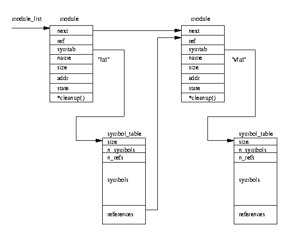

# 第十二章 模块


``本章主要描叙Linux核心动态加载功能模块（如文件系统）的工作原理。

Linux核心是一种monolithic类型的内核，即单一的大程序，核心中所有的功能部件都可以对其全部内部数据结构和例程进行访问。核心的另外一种形式是微内核结构，此时核心的所有功能部件都被拆成独立部分， 这些部分之间通过严格的通讯机制进行联系。这样通过配置进程将新部件加入核心的方式非常耗时。比如说我们想为一个NCR 810 SCSI卡配置SCSI驱动，但是核心中没有这个部分。那么我们必须重新配置并重构核心。 Linux可以让我们可以随意动态的加载与卸载操作系统部件。Linux模块就是这样一种可在系统启动后的任何时候动态连入核心的代码块。当我们不再需要它时又可以将它从核心中卸载并删除。Linux模块多指设备驱动、伪设备驱动, 如网络设备和文件系统。

Linux为我们提供了两个命令：使用insmod来显式加载核心模块，使用rmmod来卸载模块。同时核心自身也可以请求核心后台进程kerneld来加载与卸载模块。

动态可加载代码的好处在于可以让核心保持很小的尺寸同时非常灵活。在我的Intel系统中由于使用了模块，整个核心仅为406K字节长。由于我只是偶尔使用VFAT文件系统, 所以我将Linux核心构造成当mount VFAT分区时自动加载VFAT文件系统模块。当我卸载VFAT分区时系统将检测到我不再需要VFAT文件系统模块，将把它从系统中卸载。模块同时还可以让我们无需重构核心并频繁重新启动来尝试运行新核心代码。尽管使用模块很自由，但是也有可能同时带来与核心模块相关的性能与内存损失。可加载模块的代码一般有些长并且额外的数据结构可能会占据一些内存。同时对核心资源的间接使用可能带来一些效率问题。

一旦Linux模块被加载则它和普通核心代码一样都是核心的一部分。它们具有与其他核心代码相同的权限与职 责；换句话说Linux核心模块可以象所有核心代码和设备驱动一样使核心崩溃。

模块为了使用所需核心资源所以必须能够找到它们。例如模块需要调用核心内存分配例程kmalloc()来分配 内存。模块在构造时并不知道kmalloc()在内存中何处，这样核心必须在使用这些模块前修改模块中对 kmalloc()的引用地址。核心在其核心符号表中维护着一个核心资源链表这样当加载模块时它能够解析出模块 中对核心资源的引用。Linux还允许存在模块堆栈，它在模块之间相互调用时使用。例如VFAT文件系统模块 可能需要FAT文件系统模块的服务，因为VFAT文件系统多少是从FAT文件系统中扩展而来。某个模块对其他模 块的服务或资源的需求类似于模块对核心本身资源或服务的请求。不过此时所请求的服务是来自另外一个事先 已加载的模块。每当加载模块时，核心将把新近加载模块输出的所有资源和符号添加到核心符号表中。

当试图卸载某个模块时，核心需要知道此模块是否已经没有被使用，同时它需要有种方法来通知此将卸载模块。 模块必须能够在从核心种删除之前释放其分配的所有系统资源，如核心内存或中断。当模块被卸载时，核心将从核心符号表中删除所有与之对应的符号。

可加载模块具有使操作系统崩溃的能力，而编写较差的模块会带来另外一种问题。当你在一个或早或迟构造的核心而不是当前你运行的核心上加载模块时将会出现什么结果？一种可能的情况是模块将调用具有错误参数的核心例程。核心应该使用严格的版本控制来对加载模块进行检查以防止这种这些情况的发生。


## 12.1 模块的加载



图12.1 核心模块链表s


核心模块的加载方式有两种。首先一种是使用insmod命令手工加载模块。另外一种则是在需要时加载模块；我们称它为请求加载。当核心发现有必要加载某个模块时，如用户安装了核心中不存在的文件系统时，核心将请求核心后台进程（kerneld）准备加载适当的模块。这个核心后台进程仅仅是一个带有超级用户权限的普通用户进程。当系统启动时它也被启动并为核心打开了一个进程间通讯（IPC）通道。核心需要执行各种任务时用它来向kerneld发送消息。

kerneld的主要功能是加载和卸载核心模块, 但是它还可以执行其他任务, 如通过串行线路建立PPP连接并在适当时候关闭它。kerneld自身并不执行这些任务，它通过某些程序如insmod来做此工作。它只是核心的代理，为核心进行调度。

insmod程序必须找到要求加载的核心模块。请求加载核心模块一般被保存在/lib/modules/kernel-version 中。这些核心模块和系统中其他程序一样是已连接的目标文件，但是它们被连接成可重定位映象。即映象没有被连接到在特定地址上运行。这些核心模块可以是a.out或ELF文件格式。insmod将执行一个特权级系统调用来找到核心的输出符号。这些都以符号名以及数值形式，如地址值成对保存。核心输出符号表被保存在核心维护的模块链表的第一个module结构中，同时module_list指针指向此结构。只有特殊符号被添加到此表中，它们在核心编译与连接时确定，不是核心每个符号都被输出到其模块中。例如设备驱动为了控制某个特定系统中断而由核心例程调用的"request_irq"符号。在我的系统中，其值为0x0010cd30。我们可以通过使用ksyms工具或者查看/proc/ksyms来观看当前核心输出符号。ksyms工具既可以显示所有核心输出符号也可以只显示那些已加载模块的符号。insmod将模块读入虚拟内存并通过使用来自核心输出符号来修改其未解析的核心例程和资源的引用地址。这些修改工作采取由insmod程序直接将符号的地址写入模块中相应地址来修改内存中的模块映象。

当insmod修改完模块对核心输出符号的引用后，它将再次使用特权级系统调用来申请足够的空间来容纳新核 心。核心将为其分配一个新的module结构以及足够的核心内存来保存新模块, 并将它放到核心模块链表的尾部。 然后将其新模块标志为UNINITIALIZED。

图12.1给出了一个加载两个模块：VFAT和FAT后的核心链表示意图。不过图中没有画出链表中的第一个模块： 用来存放核心输出符号表的一个伪模块。lsmod可以帮助我们列出系统中所有已加载的核心模块以及相互间 依赖关系。它是通过重新格式化从核心module结构中建立的/proc/modules来进行这项工作的。核心为其分配的内存被映射到insmod的地址空间, 这样它就能访问核心空间。insmod将模块拷贝到已分配空间中, 如果为它分配的核心内存已用完，则它将再次申请。不过不要指望多次将加载模块到相同地址，更不用说在两个不同 Linux系统的相同位置。另外此重定位工作包括使用适当地址来修改模块映象。

这个新模块也希望将其符号输出到核心中，insmod将为其构造输出符号映象表。每个核心模块必须包含模块 初始化和模块清除例程，它们的符号被设计成故意不输出, 但是insmod必须知道这些地址, 这样它可以将它们传递给核心。所有这些工作做完之后，insmod将调用初始化代码并执行一个特权级系统调用将模块的初始化与清除例程地址传递给核心。

当将一个新模块加载到核心中间时，核心必须更新其符号表并修改那些被新模块使用的老模块。那些依赖于其他模块的模块必须维护在其符号表尾部维护一个引用链表并在其module数据结构中指向它。图12.1中VFAT 依赖于FAT文件系统模块。所以FAT模块包含一个对VFAT模块的引用；这个引用在加载VFAT模块时添加。核心调用模块的初始化例程，如果成功它将安装此模块。模块的清除例程地址被存储在其module结构中，它将在 模块卸载时由核心调用。最后模块的状态被设置成RUNNING。


## 12.2 模块的卸载

模块可以通过使用rmmod命令来删除, 但是请求加载模块将被kerneld在其使用记数为0时自动从系统中删除。 kerneld在其每次idle定时器到期时都执行一个系统调用以将系统中所有不再使用的请求加载模块从系统中 删除。这个定时器的值在启动kerneld时设置；我系统上的值为180秒。这样如果你安装一个iso9660 CDROM并且你的iso9660文件系统是一个可加载模块, 则在卸载CD ROM后的很短时间内此iso9660模块将从核心中删除。

如果核心中的其他部分还在使用某个模块, 则此模块不能被卸载。例如如果你的系统中安装了多个VFAT文件系统则你将不能卸载VFAT模块。执行lsmod我们将看到每个模块的引用记数。如：

```
Module:        #pages:  Used by:
msdos              5                  1
vfat               4                  1 (autoclean)
fat                6    [vfat msdos]  2 (autoclean)
```

此记数表示依赖此模块的核心实体个数。在上例中VFAT和msdos模块都依赖于fat模块, 所以fat模块的引用记数为2。vfat和msdos模块的引用记数都为1，表示各有一个已安装文件系统。如果我们安装另一个VFAT文件系统则vfat模块的引用记数将为2。模块的引用记数被保存在其映象的第一个长字中。这个字同时还包含AUTOCLEAN和VISITED标志。请求加载模块使用这两个标志域。如果模块被标记成AUTOCLEAN则核心知道此模 块可以自动卸载。VISITED标志表示此模块正被一个或多个文件系统部分使用；只要有其他部分使用此模块则这个标志被置位。每次系统被kerneld要求将没有谁使用的请求模块删除时，核心将在所有模块中扫描可能的候选者。但是一般只查看那些被标志成AUTOCLEAN并处于RUNNING状态的模块。如果某模块的VISITED 标记被清除则它将被删除出去。如果某模块可以卸载，则可以调用其清除例程来释放掉分配给它的核心资源。它所对应的module结构将被标记成DELETED并从核心模块链表中断开。其他依赖于它的模块将修改它们各自的引用域来表示它们间的依赖关系不复存在。此模块需要的核心内存都将被回收。


