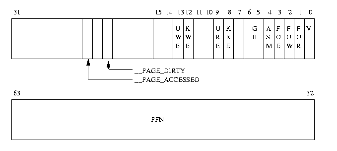
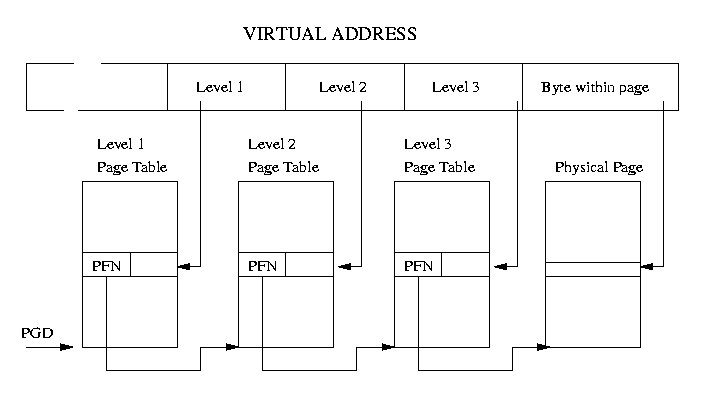
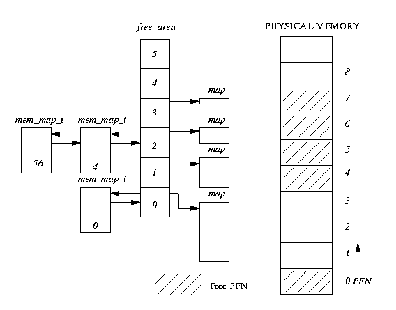
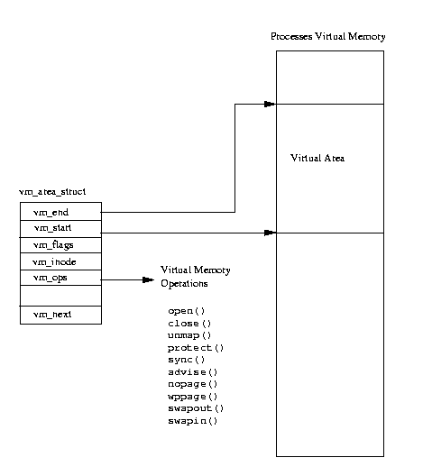
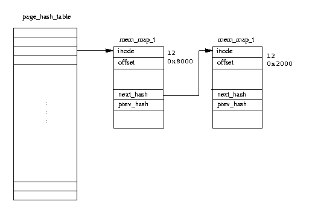

# 第三章 存储管理

``存储管理子系统时操作系统中最重要的组成部分之一。在早期计算时代，由于人们所需要的内存数目远远大于物理内存，人们设计出了各种各样的策略来解决此问题，其中最成功的是虚拟内存技术。它使得系统中为有限物理内存竞争的进程所需内存空间得到满足。

虚拟内存技术不仅仅可让我们可以使用更多的内存，它还提供了以下功能：

**巨大的寻址空间**

操作系统让系统看上去有比实际内存大得多的内存空间。虚拟内存可以是系统中实际物理空间的许多倍。每个进程运行在其独立的虚拟地址空间中。这些虚拟空间相互之间都完全隔离开来，所以进程间不会互相影响。同时，硬件虚拟内存机构可以将内存的某些区域设置成不可写。这样可以保护代码与数据不会受恶意程序的干扰。

**内存映射**

内存映射技术可以将映象文件和数据文件直接映射到进程的地址空间。在内存映射中，文件的内容被直接连接到进程虚拟地址空间上。

**公平的物理内存分配**

内存管理子系统允许系统中每个运行的进程公平地共享系统中的物理内存。

**共享虚拟内存**

尽管虚拟内存允许进程有其独立的虚拟地址空间，但有时也需要在进程之间共享内存。 例如有可能系统中有几个进程同时运行BASH命令外壳程序。为了避免在每个进程的虚拟内存空间内都存在BASH程序的拷贝，较好的解决办法是系统物理内存中只存在一份BASH的拷贝并在多个进程间共享。动态库则是另外一种进程间共享执行代码的方式。共享内存可用来作为进程间通讯(IPC)的手段，多个进程通过共享内存来交换信息。 Linux支持SYSTEM V的共享内存IPC机制。

## 3.1 虚拟内存的抽象模型

图3.1 虚拟地址到物理地址映射的抽象模型

在讨论Linux是如何具体实现对虚拟内存的支持前，有必要看一下更简单的抽象模型。

在处理器执行程序时需要将其从内存中读出再进行指令解码。在指令解码之前它必须向内存中某个位置取出或者存入某个值。然后执行此指令并指向程序中下一条指令。在此过程中处理器必须频繁访问内存，要么取指取数，要么存储数据。

虚拟内存系统中的所有地址都是虚拟地址而不是物理地址。通过操作系统所维护的一系列表格由处理器实现由虚拟地址到物理地址的转换。

为了使转换更加简单，虚拟内存与物理内存都以页面来组织。不同系统中页面的大小可以相同，也可以不同，这样将带来管理的不便。Alpha AXP处理器上运行的Linux页面大小为8KB，而Intel X86系统上使用4KB页面。每个页面通过一个叫页面框号的数字来标示(PFN) 。

页面模式下的虚拟地址由两部分构成：页面框号和页面内偏移值。如果页面大小为4KB，则虚拟地址的 11：0位表示虚拟地址偏移值，12位以上表示虚拟页面框号。处理器处理虚拟地址时必须完成地址分离工作。在页表的帮助下，它将虚拟页面框号转换成物理页面框号，然后访问物理页面中相应偏移处。

图3.1给出了两个进程X和Y的虚拟地址空间，它们拥有各自的页表。这些页表将各个进程的虚拟页面映射到内存中的物理页面。在图中，进程X的虚拟页面框号0被映射到了物理页面框号4。理论上每个页表入口应包含以下内容：

- 

- 有效标记，表示此页表入口是有效的
- 页表入口描叙的物理页面框号
- 访问控制信息。用来描叙此页可以进行哪些操作，是否可写？是否包含执行代码?

虚拟页面框号是为页表中的偏移。虚拟页面框号5对应表中的第6个单元（0是第一个）。

为了将虚拟地址转换为物理地址，处理器首先必须得到虚拟地址页面框号及页内偏移。一般将页面大小设为2的次幂。将图3.1中的页面大小设为0x2000字节（十进制为8192）并且在进程Y的虚拟地址空间中某个地址为0x2194，则处理器将其转换为虚拟页面框号1及页内偏移0x194。

处理器使用虚拟页面框号为索引来访问处理器页表，检索页表入口。如果在此位置的页表入口有效，则处理器将从此入口中得到物理页面框号。如果此入口无效，则意味着处理器存取的是虚拟内存中一个不存在的区域。在这种情况下，处理器是不能进行地址转换的，它必须将控制传递给操作系统来完成这个工作。

某个进程试图访问处理器无法进行有效地址转换的虚拟地址时，处理器如何将控制传递到操作系统依赖于具体的处理器。通常的做法是：处理器引发一个页面失效错而陷入操作系统核心，这样操作系统将得到有关无效虚拟地址的信息以及发生页面错误的原因。

再以图3.1为例，进程Y的虚拟页面框号1被映射到系统物理页面框号4，则再物理内存中的起始位置为 0x8000(4 * 0x2000)。加上0x194字节偏移则得到最终的物理地址0x8194。

通过将虚拟地址映射到物理地址，虚拟内存可以以任何顺序映射到系统物理页面。例如，在图3.1中，进程X的虚拟页面框号0被映射到物理页面框号1而虚拟页面框号7被映射到物理页面框号0，虽然后者的虚拟页面框号要高于前者。这样虚拟内存技术带来了有趣的结果：虚拟内存中的页面无须在物理内存保持特定顺序。

 

### 3.1.1 请求换页

在物理内存比虚拟内存小得多的系统中，操作系统必须提高物理内存的使用效率。节省物理内存的一种方法是仅加载那些正在被执行程序使用的虚拟页面。比如说，某个数据库程序可能要对某个数据库进行查询操作，此时并不是数据库的所有内容都要加载到内存中去，而只加载那些要用的部分。如果此数据库查询是一个搜索查询而无须对数据库进行添加记录操作，则加载添加记录的代码是毫无意义的。这种仅将要访问的虚拟页面载入的技术叫请求换页。

当进程试图访问当前不在内存中的虚拟地址时，处理器在页表中无法找到所引用地址的入口。在图3.1中，对于虚拟页面框号2，进程X的页表中没有入口，这样当进程X试图访问虚拟页面框号2内容时，处理器不能将此地址转换成物理地址。这时处理器通知操作系统有页面错误发生。

如果发生页面错的虚拟地址是无效的，则表明进程在试图访问一个不存在的虚拟地址。这可能是应用程序出错而引起的，例如它试图对内存进行一个随机的写操作。此时操作系统将终止此应用的运行以保护系统中其他进程不受此出错进程的影响。

如果出错虚拟地址是有效的，但是它指向的页面当前不在内存中，则操作系统必须将此页面从磁盘映象中读入到内存中来。由于访盘时间较长，进程必须等待一段时间直到页面被取出来。如果系统中还存在其他进程，操作系统就会在读取页面过程中的等待过程中选择其中之一来运行。读取回来的页面将被放在一个空闲的物理页面框中，同时此进程的页表中将添加对应此虚拟页面框号的入口。最后进程将从发生页面错误的地方重新开始运行。此时整个虚拟内存访问过程告一段落，处理器又可以继续进行虚拟地址到物理地址转换，而进程也得以继续运行。

Linux使用请求换页将可执行映象加载到进程的虚拟内存中。当命令执行时，可执行的命令文件被打开，同时其内容被映射到进程的虚拟内存。这些操作是通过修改描叙进程内存映象的数据结构来完成的，此过程称为内存映射。然而只有映象的起始部分被调入物理内存，其余部分仍然留在磁盘上。当映象执行时，它会产生页面错误，这样Linux将决定将磁盘上哪些部分调入内存继续执行。

### 3.1.2 交换

如果进程需要把一个虚拟页面调入物理内存而正好系统中没有空闲的物理页面，操作系统必须丢弃位于物理内存中的某些页面来为之腾出空间。

如果那些从物理内存中丢弃出来的页面来自于磁盘上的可执行文件或者数据文件，并且没有修改过则不需要保存那些页面。当进程再次需要此页面时，直接从可执行文件或者数据文件中读出。

但是如果页面被修改过，则操作系统必须保留页面的内容以备再次访问。这种页面被称为dirty页面， 当从内存中移出来时，它们必须保存在叫做交换文件的特殊文件中。相对于处理器和物理内存的速度，访问交换文件的速度是非常缓慢的，操作系统必须在将这些dirty页面写入磁盘和将其继续保留在内存中做出选择。

选择丢弃页面的算法经常需要判断哪些页面要丢弃或者交换，如果交换算法效率很低，则会发生"颠簸"现象。在这种情况下，页面不断的被写入磁盘又从磁盘中读回来，这样一来操作系统就无法进行其他任何工作。以图3.1为例，如果物理页面框号1被频繁使用，则页面丢弃算法将其作为交换到硬盘的侯选者是不恰当的。一个进程当前经常使用的页面集合叫做工作集。高效的交换策略能够确保所有进程的工作集保存在物理内存中。

Linux使用最近最少使用（LRU）页面衰老算法来公平地选择将要从系统中抛弃的页面。这种策略为系统中的每个页面设置一个年龄，它随页面访问次数而变化。页面被访问的次数越多则页面年龄越年轻；相反则越衰老。年龄较老的页面是待交换页面的最佳侯选者。

 

### 3.1.3 共享虚拟内存

虚拟内存让多个进程之间可以方便地共享内存。所有的内存访问都是通过每个进程自身的页表进行。对于两个共享同一物理页面的进程，在各自的页表中必须包含有指向这一物理页面框号的页表入口。

图3.1中两个进程共享物理页面框号4。对进程X来说其对应的虚拟页面框号为4而进程Y的为6。这个有趣的现象说明：共享物理页面的进程对应此页面的虚拟内存位置可以不同。

 

### 3.1.4 物理与虚拟寻址模式

操作系统自身也运行在虚拟内存中的意义不大。如果操作系统被迫维护自身的页表那将是一个令人恶心的方案。多数通用处理器同时支持物理寻址和虚拟寻址模式。物理寻址模式无需页表的参与且处理器不会进行任何地址转换。Linux核心直接运行在物理地址空间上。

Alpha AXP处理器没有特殊的物理寻址模式。它将内存空间划分为几个区域并将其中两个指定为物理映射地址。核心地址空间被称为KSEG地址空间，它位于地址0xfffffc0000000000以上区域。为了执行位于KSEG的核心代码或访问那里的数据，代码必须在核心模式下执行。Alpha上的Linux核心从地址0xfffffc0000310000开始执行.

 

### 3.1.5 访问控制

页表入口包含了访问控制信息。由于处理器已经将页表入口作为虚拟地址到物理地址的映射，那么可以很方便地使用访问控制信息来判断处理器是否在以其应有的方式来访问内存。

诸多因素使得有必要严格控制对内存区域的访问。有些内存，如包含执行代码的部分，显然应该是只读的，操作系统决不能允许进程对此区域的写操作。相反包含数据的页面应该是可写的， 但是去执行这段数据肯定将导致错误发生。多数处理器至少有两种执行方式：核心态与用户态。任何人都不会允许在用户态下执行核心代码或者在用户态下修改核心数据结构。

 

图3.2 Alpha AXP页表入口

页表入口中的访问控制信息是处理器相关的；图3.2是Alpha AXP处理器的PTE(Page Table Entry)。这些位域的含义如下：

- **V**

  有效，如果此位置位，表明此PTE有效

-  

- **FOE**

  “执行时失效”，无论合时只要执行包含在此页面中的指令，处理器都将报告页面错误并将控制传递

- **FOW**

  “写时失效”, 除了页面错误发生在对此页面的写时，其他与上相同。

- **FOR**

  “读时失效”，除了页面错误发生在对此页面的读时，其他与上相同。

- **ASM**

  地址空间匹配。被操作系统用于清洗转换缓冲中的某些入口。

- **KRE**

  运行在核心模式下的代码可以读此页面。

- **URE**

  运行在用户模式下的代码可以读此页面。

- **GH**

  将整个块映射到单个而不是多个转换缓冲时的隐含粒度。

- **KWE**

  运行在核心模式下的代码可以写此页面。

- **UWE**

  运行在用户模式下的代码可以写此页面。

- **page frame number**

  对于V位置位的PTE，此域包含了对应此PTE的物理页面框号；对于无效PTE，此域不为0，它包含了页面在交换文件中位置的信息。

以下两位由Linux定义并使用。

- **_PAGE_DIRTY**

  如果置位，此页面要被写入交换文件。

- **_PAGE_ACCESSED**

  Linux用它表示页面已经被访问过。

## 3.2 高速缓冲

如果用上述理论模型来实现一个系统，它可能可以工作，但效率不会高。操作系统设计者和处理器设计者都在努力以提高系统的性能。除了制造更快的CPU和内存外，最好的办法是在高速缓冲中维护有用信息和数据以加快某些操作。Linux使用了许多与高速缓冲相关的内存管理策略。

- **Buffer Cache**

  这个buffer cache中包含了被块设备驱动使用的数据缓冲。这些缓冲的单元的大小一般固定(例如说512字节)并且包含从块设备读出或者写入的信息块。块设备是仅能够以固定大小块进行读写操作的设备。所有的硬盘都是块设备。

-  

  利用设备标志符和所需块号作索引可以在buffer cache中迅速地找到数据。块设备只能够通过buffer cache来存取。如果数据在buffer cache中可以找到则无需从物理块设备(如硬盘)中读取，这样可以加速访问。

**Page Cache**

- 

  用来加速硬盘上可执行映象文件与数据文件的存取。它每次缓冲一个页面的文件内容。页面从磁盘上读入内存后缓存在page cache中。

-  

   

- **Swap Cache**

  只有修改过的页面存储在交换文件中。只要这些页面在写入到交换文件后没有被修改，则下次此页面被交换出内存时，就不必再进行更新写操作，这些页面都可以简单的丢弃。在交换频繁发生的系统中，Swap Cache可以省下很多不必要且耗时的磁盘操作。

-  

   

- **Hardware Caches**

  一个常见的hardware cache是处理器中的页表入口cache。处理器不总是直接读取页表而是在需要时缓存页面的转换。这种cache又叫做转换旁视缓冲(Translation Look-aside Buffers)，它包含系统中一个或多个处理器的页表入口的缓冲拷贝。

-  

  当发出对虚拟地址的引用时，处理器试图找到相匹配的TLB入口。如果找到则直接将虚拟地址转换成物理地址并对数据进行处理。如果没有找到则向操作系统寻求帮助。处理器将向操作系统发出TLB失配信号，它使用一个特定的系统机制来将此异常通知操作系统。操作系统则为此地址匹配对产生新的TLB入口。当操作系统清除此异常时，处理器将再次进行虚拟地址转换。由于此时在TLB中已经有相应的入口，这次操作将成功。

-  

  使用高速缓存的缺点在于Linux必须消耗更多的时间和空间来维护这些缓存，并且当缓存系统崩溃时系统也将崩溃。

## 3.3 Linux 页表

图3.3 Linux的三级页表结构

Linux总是假定处理器有三级页表。每个页表通过所包含的下级页表的页面框号来访问。图3.3给出了虚拟地址是如何分割成多个域的，每个域提供了某个指定页表的偏移。为了将虚拟地址转换成物理地址，处理器必须得到每个域的值。这个过程将持续三次直到对应于虚拟地址的物理页面框号被找到。最后再使用虚拟地址中的最后一个域，得到了页面中数据的地址。

为了实现跨平台运行，Linux提供了一系列转换宏使得核心可以访问特定进程的页表。这样核心无需知道 页表入口的结构以及它们的排列方式。

这种策略相当成功，无论在具有三级页表结构的Alpha AXP还是两级页表的Intel X86处理器中，Linux总是使 用相同的页表操纵代码。

## 3.4 页面分配与回收

对系统中物理页面的请求十分频繁。例如当一个可执行映象被调入内存时，操作系统必须为其分配页面。当映象执行完毕和卸载时这些页面必须被释放。物理页面的另一个用途是存储页表这些核心数据结构。虚拟内存子系统中负责页面分配与回收的数据结构和机制可能用处最大。

系统中所有的物理页面用包含mem_map_t结构的链表mem_map来描叙，这些结构在系统启动时初始化。每个 mem_map_t描叙了一个物理页面。其中与内存管理相关的重要域如下：

**count**

- **age**

  此域描叙页面的年龄，用于选择将适当的页面抛弃或者置换出内存时。

- **map_nr**

  记录本mem_map_t描叙的物理页面框号。

页面分配代码使用free_area数组来寻找和释放页面，此机制负责整个缓冲管理。另外此代码与处理器使用的页面大小和物理分页机制无关。

free_area中的每个元素都包含页面块的信息。数组中第一个元素描叙1个页面，第二个表示2个页面大小的块而接下来表示4个页面大小的块，总之都是2的次幂倍大小。list域表示一个队列头，它包含指向mem_map数组中page数据结构的指针。所有的空闲页面都在此队列中。map域是指向某个特定页面尺寸的页面组分配情况位图的指针。当页面的第N块空闲时，位图的第N位被置位。

图free-area-figure画出了free_area结构。第一个元素有个自由页面（页面框号0），第二个元素有4个页面大小的2个自由块，前一个从页面框号4开始而后一个从页面框号56开始。

 

### 3.4.1 页面分配

Linux使用Buddy算法来有效的分配与回收页面块。页面分配代码每次分配包含一个或者多个物理页面的内存块。页面以2的次幂的内存块来分配。这意味着它可以分配1个、2个和4个页面的块。只要系统中有足够的空闲页面来满足这个要求(nr_free_pages > min_free_page)，内存分配代码将在free_area中寻找一个与请求大小相同的空闲块。free_area中的每个元素保存着一个反映这样大小的已分配与空闲页面 的位图。例如，free_area数组中第二个元素指向一个反映大小为四个页面的内存块分配情况的内存映象。

分配算法首先搜寻满足请求大小的页面。它从free_area数据结构的list域着手沿链来搜索空闲页面。如果没有这样请求大小的空闲页面，则它搜索两倍于请求大小的内存块。这个过程一直将持续到free_area 被搜索完或找到满足要求的内存块为止。如果找到的页面块大于请求的块则对其进行分割以使其大小与请求块匹配。由于块大小都是2的次幂所以分割过程十分简单。空闲块被连进相应的队列而这个页面块被分配给调用者。

图3.4 free_area数据结构

在图3.4中，当系统中有大小为两个页面块的请求发出时，第一个4页面大小的内存块（从页面框号4开始）将分成两个2页面大小的块。前一个，从页面框号4开始的，将分配出去返回给请求者，而后一个，从页面框号6开始，将被添加到free_area数组中表示两个页面大小的空闲块的元素1中。

### 3.4.2 页面回收

将大的页面块打碎进行分配将增加系统中零碎空闲页面块的数目。页面回收代码在适当时机下要将这些页面结合起来形成单一大页面块。事实上页面块大小决定了页面重新组合的难易程度。

当页面块被释放时，代码将检查是否有相同大小的相邻或者buddy内存块存在。如果有，则将它们结合起来形成一个大小为原来两倍的新空闲块。每次结合完之后，代码还要检查是否可以继续合并成更大的页面。最佳情况是系统的空闲页面块将和允许分配的最大内存一样大。

在图3.4中，如果释放页面框号1，它将和空闲页面框号0结合作为大小为2个页面的空闲块排入free_area的第一个元素中。

## 3.5 内存映射

映象执行时，可执行映象的内容将被调入进程虚拟地址空间中。可执行映象使用的共享库同样如此。然而可执行文件实际上并没有调入物理内存，而是仅仅连接到进程的虚拟内存。当程序的其他部分运行时引用到这部分时才把它们从磁盘上调入内存。将映象连接到进程虚拟地址空间的过程称为内存映射。

图3.5 虚拟内存区域

每个进程的虚拟内存用一个mm_struct来表示。它包含当前执行的映象（如BASH）以及指向vm_area_struct 的大量指针。每个vm_area_struct数据结构描叙了虚拟内存的起始与结束位置，进程对此内存区域的存取权限以及一组内存操作函数。这些函数都是Linux在操纵虚拟内存区域时必须用到的子程序。其中一个负责处理进程试图访问不在当前物理内存中的虚拟内存(通过页面失效)的情况。此函数叫nopage。它用在Linux试图将可执行映象的页面调入内存时。

可执行映象映射到进程虚拟地址时将产生一组相应的vm_area_struct数据结构。每个vm_area_struct数据结构表示可执行映象的一部分：可执行代码、初始化数据(变量)、未初始化数据等等。Linux支持许多标准的虚拟内存操作函数，创建vm_area_struct数据结构时有一组相应的虚拟内存操作函数与之对应。

## 3.6 请求换页

当可执行映象到进程虚拟地址空间的映射完成后，它就可以开始运行了。由于只有很少部分的映象调入内存，所以很快就会发生对不在物理内存中的虚拟内存区域的访问。当进程访问无有效页表入口的虚拟地址时，处理器将向Linux报告一个页面错误。

页面错误带有失效发生的虚拟地址及引发失效的访存方式。Linux必须找到表示此区域的vm_area_struct结构。对vm_area_struct数据结构的搜寻速度决定了处理页面错误的效率，而所有vm_area_struct结构是通过一种AVL(Adelson-Velskii and Landis) 树结构连在一起的。如果无法找到vm_area_struct与此失效虚拟地址的对应关系，则系统认为此进程访问了非法虚拟地址。这时Linux将向进程发送SIGSEGV信号，如果进程没有此信号的处理过程则终止运行。

如果找到此对应关系，Linux接下来检查引起该页面错误的访存类型。如果进程以非法方式访问内存，比如对不可写区域进行写操作，系统将产生内存错误的信号。

如果Linux认为页面出错是合法的，那么它需要对这种情况进行处理。

首先Linux必须区分位于交换文件中的页面和那些位于磁盘上的可执行映象。Alpha AXP的页表中有可能存在有效位没有设置但是在PFN域中有非0值的页表入口。在这种情况下，PFN域指示的是此页面在交换文件中的位置。如何处理交换文件中的页面将在下章讨论。

不是所有的vm_area_struct数据结构都有一组虚拟内存操作函数，它们有的甚至没有nopage函数。这是因为 Linux通过分配新的物理页面并为其创建有效的页表入口来修正这次访问。如果这个内存区域存在nopage操作函数，Linux将调用它。

一般Linux nopage函数被用来处理内存映射可执行映象，同时它使用页面cache将请求的页面调入物理内存中去。

当请求的页面调入物理内存时，处理器页表也必须更新。更新这些入口必须进行相关硬件操作，特别是处理器使用TLB时。这样当页面失效被处理完毕后，进程将从发生失效虚拟内存访问的位置重新开始运行。

## 3.7 Linux页面cache

图3.6 Linux页面Cache

Linux使用页面cache的目的是加快对磁盘上文件的访问。内存映射文件以每次一页的方式读出并将这些页面存储在页面cache中。图3.6表明页面cache由page_hash_table，指向mem_map_t数据结构的指针数组组成。

Linux中的每个文件通过一个VFS inode（在文件系统一章中讲叙）数据结构来标识并且每个VFS inode都是唯一的，它可以并仅可以描叙一个文件。页表的索引从文件的VFS inode和文件的偏移中派生出来。

从一个内存映射文件中读出页面，例如产生换页请求时要将页面读回内存中，系统尝试从页面cache来读出。如果页面在cache中，则返回页面失效处理过程一个指向mem_map_t数据结构；否则此页面将从包含映象的文件系统中读入内存并为之分配物理页面。

在映象的读入与执行过程中，页面cache不断增长。当不再需要某个页面时，即不再被任何进程使用时，它将被从页面cache中删除。

## 3.8 换出与丢弃页面

当系统中物理内存减少时，Linux内存管理子系统必须释放物理页面。这个任务由核心交换后台进程(kswapd )来完成。

核心交换后台进程是一种特殊的核心线程。它是没有虚拟内存的进程，在物理地址空间上以核心态运行。核心交换后台进程的名字容易使人误解，其实它完成的工作比仅仅将页面交换到系统的交换文件中要多得多。其目标是保证系统中有足够的空闲页面来维持内存管理系统运行效率。

此进程由核心的init进程在系统启动时运行，被核心交换定时器周期性的调用。

当定时器到时后，交换后台进程将检查系统中的空闲页面数是否太少。它使用两个变量：free_pages_high 和free_page_low来判断是否该释放一些页面。只要系统中的空闲页面数大于free_pages_high，核心交换后台进程不做任何工作；它将睡眠到下一次定时器到时。在检查中，核心交换后台进程将当前被写到交换文件中的页面数也计算在内，它使用nr_async_pages来记录这个数值；当有页面被排入准备写到交换文件队列中时，它将递增一次，同时当写入操作完成后递减一次。如果系统中的空闲页面数在free_pages_high甚至 free_pages_low以下时，核心交换后台进程将通过三个途径来减少系统中使用的物理页面的个数：

- 

- 减少缓冲与页面cache的大小，
- 将系统V类型的内存页面交换出去，
- 换出或者丢弃页面。

- 如果系统中空闲页面数低于free_pages_low，核心交换后台进程将在下次运行之前释放6个页面。否则它只释放3个。以上三种方法将依次使用直到系统释放出足够的空闲页面。当核心交换后台进程试图释放物理页面时它将记录使用的最后一种方法。下一次它会首先运行上次最后成功的算法。

   

当释放出足够页面后，核心交换后台进程将再次睡眠到下次定时器到时。如果导致核心交换后台进程释放页面的原因是系统中的空闲页面数小于free_pages_low，则它只睡眠平时的一半时间。一旦空闲页面数大于 free_pages_low则核心交换进程的睡眠时间又会延长。

### 3.8.1 减少Page Cache和Buffer Cache的大小

Page Cache和Buffer cache中的页面将被优先考虑释放到free_area数组中。Page Cache中包含的是内存映射文件的页面，其中有些可能是不必要的，它们浪费了系统的内存。而Buffer Cache中包含的是从物理设备中读写的缓冲数据，有些可能也是不必要的。当系统中物理页面开始耗尽时，从这些cache中丢弃页面比较简单（它不需要象从内存中交换一样，无须对物理设备进行写操作）。除了会使对物理设备及内存映射文件的访问速度降低外，页面丢弃策略没有太多的副作用。如果策略得当，则所有进程的损失相同。

每次核心交换后台进程都会尝试去压缩这些cache。

它首先检查mem_map页面数组中的页面块看是否有可以从物理内存中丢弃出去的。当系统中的空闲页面数降低 到一个危险水平时，核心后台交换进程频繁进行交换，则检查的页面块一般比较大。检查的方式为轮转，每次试图压缩内存映象时，核心后台交换进程总是检查不同的页面块。这是众所周知的clock算法，每次在整个mem_map页面数组中对页面进行检查。

核心后台交换进程将检查每个页面看是否已经被page cache或者buffer cache缓冲。读者可能已经注意到共享页面不在被考虑丢弃的页面之列，这种页面不会同时出现在这两种cache中。如果页面不在这两者中任何一种之中时，它将检查mem_map页面数组中的下一个页面。

缓存在buffer cache(或者页面中的缓冲被缓存)中的页面可以使缓冲分配和回收更加有效。内存压缩代码将 力图释放在受检页面中包含的缓冲区。

如果页面中包含的所有缓冲区都被释放，这个页面也将被释放。如果受检页面在Linux的page cache中，则它会从page cache中删除并释放。

如果释放出来了足够的页面，核心交换后台进程将等待到下一次被唤醒。这些被释放的页面都不是任何进程虚拟内存的一部分，这样无须更新页表。如果没有足够的缓冲页面丢弃则交换进程将试图将一些共享页面交换出去。

## 3.8.2 换出系统V内存页面

系统V共享内存是一种用来在进程之间通过共享虚拟内存来实现进程通讯的机制。进程是如何共享内存将在IPC 一章中详细讨论。现在只需要说明系统V共享内存的任何区域都可以用一个shmid_ds数据结构来表示就足够了。 此结构包含一个指向vm_area的链表指针，vm_area是为每个共享此虚拟内存区域设计的结构。它们之间通过 vm_next_shared和vm_prev_shared指针来连接。每个shmid_ds数据结构包含一个页表入口，每个入口描叙物理页面与共享虚拟页面之间的映射关系。

核心交换后台进程同样使用clock算法来将系统V共享内存页面交换出去。

每次运行时，它要记得哪个共享虚拟内存区域的哪个页面是最后一个被交换出去的。两个索引可以协助它完成这项工作，其一是一组shmid_ds数据结构的索引，另一个是系统V共享内存区域的页表入口链表的索引。 这能够保证对系统V共享内存区域作出公平的选择。

由于对于给定的系统V共享虚拟内存的物理页面框号被保存在所有共享此虚拟内存区域进程的页表中，核心 交换后台进程必须同时修改所有的页表以表示页面不再在内存而在交换文件中。对于每个要交换出去的共享 页面，核心交换后台进程可以在每个共享进程的页表中的页表入口中找到它们(通过vm_area_struct数据结 构)。如果对应此系统V共享内存的页面的进程页表入口是有效的，它可以将其转变成无效，这样换出页表入口和共享页面的用户数将减一。换出系统V共享页表入口的格式中包含一个对应于一组shmid_ds数据结构的索引以及一个对系统V共享内存区域的页表入口索引。

如果所有共享进程的页表都被修改后此页面的记数为0则共享页面可以被写到交换文件中。同样指向此系统V共享内存区域的shmid_ds数据结构链表中的页表入口也被换出页表入口代替。换出页表入口虽然无效但是它包含一组打开的交换文件的索引，同时还能找到换出页面在文件中的偏移。当页面重新被带入物理内存时，这些信息十分有用。

### 3.8.3 换出和丢弃页面

交换后台进程依次检查系统中的每个进程以确认谁最适合交换出去。

比较好的候选者是那些可以被交换出去（有些是不可被交换出去的）并且只有一个或者几个页面在内存中的进程。只有那些包含的数据无法检索的页面才会从物理内存中交换到系统交换文件中去。

可执行映象的许多内容都可以从映象文件中读出并且可以很容易重读出来。例如，映象中的可执行指令不能被映象本身修改，所以决不会写到交换文件中去。这些页面直接丢弃就可以。当进程再次引用它们时，只需要从可执行映象文件中读入内存即可。

一旦确定了将要被交换出去的进程，交换后台进程将搜索其整个虚拟内存区域以找到那些没有共享或者加锁的区域。

Linux并不会将选中的进程的整个可交换页面都交换出去，它只删除一小部分页面。

如果内存被加锁则页面不能被交换或者丢弃。

Linux交换算法使用页面衰老算法。每个页面有一个计数器来告诉核心交换后台进程这个页面是否值得交换出 去（此计数器包含在mem_map_t结构中）。当页面没有使用或者没有找到时将会衰老；交换后台进程仅仅交换 出那些老页面。缺省操作是：当页面被首次分配时，其年龄初始值为3，每次引用其年龄将加3，最大值为20。 每次核心交换后台进程运行它来使页面衰老-将年龄减1。这个缺省操作可以改变并且由于这个原因它们被存储在swap_control数据结构中。

如果页面变老了(age=0)，则交换后台进程将进一步来处理它。dirty页面可以被交换出去。Linux在PTE中使 用一个硬件相关位来描叙页面的这个特性（见图3.2）。然而不是所有的dirty页面都有必要写入到交换文件 中去。进程的每个虚拟内存区域可能有其自身的交换操作(由vm_area_struct结构中的vm_ops指针表示)，在 交换时使用的是这些方法。否则，交换后台进程将在交换文件中分配一个页面并将页面写到设备上去。

页面的页表入口被标志成无效但是它包含了页面在在交换文件中位置的信息，包括一个表示页面在交换文件中位置的偏移值以及使用的是哪个交换文件。但是不管使用的是哪种交换算法，以前那个物理页面将被标志成空闲并放入free_area中。Clean（或者not dirty）的页面可以丢弃同时放入free_area以备重新使用。

如果有足够的可交换进程页面被交换出去或丢弃，则交换后台进程将再次睡眠。下次它醒来时将考虑系统中 的下一个进程。通过这种方法，交换后台进程一点一点地将每个进程的可交换或可丢弃物理页面收回知道系 统再次处于平衡状态。这比将整个进程交换出去要公平得多。

## 3.9 The Swap Cache

当将页面交换到交换文件中时，Linux总是避免页面写，除非必须这样做。当页面已经被交换出内存但是当有进程再次访问时又要将它重新调入内存。只要页面在内存中没有被写过，则交换文件中的拷贝是有效的。

Linux使用swap cache来跟踪这些页面。这个swap cache是一个页表入口链表，每个对应于系统中的物理页面。这是一个对应于交换出页面的页表入口并且描叙页面放置在哪个交换文件中以及在交换文件中的位置。 如果swap cache入口为非0值，则表示在交换文件中的这一页没有被修改。如果此页被修改（或者写入）。 则其入口从swap cache中删除。

当Linux需要将一个物理页面交换到交换文件时，它将检查swap cache，如果对应此页面存在有效入口，则 不必将这个页面写到交换文件中。这是因为自从上次从交换文件中将其读出来，内存中的这个页面还没有被修改。

swap cache中的入口是已换出页面的页表入口。它们虽被标记为无效但是为Linux提供了页面在哪个交换文件中以及文件中的位置等信息。

## 3.10 页面的换入

保存在交换文件中的dirty页面可能被再次使用到，例如，当应用程序向包含在已交换出物理页面上的虚拟内存区域写入时。对不在物理内存中的虚拟内存页面的访问将引发页面错误。由于处理器不能将此虚拟地址转换成物理地址，处理器将通知操作系统。由于已被交换出去，此时描叙此页面的页表入口被标记成无效。处理器不能处理这种虚拟地址到物理地址的转换，所以它将控制传递给操作系统，同时通知操作系统页面错误的地址与原因。这些信息的格式以及处理器如何将控制传递给操作系统与具体硬件有关。

处理器相关页面错误处理代码将定位描叙包含出错虚拟地址对应的虚拟内存区域的vm_area_struct数据结构。 它通过在此进程的vm_area_struct中查找包含出错虚拟地址的位置直到找到为止。这些代码与时间关系重大，进程的vm_area_struct数据结构特意安排成使查找操作时间更少。

执行完这些处理器相关操作并且找到出错虚拟地址的有效内存区域后，页面错处理过程其余部分和前面类似。

通用页面错处理代码为出错虚拟地址寻找页表入口。如果找到的页表入口是一个已换出页面，Linux必须将其 交换进入物理内存。已换出页面的页表入口的格式与处理器类型有关，但是所有的处理器将这些页面标记成无效并把定位此页面的必要信息放入页表入口中。Linux利用这些信息以便将页面交换进物理入内存。

此时Linux知道出错虚拟内存地址并且拥有一个包含页面位置信息的页表入口。vm_area_struct数据结构可能包含将此虚拟内存区域交换到物理内存中的子程序:swapin。如果对此虚拟内存区域存在swapin则Linux会使用它。这是已换出系统V共享内存页面的处理过程-因为已换出系统V共享页面和普通的已换出页面有少许不同。如果没有swapin操作，这可能是Linux假定普通页面无须特殊处理。

系统将分配物理页面并将已换出页面读入。关于页面在交换文件中位置信息从页表入口中取出。

如果引起页面错误的访问不是写操作则页面被保留在swap cache中并且它的页表入口不再标记为可写。如果 页面随后被写入，则将产生另一个页面错误，这时页面被标记为dirty，同时其入口从swap cache中删除。 如果页面没有被写并且被要求重新换出，Linux可以免除这次写，因为页面已经存在于交换文件中。

如果引起页面从交换文件中读出的操作是写操作，这个页面将被从swap cache中删除并且其页表入口被标记 成dirty且可写。

