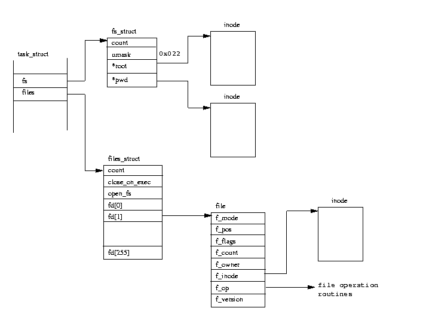
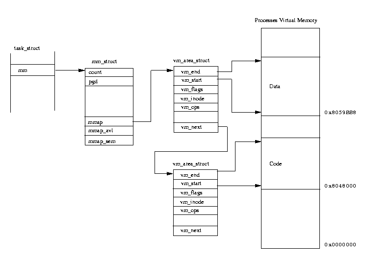
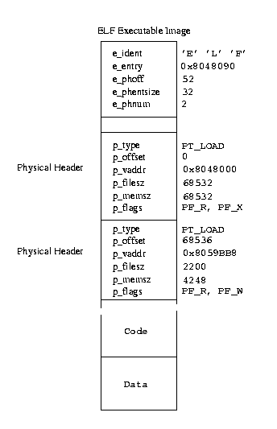

# 第四章 进程管理

``本章重点讨论Linux内核如何在系统中创建、管理以及删除进程。

进程在操作系统中执行特定的任务。而程序是存储在磁盘上包含可执行机器指令和数据的静态实体。进程或者任务是处于活动状态的计算机程序。

进程是一个随执行过程不断变化的实体。和程序要包含指令和数据一样，进程也包含程序计数器和所有CPU寄存器的值，同时它的堆栈中存储着如子程序参数、返回地址以及变量之类的临时数据。当前的执行程序，或者说进程，包含着当前处理器中的活动状态。Linux是一个多处理操作系统。进程具有独立的权限与职责。如果系统中某个进程崩溃，它不会影响到其余的进程。每个进程运行在其各自的虚拟地址空间中，通过核心控制下可靠的通讯机制，它们之间才能发生联系。

进程在生命期内将使用系统中的资源。它利用系统中的CPU来执行指令，在物理内存来放置指令和数据。使用文件系统提供的功能打开并使用文件，同时直接或者间接的使用物理设备。Linux必须跟踪系统中每个进程以及资源，以便在进程间实现资源的公平分配。如果系统有一个进程独占了大部分物理内存或者CPU的使用时间，这种情况对系统中的其它进程是不公平的。

系统中最宝贵的资源是CPU，通常系统中只有一个CPU。Linux是一个多处理操作系统，它最终的目的是:任何时刻系统中的每个CPU上都有任务执行，从而提高CPU的利用率。如果进程个数多于CPU的个数，则有些进程必须等待到CPU空闲时才可以运行。多处理是的思路很简单；当进程需要某个系统资源时它将停止执行并等待到资源可用时才继续运行。单处理系统中，如DOS，此时CPU将处于空等状态，这个时间将被浪费掉。在多处理系统中，因为可以同时存在多个进程，所以当某个进程开始等待时，操作系统将把CPU控制权拿过来并交给其它可以运行的进程。调度器负责选择适当的进程来运行，Linux使用一些调度策略以保证CPU分配的公平性。

Linux支持多种类型的可执行文件格式，如ELF，JAVA等。由于这些进程必须使用系统共享库，所以对它们的管理要具有透明性。

## 4.1 Linux进程

为了让Linux来管理系统中的进程，每个进程用一个task_struct数据结构来表示（任务与进程在Linux中可以混用）。数组task包含指向系统中所有task_struct结构的指针。

这意味着系统中的最大进程数目受task数组大小的限制，缺省值一般为512。创建新进程时，Linux将从系统内存中分配一个task_struct结构并将其加入task数组。当前运行进程的结构用current指针来指示。

Linux还支持实时进程。这些进程必须对外部时间作出快速反应（这就是“实时”的意思），系统将区分对待这些进程和其他进程。虽然task_struct数据结构庞大而复杂，但它可以分成一些功能组成部分：

- **State**

  进程在执行过程中会根据环境来改变state。Linux进程有以下状态：**Running**进程处于运行（它是系统的当前进程）或者准备运行状态（它在等待系统将CPU分配给它）。**Waiting**进程在等待一个事件或者资源。Linux将等待进程分成两类；可中断与不可中断。可中断等待进程可以被信号中断；不可中断等待进程直接在硬件条件等待，并且任何情况下都不可中断。**Stopped**进程被停止，通常是通过接收一个信号。正在被调试的进程可能处于停止状态。**Zombie**这是由于某些原因被终止的进程，但是在task数据中仍然保留task_struct结构。 它象一个已经死亡的进程。

- **Scheduling Information**

  调度器需要这些信息以便判定系统中哪个进程最迫切需要运行。

- **Identifiers**

  系统中每个进程都有进程标志。进程标志并不是task数组的索引，它仅仅是个数字。每个进程还有一个用户与组标志，它们用来控制进程对系统中文件和设备的存取权限。

- **Inter-Process Communication**

  Linux支持经典的Unix IPC机制，如信号、管道和信号灯以及系统V中IPC机制，包括共享内存、信号灯和消息队列。我们将在[IPC](http://www.embeddedlinux.org.cn/linuxkernel/ipc/ipc.html)一章中详细讨论Linux中IPC机制。

- **Links**

  Linux系统中所有进程都是相互联系的。除了初始化进程外，所有进程都有一个父进程。新进程不是被创建，而是被复制，或者从以前的进程克隆而来。每个进程对应的task_struct结构中包含有指向其父进程和兄弟进程（具有相同父进程的进程）以及子进程的指针。我们可以使用pstree 命令来观察Linux系统中运行进程间的关系：`init(1)-+-crond(98)        |-emacs(387)        |-gpm(146)        |-inetd(110)        |-kerneld(18)        |-kflushd(2)        |-klogd(87)        |-kswapd(3)        |-login(160)---bash(192)---emacs(225)        |-lpd(121)        |-mingetty(161)        |-mingetty(162)        |-mingetty(163)        |-mingetty(164)        |-login(403)---bash(404)---pstree(594)        |-sendmail(134)        |-syslogd(78)        `-update(166) `另外，系统中所有进程都用一个双向链表连接起来，而它们的根是init进程的task_struct数据结构。这 个链表被Linux核心用来寻找系统中所有进程，它对ps或者kill命令提供了支持。

- **Times and Timers**

  核心需要记录进程的创建时间以及在其生命期中消耗的CPU时间。时钟每跳动一次，核心就要更新保存在jiffies变量中，记录进程在系统和用户模式下消耗的时间量。Linux支持与进程相关的interval定时器，进程可以通过系统调用来设定定时器以便在定时器到时后向它发送信号。这些定时器可以是一次性的或者周期性的。

- **File system**

  进程可以自由地打开或关闭文件，进程的task_struct结构中包含一个指向每个打开文件描叙符的指针以及指向两个VFS inode的指针。每个VFS inode唯一地标记文件中的一个目录或者文件，同时还对底层文件系统提供统一的接口。Linux对文件系统的支持将在[filesystem](http://www.embeddedlinux.org.cn/linuxkernel/fs/filesystem.html)一章中详细描叙。这两个指针，一个指向进程的根目录，另一个指向其当前或者pwd目录。pwd从Unix命令pwd中派生出来， 用来显示当前工作目录。这两个VFS inode包含一个count域，当多个进程引用它们时，它的值将增加。这就是为什么你不能删除进程当前目录，或者其子目录的原因。

- **Virtual memory**

  多数进程都有一些虚拟内存（核心线程和后台进程没有），Linux核心必须跟踪虚拟内存与系统物理内存的映射关系。

- **Processor Specific Context**

  进程可以认为是系统当前状态的总和。进程运行时，它将使用处理器的寄存器以及堆栈等等。进程被挂起时，进程的上下文-所有的CPU相关的状态必须保存在它的task_struct结构中。当调度器重新调度该进程时，所有上下文被重新设定。

## 4.2 Identifiers

和其他Unix一样，Linux使用用户和组标志符来检查对系统中文件和可执行映象的访问权限。Linux系统中所有的文件都有所有者和允许的权限，这些权限描叙了系统使用者对文件或者目录的使用权。基本的权限是读、写和可执行，这些权限被分配给三类用户：文件的所有者，属于相同组的进程以及系统中所有进程。每类用户具有不同的权限，例如一个文件允许其拥有者读写，但是同组的只能读而其他进程不允许访问。

Linux使用组将文件和目录的访问特权授予一组用户，而不是单个用户或者系统中所有进程。如可以为某个软件项目中的所有用户创建一个组，并将其权限设置成只有他们才允许读写项目中的源代码。一个进程可以同时属于多个组（最多为32个），这些组都被放在进程的task_struct中的group数组中。只要某组进程可以存取某个文件，则由此组派生出的进程对这个文件有相应的组访问权限。

task_struct结构中有四对进程和组标志符：

- **uid, gid**

  表示运行进程的用户标志符和组标志符。

- **effective uid and gid**

  有些程序可以在执行过程中将执行进程的uid和gid改成其程序自身的uid和gid（保存在描叙可执行映象的VFS inode属性中）。这些程序被称为setuid程序，常在严格控制对某些服务的访问时使用，特别是那些为别的进程而运行的进程，例如网络后台进程。有效uid和gid是那些setuid执行过程在执行时变化出的uid 和gid。当进程试图访问特权数据或代码时，核心将检查进程的有效gid和uid。

- **file system uid and gid**

  它们和有效uid和gid相似但用来检验进程的文件系统访问权限。如运行在用户模式下的NFS服务器存取文件时，NFS文件系统将使用这些标志符。此例中只有文件系统uid和gid发生了改变（而非有效uid和gid）。这样可以避免恶意用户向NFS服务器发送KILL信号。

- **saved uid and gid**

  POSIX标准中要求实现这两个标志符，它们被那些通过系统调用改变进程uid和gid的程序使用。当进程的原始uid和gid变化时，它们被用来保存真正的uid和gid。

## 4.3 调度

所有进程部分时间运行于用户模式，部分时间运行于系统模式。如何支持这些模式，底层硬件的实现各不相同，但是存在一种安全机制可以使它们在用户模式和系统模式之间来回切换。用户模式的权限比系统模式下的小得多。进程通过系统调用切换到系统模式继续执行。此时核心为进程而执行。在Linux中，进程不能被抢占。只要能够运行它们就不能被停止。当进程必须等待某个系统事件时，它才决定释放出CPU。例如进程可能需要从文件中读出字符。一般等待发生在系统调用过程中，此时进程处于系统模式；处于等待状态的进程将被挂起而其他的进程被调度管理器选出来执行。

进程常因为执行系统调用而需要等待。由于处于等待状态的进程还可能占用CPU时间，所以Linux采用了预加载调度策略。在此策略中，每个进程只允许运行很短的时间：200毫秒，当这个时间用完之后，系统将选择另一个进程来运行，原来的进程必须等待一段时间以继续运行。这段时间称为时间片。

调度器必须选择最迫切需要运行而且可以执行的进程来执行。

可运行进程是一个只等待CPU资源的进程。Linux使用基于优先级的简单调度算法来选择下一个运行进程。当选定新进程后，系统必须将当前进程的状态，处理器中的寄存器以及上下文状态保存到task_struct结构中。同时它将重新设置新进程的状态并将系统控制权交给此进程。为了将CPU时间合理的分配给系统中每个可执行进程，调度管理器必须将这些时间信息也保存在task_struct中。

- **policy**

  应用到进程上的调度策略。系统中存在两类Linux进程:普通与实时进程。实时进程的优先级要高于其它进程。如果一个实时进程处于可执行状态，它将先得到执行。实时进程又有两种策略：时间片轮转和先进先出。在时间片轮转策略中，每个可执行实时进程轮流执行一个时间片，而先进先出策略每个可执行进程按各自在运行队列中的顺序执行并且顺序不能变化。

- **priority**

  调度管理器分配给进程的优先级。同时也是进程允许运行的时间（jiffies）。系统调用renice可以改变进程的优先级。

- **rt_priority**

  Linux支持实时进程，且它们的优先级要高于非实时进程。调度器使用这个域给每个实时进程一个相对优先级。同样可以通过系统调用来改变实时进程的优先级。

- **counter**

  进程允许运行的时间(保存在jiffies中)。进程首次运行时为进程优先级的数值，它随时间变化递减。

核心在几个位置调用调度管理器。如当前进程被放入等待队列后运行或者系统调用结束时，以及从系统模式返回用户模式时。此时系统时钟将当前进程的counter值设为0以驱动调度管理器。每次调度管理器运行时将进行下列操作：

- **kernel work**

  调度管理器运行底层处理程序并处理调度任务队列。[kernel](http://www.embeddedlinux.org.cn/linuxkernel/kernel/kernel.html)一章将详细描叙这个轻量级核心线程。

- **Current process**

  当选定其他进程运行之前必须对当前进程进行一些处理。如果当前进程的调度策略是时间片轮转，则它被放回到运行队列。

-  

  如果任务可中断且从上次被调度后接收到了一个信号，则它的状态变为Running。

-  

  如果当前进程超时，则它的状态变为Running。

-  

  如果当前进程的状态是Running，则状态保持不变。 那些既不处于Running状态又不是可中断的进程将会从运行队列中删除。这意味着调度管理器选择运行进程时不会将这些进程考虑在内。

 

- **Swap processes**

  如果系统选择其他进程运行，则必须被挂起当前进程且开始执行新进程。进程执行时将使用寄存器、物理内存以及CPU。每次调用子程序时，它将参数放在寄存器中并把返回地址放置在堆栈中，所以调度管理器总是运行在当前进程的上下文。虽然可能在特权模式或者核心模式中，但是仍然处于当前运行进程中。当挂起进程的执行时，系统的机器状态，包括程序计数器(PC)和全部的处理器寄存器，必须存储在进程的task_struct数据结构中。同时加载新进程的机器状态。这个过程与系统类型相关，不同的CPU使用不同的方法完成这个工作，通常这个操作需要硬件辅助完成。

 

### 4.3.1 多处理器系统中的调度

在Linux世界中，多CPU系统非常少见。但是Linux上已经做了很多工作来保证它能运行在SMP（对称多处理）机器上。Linux能够在系统中的CPU间进行合理的负载平衡调度。这里的负载平衡工作比调度管理器所做的更加明显。

在多处理器系统中，人们希望每个处理器总处与工作状态。当处理器上的当前进程用完它的时间片或者等待系统资源时，各个处理器将独立运行调度管理器。SMP系统中一个值得注意的问题是系统中不止一个idle进程。在单处理器系统中，idle进程是task数组中的第一个任务，在SMP系统中每个CPU有一个idle进程，同时每个CPU都有一个当前进程，SMP系统必须跟踪每个处理器中的idle进程和当前进程。

在SMP系统中，每个进程的task_struct结构中包含着当前运行它的处理器的编号以及上次运行时处理器的编号。 把进程每次都调度到不同CPU上执行显然毫无意义，Linux可以使用processor_mask来使得某个进程只在一个或者几个处理器上运行:如果N位置位，则进程可在处理器N上运行。当调度管理器选择新进程运行时，它 不会考虑一个在其processor_mask中在当前处理器位没有置位的进程。同时调度管理器将给予上次在此处理器中运行的进程一些优先权，因为将进程迁移到另外处理器上运行将带来性能的损失。

## 4.4 文件

图4.1 进程所使用的文件

图4.1给出了两个描叙系统中每个进程所使用的文件系统相关信息。第一个fs_struct包含了指向进程的VFS inode和其屏蔽码。这个屏蔽码值是创建新文件时所使用的缺省值，可以通过系统调用来改变。

第二个数据结构files_struct包含了进程当前所使用的所有文件的信息。程序从标准输入中读取并写入到标准输出中去。任何错误信息将输出到标准错误输出。这些文件有些可能是真正的文件，有的则是输出/输入终端或者物理设备，但程序都将它们视为文件。每个文件有一个描叙符，files_struct最多可以包含256个文件数据结构，它们分别描叙一个被当前进程使用的文件。f_mode域表示文件将以何种模式创建：只读 、读写还是只写。f_pos中包含下一次文件读写操作开始位置。f_inode指向描叙此文件的VFS inode， f_ops指向一组可以对此文件进行操作的函数入口地址指针数组。这些抽象接口十分强大，它们使得Linux 能够支持多种文件类型。在Linux中，管道是用我们下面要讨论的机制实现的。

每当打开一个文件时，位于files_struct中的一个空闲文件指针将被用来指向这个新的文件结构。Linux进 程希望在进程启动时至少有三个文件描叙符被打开，它们是标准输入，标准输出和标准错误输出，一般进程 会从父进程中继承它们。这些描叙符用来索引进程的fd数组，所以标准输入，标准输出和标准错误输出分别 对应文件描叙符0，1和2。每次对文件的存取都要通过文件数据结构中的文件操作子程序和VFS inode一起来完成，

## 4.5 虚拟内存

进程的虚拟内存包括可执行代码和多个资源数据。首先加载的是程序映象，例如ls。ls和所有可执行映象一样，是由可执行代码和数据组成的。此映象文件包含所有加载可执行代码所需的信息，同时还将程序数据连接进入进程的虚拟内存空间。然后在执行过程中，进程定位可以使用的虚拟内存，以包含正在读取的文件内容。新分配的虚拟内存必须连接到进程已存在的虚拟内存中才能够使用。 最后Linux进程调用通用库过程，比如文件处理子程序。如果每个进程都有库过程的拷贝，那么共享就变得没有意义。而Linux可以使多个进程同时使用共享库。来自共享库的代码和数据必须连接进入进程的虚拟地址空间以及共享此库的其它进程的虚拟地址空间。

任何时候进程都不同时使用包含在其虚拟内存中的所有代码和数据。虽然它可以加载在特定情况下使用的那些代码，如初始化或者处理特殊事件时，另外它也使用了共享库的部分子程序。但如果将这些没有或很少使用的代码和数据全部加载到物理内存中引起极大的浪费。如果系统中多个进程都浪费这么多资源，则会大大降低的系统效率。Linux使用请求调页技术来把那些进程需要访问的虚拟内存带入物理内存中。核心将进程页表中这些虚拟地址标记成存在但不在内存中的状态，而无需将所有代码和数据直接调入物理内存。当进程试图访问这些代码和数据时，系统硬件将产生页面错误并将控制转移到Linux核心来处理之。这样对于处理器地址空间中的每个虚拟内存区域，Linux都必须知道这些虚拟内存从何处而来以及如何将其载入内存以处理页面错误。

图4.2 进程的虚拟内存

Linux核心需要管理所有的虚拟内存地址，每个进程虚拟内存中的内容在其task_struct结构中指向的 vm_area_struct结构中描叙。进程的mm_struct数据结构也包含了已加载可执行映象的信息和指向进程页表 的指针。它还包含了一个指向vm_area_struct链表的指针，每个指针代表进程内的一个虚拟内存区域。

此链表按虚拟内存位置来排列，图4.2给出了一个简单进程的虚拟内存以及管理它的核心数据结构分布图。 由于那些虚拟内存区域来源各不相同，Linux使用vm_area_struct中指向一组虚拟内存处理过程的指针来抽 象此接口。通过使用这个策略，所有的进程虚拟地址可以用相同的方式处理而无需了解底层对于内存管理的区别。如当进程试图访问不存在内存区域时，系统只需要调用页面错误处理过程即可。

为进程创建新虚拟内存区域或处理页面不在物理内存错误时，Linux核心重复使用进程的vm_area_struct数据结构集合。这样消耗在查找vm_area_struct上的时间直接影响了系统性能。Linux把vm_area_struct数据结构以AVL(Adelson-Velskii and Landis)树结构连接以加快速度。在这种连接中，每个vm_area_struct结构有一个左指针和右指针指向vm_area_struct结构。左边的指针指向一个更低的虚拟内存起始地址节点而右边的指针指向一个更高虚拟内存起始地址节点。为了找到某个的节点，Linux从树的根节点开始查找，直到找到正确的vm_area_struct结构。插入或者释放一个vm_area_struct结构不会消耗额外的处理时间。

当进程请求分配虚拟内存时，Linux并不直接分配物理内存。它只是创建一个vm_area_struct 结构来描叙此虚拟内存，此结构被连接到进程的虚拟内存链表中。当进程试图对新分配的虚拟内存进行写操作时，系统将产生页面错。处理器会尝试解析此虚拟地址，但是如果找不到对应此虚拟地址的页表入口时，处理器将放弃解析并产生页面错误异常，由Linux核心来处理。Linux则查看此虚拟地址是否在当前进程的虚拟地址空间中。如果是Linux会创建正确的PTE并为此进程分配物理页面。包含在此页面中的代码或数据可能需要从文件系统或者交换磁盘上读出。然后进程将从页面错误处开始继续执行，由于物理内存已经存在，所以不会再产生页面异常。

## 4.6 进程创建

系统启动时总是处于核心模式，此时只有一个进程：初始化进程。象所有进程一样，初始化进程也有一个由堆栈、寄存器等表示的机器状态。当系统中有其它进程被创建并运行时，这些信息将被存储在初始化进程的task_struct结构中。在系统初始化的最后，初始化进程启动一个核心线程（init）然后保留在idle状态。 如果没有任何事要做，调度管理器将运行idle进程。idle进程是唯一不是动态分配task_struct的进程，它的 task_struct在核心构造时静态定义并且名字很怪，叫init_task。

由于是系统的第一个真正的进程，所以init核心线程（或进程）的标志符为1。它负责完成系统的一些初始化设置任务（如打开系统控制台与安装根文件系统），以及执行系统初始化程序，如/etc/init, /bin/init 或者 /sbin/init ，这些初始化程序依赖于具体的系统。init程序使用/etc/inittab作为脚本文件来创建系统中的新进程。这些新进程又创建各自的新进程。例如getty进程将在用户试图登录时创建一个login进程。系 统中所有进程都是从init核心线程中派生出来。

新进程通过克隆老进程或当前进程来创建。系统调用fork或clone可以创建新任务，复制发生在核心状态下的核心中。在系统调用的结束处有一个新进程等待调度管理器选择它去运行。系统从物理内存中分配出来一个新的task_struct数据结构，同时还有一个或多个包含被复制进程堆栈（用户与核心）的物理页面。然后创建唯一地标记此新任务的进程标志符。但复制进程保留其父进程的标志符也是合理的。新创建的task_struct将被放入task数组中，另外将被复制进程的task_struct中的内容页表拷入新的task_struct中。

复制完成后，Linux允许两个进程共享资源而不是复制各自的拷贝。这些资源包括文件、信号处理过程和虚拟内存。进程对共享资源用各自的count来记数。在两个进程对资源的使用完毕之前，Linux绝不会释放此资源，例如复制进程要共享虚拟内存，则其task_struct将包含指向原来进程的mm_struct的指针。mm_struct将增加count变量以表示当前进程共享的次数。

复制进程虚拟空间所用技术的十分巧妙。复制将产生一组新的vm_area_struct结构和对应的mm_struct结构，同时还有被复制进程的页表。该进程的任何虚拟内存都没有被拷贝。由于进程的虚拟内存有的可能在物理内存中，有的可能在当前进程的可执行映象中，有的可能在交换文件中，所以拷贝将是一个困难且繁琐的工作。Linux使用一种"copy on write"技术：仅当两个进程之一对虚拟内存进行写操作时才拷贝此虚拟内存块。但是不管写与不写，任何虚拟内存都可以在两个进程间共享。只读属性的内存，如可执行代码，总是可以共享的。为了使"copy on write"策略工作，必须将那些可写区域的页表入口标记为只读的，同时描叙它们的vm_area_struct数据都被设置为"copy on write"。当进程之一试图对虚拟内存进行写操作时将产生页面错误。这时Linux将拷贝这一块内存并修改两个进程的页表以及虚拟内存数据结构。

## 4.7 时钟和定时器

核心跟踪着进程的创建时间以及在其生命期中消耗的CPU时间。每个时钟滴答时，核心将更新当前进程在系统 模式与用户模式下所消耗的时间（记录在jiffies中）。

除了以上记时器外，Linux还支持几种进程相关的时间间隔定时器。

进程可以使用这些定时器在到时时向它发送各种信号，这些定时器如下：

- **Real**

  此定时器按照实时时钟记数，当时钟到期时，向进程发送SIGALRM信号。

- **Virtual**

  此定时器仅在进程运行时记数，时钟到期时将发送SIGVTALRM信号。

- **Profile**

  此定时器在进程运行和核心为其运行时都记数。当到时时向进程发送SIGPROF信号。

以上时间间隔定时器可以同时也可以单独运行，Linux将所有这些信息存储在进程的task_struct数据结构中。通过系统调用可以设置这些时间间隔定时器并启动、终止它们或读取它们的当前值。Virtual和Profile定时器以相同方式处理。

每次时钟滴答后当前进程的时间间隔定时器将递减，当到时之后将发送适当的信号。

Real时钟间隔定时器的机制有些不同，这些将在[kernel](http://www.embeddedlinux.org.cn/linuxkernel/kernel/kernel.html)一章中详细讨论。每个进程有其自身的timer_list数 据结构，当时间间隔定时器运行时，它们被排入系统的定时器链表中。当定时器到期后，底层处理过程将把它从队列中删除并调用时间间隔处理过程。此过程将向进程发送SIGALRM信号并重新启动定时器，将其重新放入系统时钟队列。

 

## 4.8 程序执行

象Unix一样，Linux程序通过命令解释器来执行。命令解释器是一个用户进程，人们将其称为shell程序。

在Linux中有多个shell程序，最流行的几个是sh、bash和tcsh。除了几个内置命令如cd和pwd外，命令都是 一个可执行二进制文件。当键入一个命令时，Shell程序将搜索包含在进程PATH环境变量中查找路径中的目 录来定位这个可执行映象文件。如果找到，则它被加载且执行。shell使用上面描叙的fork机制来复制自身 然后用找到的二进制可执行映象的内容来代替其子进程。一般情况下，shell将等待此命令的完成或者子进 程的退出。你可以通过按下control-Z键使子进程切换到后台而shell再次开始运行。同时还可以使用shell 命令bg将命令放入后台执行，shell将发送SIGCONT信号以重新启动进程直到进程需要进行终端输出和输入。

可执行文件可以有许多格式，甚至是一个脚本文件。脚本文件需要恰当的命令解释器来处理它们；例如 /bin/sh解释shell脚本。可执行目标文件包含可执行代码和数据，这样操作系统可以获得足够的信息将其 加载到内存并执行之。Linux最常用的目标文件是ELF，但是理论上Linux可以灵活地处理几乎所有目标文件 格式。

图4.3 已注册的二进制格式

通过使用文件系统，Linux所支持的二进制格式既可以构造到核心又可以作为模块加载。核心保存着一个可以支持的二进制格式的链表（见图4.3），同时当执行一个文件时，各种二进制格式被依次尝试。

Linux上支持最广的格式是a.out和ELF。执行文件并不需要全部读入内存，而使用一种请求加载技术。进程 使用的可执行映象的每一部分被调入内存而没用的部分将从内存中丢弃。

### 4.8.1 ELF

ELF（可执行与可连接格式）是Unix系统实验室设计的一种目标文件格式，现在已成为Linux中使用最多的格式。但与其它目标文件格式相比，如ECOFF和a.out，ELF的开销稍大，它的优点是更加灵活。ELF可执行文件 中包含可执行代码，即正文段：text和数据段：data。位于可执行映象中的表描叙了程序应如何放入进程的 虚拟地址空间中。静态连接映象是通过连接器ld得到，在单个映象中包含所有运行此映象所需代码和数据。 此映象同时也定义了映象的内存分布和首先被执行的代码的地址。

图4.4 ELF可执行文件格式

图4.4给出了一个静态连接的ELF可执行映象的构成。

这是一个打印"Hello World"并退出的简单C程序。文件头将其作为一个带两个物理文件头(e_phnum = 2)的ELF映象来描叙，物理文件头位于映象文件起始位置52字节处。第一个物理文件头描叙的是映象中的可执行代码。它从虚拟地址0x8048000开始，长度为65532字节。这是因为它包含了printf()函数库代码以输出"Hello World"的静态连接映象。映象的入口点，即程序的第一条指令，不是位于映象的起始位置 而在虚拟地址0x8048090（e_entry）处。代码正好接着第二个物理文件头。这个物理文件头描叙了此程序使用的数据，它被加载到虚拟内存中0x8059BB8处。这些数据是可读并可写的。你可能已经注意到了数据 的大小在文件中是2200字节(p_filesz)但是在内存中的大小为4248字节。这是因为开始的2200字节包含的是预先初始化数据而接下来的2048字节包含的是被执行代码初始化的数据。

当Linux将一个ELF可执行映象加载到进程的虚拟地址空间时，它并不真的加载映象。首先它建立其虚拟内存数据结构：进程的vm_area_struct树和页表。当程序执行时将产生页面错，引起程序代码和数据从物理内存中取出。程序中没有使用到的部分从来都不会加载到内存中去。一旦ELF二进制格式加载器发现这个映象是有效的ELF可执行映象，它将把进程的当前可执行映象从虚拟内存冲刷出去。当进程是一个复制映象时（所有的进程都是），父进程执行的是老的映象程序，例如象bash这样的命令解释器。同时还将清除任何信号处理过程并且关闭打开的文件，在冲刷的最后，进程已经为新的可执行映象作好了准备。不管可执行映象是哪种格式，进程的mm_struct结构中将存入相同信息，它们是指向映象代码和数据的指针。当ELF可执行映象从文件中读出且相关程序代码被映射到进程虚拟地址空间后，这些指针的值都被确定下来。同时vm_area_struct也被建立起来，进程的页表也被修改。mm_struct结构中还包含传递给程序和进程环境变量的参数的指针。

#### ELF 共享库

另一方面，动态连接映象并不包含全部运行所需要的代码和数据。其中的一部分仅在运行时才连接到共享库中。ELF共享库列表还在运行时连接到共享库时被动态连接器使用。Linux使用几个动态连接器，如ld.so.1，libc.so.1和ld-linux.so.1，这些都放置在/lib目录中。这些库中包含常用代码，如C语言子程序等。如果没有动态连接，所有程序将不得不将所有库过程拷贝一份并连接进来，这样将需要更多的磁盘与虚拟内存空间。通过动态连接，每个被引用库过程的信息都可以包含在ELF映象列表中。这些信息用来帮助动态连接器定位库过程并将它连入程序的地址空间。

 

### 4.8.2 脚本文件

脚本文件的运行需要解释器的帮助。Linux中有许许多多的解释器；例如wish、perl以及命令外壳程序tcsh。 Linux使用标准的Unix规则，在脚本文件的第一行包含了脚本解释器的名字。典型的脚本文件的开头如下：

\#!/usr/bin/wish

此时命令解释器会试着寻找脚本解释器。 然后它打开此脚本解释器的执行文件得到一个指向此文件的VFS inode并使此脚本解释器开始解释此脚本。这时脚本文件名变成了脚本解释器的0号参数(第一个参数)并且其余参数向上挪一个位置(原来的第一个参数变成第二个)。脚本解释器的加载过程与其他可执行文件相同。Linux会逐个尝试各种二进制可执行格式直到它可以执行。

 

