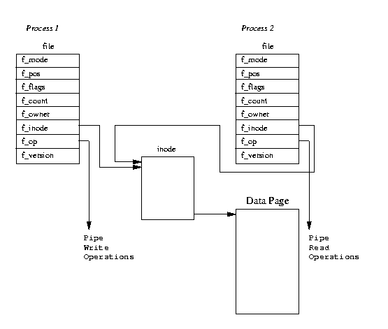
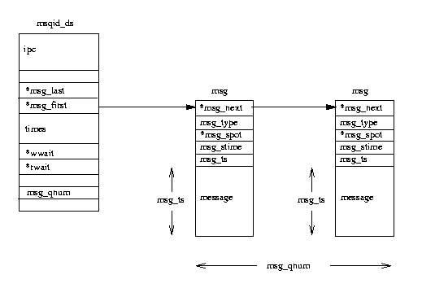
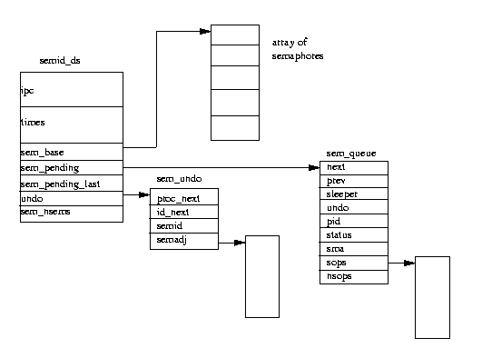
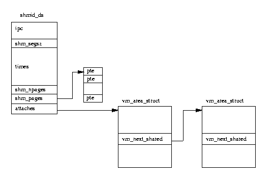

# 第五章 进程间通讯机制


``进程在核心的协调下进行相互间的通讯。Linux支持大量进程间通讯(IPC)机制。除了信号和管道外，Linux 还支持Unix系统V中的IPC机制。


## 5.1 信号

信号是Unix系统中的最古老的进程间通讯方式。它们用来向一个或多个进程发送异步事件信号。信号可以从键盘中断中产生，另外进程对虚拟内存的非法存取等系统错误环境下也会有信号产生。信号还被shell程序用来向其子进程发送任务控制命令。

系统中有一组被详细定义的信号类型，这些信号可以由核心或者系统中其它具有适当权限的进程产生。使用kill命令(kill -l)可以列出系统中所有已经定义的信号。在我的系统(Intel系统)上运行结果如下：

```
 1) SIGHUP	 2) SIGINT	 3) SIGQUIT	 4) SIGILL
 5) SIGTRAP	 6) SIGIOT	 7) SIGBUS	 8) SIGFPE
 9) SIGKILL	10) SIGUSR1	11) SIGSEGV	12) SIGUSR2
13) SIGPIPE	14) SIGALRM	15) SIGTERM	17) SIGCHLD
18) SIGCONT	19) SIGSTOP	20) SIGTSTP	21) SIGTTIN
22) SIGTTOU	23) SIGURG	24) SIGXCPU	25) SIGXFSZ
26) SIGVTALRM	27) SIGPROF	28) SIGWINCH	29) SIGIO
30) SIGPWR	
```

当我在Alpha AXP中运行此命令时，得到了不同的信号个数。除了两个信号外，进程可以忽略这些信号中的绝大部分。其一是引起进程终止执行的SIGSTOP信号，另一个是引起进程退出的SIGKILL信号。 至于其它信号，进程可以选择处理它们的具体方式。进程可以阻塞信号，如若不阻塞，则可以在自行处理此信号和将其转交核心处理之间作出选择。如果由核心来处理此信号，它将使用对应此信号的缺省处理方法。 比如当进程接收到SIGFPE(浮点数异常)时，核心的缺省操作是引起core dump和进程的退出。信号没有固有的相对优先级。如果在同一时刻对于一个进程产生了两个信号，则它们将可能以任意顺序到达进程并进行处理。同时Linux并不提供处理多个相同类型信号的方式。即进程无法区分它是收到了1个还是42个SIGCONT信号。

Linux通过存储在进程task_struct中的信息来实现信号。信号个数受到处理器字长的限制。32位字长的处理器最多可以有32个信号而64位处理器如Alpha AXP可以有最多64个信号。当前未处理的信号保存在signal域中，并带有保存在blocked中的被阻塞信号的屏蔽码。除了SIGSTOP和SIGKILL外，所有的信号都能被阻塞。当产生可阻塞信号时，此信号可以保持一直处于待处理状态直到阻塞释放。Linux保存着每个进程处理每个可能信号的信息，它们保存在每个进程task_struct中的sigaction数组中。这些信息包括进程希望处理的信号所对应的过程地址，或者指示是忽略信号还是由核心来处理它的标记。通过系统调用，进程可以修改缺省的信号处理过程，这将改变某个信号的sigaction以及阻塞屏蔽码。

并不是系统中每个进程都可以向所有其它进程发送信号：只有核心和超级用户具有此权限。普通进程只能向具有相同uid和gid的进程或者在同一进程组中的进程发送信号。信号是通过设置task_struct结构中signal域里的某一位来产生的。如果进程没有阻塞信号并且处于可中断的等待状态，则可以将其状态改成Running，同时如确认进程还处在运行队列中，就可以通过信号唤醒它。这样系统下次发生调度时，调度管理器将选择它运行。如果进程需要缺省的信号处理过程，则Linux可以优化对此信号的处理。例如SIGWINCH（X窗口的焦点改变）信号，其缺省处理过程是什么也不做。

信号并非一产生就立刻交给进程，而是必须等待到进程再次运行时才交给进程。每次进程从系统调用中退出前，它都会检查signal和blocked域，看是否有可以立刻发送的非阻塞信号。这看起来非常不可靠，但是系统中每个进程都在不停地进行系统调用，如向终端输出字符。当然进程可以选择去等待信号，此时进程将一直处于可中断状态直到信号出现。对当前不可阻塞信号的处理代码放置在sigaction结构中。

如果信号的处理过程被设置成缺省则由核心来应付它。SIGSTOP信号的缺省处理过程是将当前进程的状态改变成为Stopped并运行调度管理器以选择一个新进程继续运行。SIGFPE的缺省处理过程则是引起core dump并使进程退出。当然，进程可以定义其自身的信号处理过程。一旦信号产生，这个过程就将被调用。它的地址存储在sigaction结构中。核心必须调用进程的信号处理例程，具体如何去做依赖于处理器类型，但是所有的CPU 必须处理这个问题：如果信号产生时，当前进程正在核心模式下运行并且马上要返回调用核心或者系统例程的进程，而该进程处在用户模式下。解决这个问题需要操纵进程的堆栈及寄存器。进程的程序计数器被设置成其信号处理过程的地址，而参数通过调用框架或者寄存器传递到处理例程中。当进程继续执行时，信号处理例程好象普通的函数调用一样。

Linux是POSIX兼容的，所以当某个特定信号处理例程被调用时，进程可以设定哪个信号可以阻塞。这意味着可以在进程信号处理过程中改变blocked屏蔽码。当信号处理例程结束时，此blocked屏蔽码必须设置成原有值。 因此，Linux添加了一个过程调用来进行整理工作，通过它来重新设置被发送信号进程调用栈中的原有blocked屏蔽码。 对于同一时刻几个信号处理过程，Linux通过堆栈方式来优化其使用，每当一个处理过程退出时，下一个处理过程必须等到整理例程结束后才执行。


## 5.2 管道

一般的Linux shell程序都允许重定向。如

```
$ ls | pr | lpr
```

在这个管道应用中，ls列当前目录的输出被作为标准输入送到pr程序中，而pr的输出又被作为标准输入送到lpr程序中。管道是单向的字节流，它将某个进程的标准输出连接到另外进程的标准输入。但是使用管道的进程都不会意识到重定向的存在，并且其执行结果也不会有什么不同。shell程序负责在进程间建立临时的管道。





图5.1 管道


在Linux中，管道是通过指向同一个临时VFS inode的两个file数据结构来实现的，此VFS inode指向内存中的一个物理页面。图5.1中每个file数据结构指向不同的文件操作例程向量，一个是实现对管道的写，另一个从管道中读。

这样就隐藏了读写管道和读写普通的文件时系统调用的差别。当写入进程对管道写时，字节被拷贝到共享数据页面中，当读取进程从管道中读时，字节从共享数据页面中拷贝出来。Linux必须同步对管道的访问。它必须保证读者和写者以确定的步骤执行，为此需要使用锁、等待队列和信号等同步机制。

当写者想对管道写入时，它使用标准的写库函数。表示打开文件和打开管道的描叙符用来对进程的file数据 结构集合进行索引。Linux系统调用使用由管道file数据结构指向的write过程。这个write过程用保存在表示管道的VFS inode中的信息来管理写请求。

如果没有足够的空间容纳对所有写入管道的数据，只要管道没有被读者加锁。则Linux为写者加锁，并把从写入进程地址空间中写入的字节拷贝到共享数据页面中去。如果管道被读者加锁或者没有足够空间存储数据，当前进程将在管道inode的等待队列中睡眠，同时调度管理器开始执行以选择其它进程来执行。如果写入进程是可中断的，则当有足够的空间或者管道被解锁时，它将被读者唤醒。当数据被写入时，管道的VFS inode被解锁，同时任何在此inode的等待队列上睡眠的读者进程都将被唤醒。

从管道中读出数据的过程和写入类似。

进程允许进行非阻塞读（这依赖于它们打开文件或者管道的方式），此时如果没有数据可读或者管道被加锁， 则返回错误信息表明进程可以继续执行。阻塞方式则使读者进程在管道inode的等待队列上睡眠直到写者 进程结束。当两个进程对管道的使用结束时，管道inode和共享数据页面将同时被遗弃。

Linux还支持命名管道(named pipe)，也就是FIFO管道，因为它总是按照先进先出的原则工作。第一个被写入 的数据将首先从管道中读出来。和其它管道不一样，FIFO管道不是临时对象，它们是文件系统中的实体并且 可以通过mkfifo命令来创建。进程只要拥有适当的权限就可以自由使用FIFO管道。打开FIFO管道的方式稍有不同。其它管道需要先创建（它的两个file数据结构，VFS inode和共享数据页面）而FIFO管道已经存在，只需要由使用者打开与关闭。在写者进程打开它之前，Linux必须让读者进程先打开此FIFO管道；任何读者进程从中读取之前必须有写者进程向其写入数据。FIFO管道的使用方法与普通管道基本相同，同时它们使用相同数据结构和操作。


## 5.3 套接口


### 5.3.1 系统V IPC机制

Linux支持Unix系统V（1983）版本中的三种进程间通讯机制。它们是消息队列、信号灯以及共享内存。这些系统V IPC机制使用共同的授权方法。只有通过系统调用将标志符传递给核心之后，进程才能存取这些资源。这些系统V IPC对象使用与文件系统非常类似的访问控制方式。对象的引用标志符被用来作为资源表中的索引。这个索引值需要一些处理后才能得到。

系统中所有系统V IPC对象的Linux数据结构包含一个ipc_perm结构，它含有进程拥有者和创建者及组标志符。另外还有对此对象（拥有者，组及其它）的存取模式以及IPC对象键。此键值被用来定位系统V IPC对象的引用标志符。这样的键值一共有两组：公有与私有。如果此键为公有，则系统中任何接受权限检查的进程都可以找到系统V IPC对象的引用标志符。系统V IPC对象绝不能用一个键值来引用，而只能使用引用标志符。


### 5.3.2 消息队列

消息队列允许一个或者多个进程向它写入与读取消息。Linux维护着一个msgque消息队列链表，其中每个元素 指向一个描叙消息队列的msqid_ds结构。当创建新的消息队列时，系统将从系统内存中分配一个msqid_ds结构，同时将其插入到数组中。





图5.2 系统V IPC消息队列


每个msqid_ds结构包含一个ipc_perm结构和指向已经进入此队列消息的指针。另外，Linux保留有关队列修改时间信息，如上次系统向队列中写入的时间等。msqid_ds包含两个等待队列：一个为队列写入进程使用而另一个由队列读取进程使用。

每次进程试图向写入队列写入消息时，系统将把其有效用户和组标志符与此队列的ipc_perm结构中的模式进行比较。如果允许写入操作，则把此消息从此进程的地址空间拷贝到msg数据结构中，并放置到此消息队列尾部。由于 Linux严格限制可写入消息的个数和长度，队列中可能容纳不下这个消息。此时，此写入进程将被添加到这个消息队列的等待队列中，同时调用调度管理器选择新进程运行。当由消息从此队列中释放时，该进程将被唤醒。

从队列中读的过程与之类似。进程对这个写入队列的访问权限将被再次检验。读取进程将选择队列中第一个消息（不管是什么类型）或者第一个某特定类型的消息。如果没有消息可以满足此要求，读取进程将被添加 到消息队列的读取等待队列中，然后系统运行调度管理器。当有新消息写入队列时，进程将被唤醒继续执行。


### 5.3.3 信号灯

信号灯最简单的形式是某个可以被多个进程检验和设置(test&set)的内存单元。这个检验与设置操作对每个进程而言是不可中断或者说是一个原子性操作；一旦启动谁也终止不了。检验与设置操作的结果是信号灯当前值加1， 这个值可以是正数也可以是负数。根据这个操作的结果，进程可能可以一直睡眠到此信号灯的值被另一个进程更改为止。信号灯可用来实现临界区(critical region)：某一时刻在此区域内的代码只能被一个进程执行。

如果你有多个协作进程从一个数据文件中读取与写入记录。有时你可能需要这些文件访问遵循严格的访问次序。 那么可在文件操作代码上使用一个初始值为1的信号灯，它带有两个信号灯操作，一个检验并对信号灯 值减1，而另一个检验并加1。第一个访问文件的进程将试图将信号灯值减1，如果获得成功则信号灯值变成了 0。此进程于是开始使用这个数据文件，但是此时如果另一进程也想将信号灯值减1，则信号灯值将为-1，这次操作将会失败。它将挂起执行直到第一个进程完成对此数据文件的使用。此时这个等待进程将被唤醒，这次它对信号灯的操作将成功。



图5.3 系统V IPC信号灯


每个系统V IPC信号灯对象对应一个信号灯数组，Linux使用semid_ds结构来表示。系统中所有semid_ds结构由一组semary指针来指示。在每个信号灯数组中有一个sem_nsems，它表示一个由sem_base指向的sem结构。授权的进程可以使用系统调用来操纵这些包含系统V IPC信号灯对象的信号灯数组。这个系统调用可以定义许多种操作，每个操作用三个输入来描叙：信号灯索引、操作值和一组标志。信号灯索引是一个信号灯数组的索引，而操作值是将被加到信号灯上的数值。首先Linux将检查是否所有操作已经成功。如果操作值与信号灯当前数值相加大于0，或者操作值与信号灯当前值都是0，操作将会成功。如果所有信号灯操作失败，Linux仅仅会把那些操作标志没有要求系统调用为非阻塞类型的进程挂起。进程挂起后，Linux必须保存信号灯操作的执行状态并将当前进程放入等待队列。系统还在堆栈上建立sem_queue结构并填充各个域。这个sem_queue结构将被放到此信号灯对象等待队列的尾部（使用 sem_pending和sem_pending_last指针）。系统把当前进程置入sem_queue结构中的等待队列(sleeper)中，然后启动调度管理器选择其它进程运行。

如果所有这些信号灯操作都成功则无需挂起当前进程，Linux将对信号灯数组中的其他成员进行相同操作，然后检查那些处于等待或者挂起状态的进程。首先，Linux将依次检查挂起队列(sem_pending) 中的每个成员，看信号灯操作能否继续。如果可以则将其sem_queue结构从挂起链表中删除并对信号灯数组发出信号灯操作。Linux还将唤醒处于睡眠状态的进程并使之成为下一个运行的进程。如果在对挂起队列的遍历过程中有的信号灯操作不能完成则Linux将一直重复此过程，直到所有信号灯操作完成且没有进程需要继续睡眠。

但是信号灯的使用可能产生一个严重的问题：死锁。当一个进程进入临界区时它改变了信号灯的值而离开临界区时由于运行失败或者被kill而没有改回信号灯时，死锁将会发生。Linux通过维护一组描叙信号灯数组变化的链表来防止该现象的发生。它的具体做法是让Linux将把此信号灯设置为进程对其进行操作前的状态。这些状态值被保存在使用该信号灯数组进程的semid_ds和task_struct结构的sem_undo结构中。

信号灯操作将迫使系统对它引起的状态变化进行维护。Linux为每个进程维护至少一个对应于信号灯数组的sem_undo结构。如果请求进行信号灯操作的进程没有该结构，则必要时Linux会为其创建一个。这个sem_undo 结构将同时放入此进程的task_struct结构和此信号灯数组的semid_ds结构中。当对信号灯进行操作时，信号灯变化值的负数被置入进程的sem_undo结构中该信号的入口中。所以当操作值为2时，则此信号灯的调整入口中将加入一个-2。

象正常退出一样，当进程被删除时，Linux将遍历该进程的sem_undo集合对信号灯数组使用调整值。如果信号灯集合被删除而sem_undo数据结构还在进程的task_struct结构中则此信号灯数组标志符将被置为无效。此时 信号灯清除代码只需丢弃sem_undo结构即可。


### 5.3.4 共享内存

共享内存允许一个或多个进程通过同时出现在它们虚拟地址空间中的内存来通讯。此虚拟内存的页面出现在每个共享进程页表中。但此页面并不一定位于所有共享进程虚拟内存的相同位置。和其它系统V IPC对象的使用方法一样，对共享内存区域的访问是通过键和访问权限检验来控制的。一旦内存被共享，则再不会检验进程对对象的使用方式。它依赖于其它机制，如系统V信号灯，来同步对共享内存的访问。





图5.4 系统V IPC共享内存


每个新创建的共享内存区域由一个shmid_ds数据结构来表示。它们被保存再shm_segs数组中。 shmid_ds数据结构描叙共享内存的大小，进程如何使用以及共享内存映射到其各自地址空间的方式。由共享内存创建者控制对此内存的存取权限以及其键是公有还是私有。如果它由足够权限，它还可以将此共享内存加载到物理内存中。

每个使用此共享内存的进程必须通过系统调用将其连接到虚拟内存上。这时进程创建新的vm_area_struct来描叙此共享内存。进程可以决定此共享内存在其虚拟地址空间的位置，或者让Linux选择一块足够大的区域。 新的vm_area_struct结构将被放到由shmid_ds指向的vm_area_struct链表中。通过vm_next_shared和vm_prev_shared 指针将它们连接起来。虚拟内存在连接时并没有创建；进程访问它时才创建。

当进程首次访问共享虚拟内存中的页面时将产生页面错。当取回此页面后，Linux找到了描叙此页面的vm_area_struct数据结构。它包含指向使用此种类型虚拟内存的处理函数地址指针。共享内存页面错误处理 代码将在此shmid_ds对应的页表入口链表中寻找是否存在此共享虚拟内存页面。如果不存在，则它将分配物理页面并为其创建页表入口。同时还将它放入当前进程的页表中，此入口被保存在shmid_ds结构中。这意味着下个试图访问此内存的进程还会产生页面错误，共享内存错误处理函数将为此进程使用其新创建的物理页面。这样，第一个访问虚拟内存页面的进程创建这块内存，随后的进程把此页面加入到各自的虚拟地址空间中。

当进程不再共享此虚拟内存时，进程和共享内存的连接将被断开。如果其它进程还在使用这个内存，则此操作只影响当前进程。其对应的vm_area_struct结构将从shmid_ds结构中删除并回收。当前进程对应此共享内存地址的页表入口也将被更新并置为无效。当最后一个进程断开与共享内存的连接时，当前位于物理内存中的共享内存页面将被释放，同时还有此共享内存的shmid_ds结构。

当共享内存没有被锁入物理内存时，情况将更加复杂。此时共享内存页面可能会在内存使用高峰期，被交换到系统的交换磁盘上。共享内存如何被交换与调入物理内存将在[mm](http://www.embeddedlinux.org.cn/linuxkernel/mm/memory.html)一章中详细描叙。

