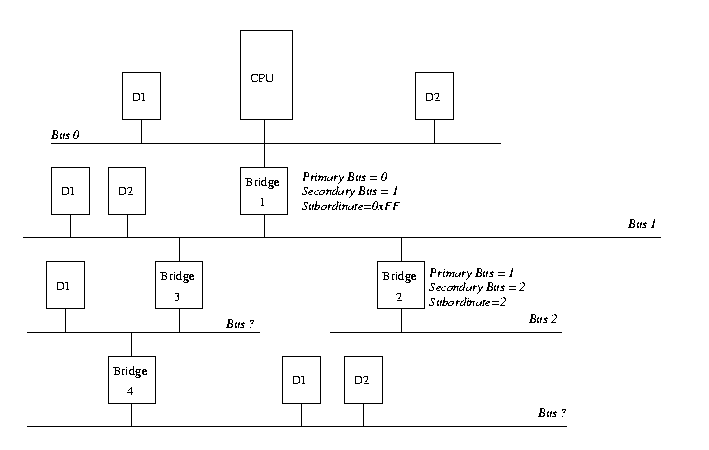
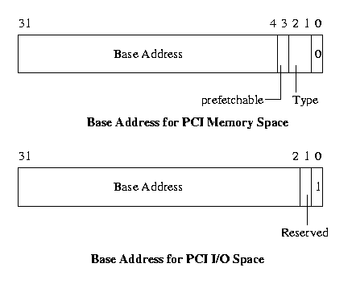

# 第六章 PCI

``外围设备互连(PCI)是一种将系统中外部设备以结构化与可控制方式连接到起来的总线标准，包括系统部件连接的电气特性及行为。本章将详细讨论Linux核心对系统中的PCI总线与设备的初始化过程。

图6.1 一个基于PCI的系统示意图

图6.1是一个基于PCI的系统示意图。PCI总线和PCI-PCI桥接器在连接系统中设备到上起关键作用，在这个系统中CPU和视频设备被连到PCI bus 0上，它是系统中的主干PCI总线。而PCI-PCI桥接器这个特殊PCI设备将主干总线PCI bus 0与下级总线PCI bus 1连接到一起。PCI标准术语中，PCI bus 1是PCI-PCI桥接器的downstream而PCI bus 0是此桥接器的up-stream。SCSI和以太网设备通过二级PCI总线连接到这个系统中。而在物理实现上，桥接器和二级PCI总线被集成到一块PCI卡上。而PCI-ISA桥接器用来支持古老的ISA设备，图中有一个高级I/O控制芯片来控制键盘、鼠标及软盘设备。

## 6.1 PCI地址空间

CPU和PCI设备需要存取在它们之间共享的内存空间。这块内存区域被设备驱动用来控制PCI设备并在CPU与PCI设备之间传递信息。最典型的共享内存包括设备的控制与状态寄存器。这些寄存器用来控制设备并读取其 信息。例如PCI SCSI设备驱动可以通过读取其状态寄存器，找出已准备好将一块数据写入SCSI磁盘的SCSI设备。同时还可以在设备加电后，通过对控制寄存器写入信息来启动设备。

CPU的系统内存可以被用作这种共享内存，但是如果采用这种方式，则每次PCI设备访问此内存块时，CPU将被迫停止工作以等待PCI设备完成此操作。这种方式将共享内存限制成每次只允许一个系统设备访问。该策略会大大降低系统性能。但如果允许系统外设不受限制地访问主存也不是好办法。它的危险之处在于一个有恶意行为的设备将使整个系统置于不稳定状态。

外设有其自身的内存空间。CPU可以自由存取此空间，但设备对系统主存的访问将处于DMA（直接内存访问）通道的严格控制下。ISA设备需要存取两个地址空间：ISA I/O（输入输出）和ISA内存。而PCI设备需要访问三种地址空间：PCI I/O、PCI内存和PCI配置空间。CPU则可以访问所有这些地址空间。PCI I/O和 PCI内存由设备驱动程序使用而PCI配置空间被Linux 核心中的PCI初始化代码使用。

Alpha AXP处理器并不能象访问系统地址空间那样随意访问这些地址空间，它只能通过辅助芯片组来存取这些 地址空间，如PCI配置空间。Alpha AXP处理器使用稀疏地址映射策略来从系统巨大的虚拟内存中"窃取"一部分并将其映射到PCI地址空间。

## 6.2 PCI 配置头

图6.2 PCI配置头

系统中每个PCI设备，包括PCI-PCI桥接器在内，都有一个配置数据结构，它通常位于PCI配置地址空间中。PCI配置头允许系统来标识与控制设备。配置头在PCI配置空间的位置取决于系统中PCI设备的拓扑结构。例如将一个PCI视频卡插入不同的PCI槽，其配置头位置会变化。但对系统没什么影响，系统将找到每个PCI设备与桥接器并使用它们配置头中的信息来配置其寄存器。

典型的办法是用PCI槽相对主板的位置来决定其PCI配置头在配置空间中的偏移。比如主板中的第一个PCI槽的PCI配置头位于配置空间偏移0处，而第二个则位于偏移256处（所有PCI配置头长度都相等，为256字节），其它槽可以由此类推。系统还将提供一种硬件相关机制以便PCI设置代码能正确的辨认出对应PCI总线上所有存在的设备的PCI配置头。通过PCI配置头中的某些域来判断哪些设备存在及哪些设备不存在（这个域叫厂商标志域: Vendor Identification field）。对空PCI槽中这个域的读操作将得到一个值为0xFFFFFFFF的错误信息。

图6.2给出了256字节PCI配置头的结构，它包含以下域：

- 厂商标识(Vendor Identification)

  用来唯一标识PCI设备生产厂家的数值。Digital的PCI厂商标识为0x1011而Intel的为0x8086。

- 设备标识(Device Identification)

  用来唯一标识设备的数值。Digital 21141快速以太设备的设备标识为0x0009。

- 状态(Status)

  此域提供PCI标准定义中此设备的状态信息。

- 命令(Command)

  通过对此域的写可以控制此设备，如允许设备访问PCI I/O内存。

- 分类代码(Class Code)

  此域标识本设备的类型。对于每种类型的视频，SCSI等设备都有标准的分类代码。如SCSI设备分类代码为0x0100。

- 基地址寄存器(Base Address Registers)

  这些寄存器用来决定和分配此设备可以使用的PCI I/O与PCI内存空间的类型，数量及位置。

- 中断引脚(Interrupt Pin)

  PCI卡上的四个物理引脚可以将中断信号从插卡上带到PCI总线上。这四个引脚标准的标记分别为A、B、C及D。中断引脚域描叙此PCI设备使用的引脚号。通常特定设备都是采用硬连接方式。这也是系统启动时，设备总使用相同中断引脚的原因。中断处理子系统用它来管理来自该设备的中断。

- 中断连线(Interrupt Line)

  本设备配置头中的中断连线域用来在PCI初始化代码、设备驱动以及Linux中断处理子系统间传递中断处理过程。虽然本域中记录的这个数值对于设备驱动毫无意义。但是它可以将中断处理过程从PCI卡上正确路由到Linux操作系统中相应的设备驱动中断处理代码中。在[interrupt](http://www.embeddedlinux.org.cn/linuxkernel/dd/interrupts.html)一章中将详细描叙Linux中断处理过程。

## 6.3 PCI I/O和PCI内存地址

这两个地址空间用来实现PCI设备和Linux核心中设备驱动程序之间的通讯。例如DEC21141快速以太网设备的内部寄存器被映射到PIC I/O空间上时，其对应的Linux设备驱动可以通过对这些寄存器的读写来控制此设备。PCI视频卡通常使用大量的PCI内存空间来存储视频信息。

在PCI系统建立并通过用PCI配置头中的命令域来打开这些地址空间前，系统决不允许对它们进行存取。值得注意的是只有PCI配置代码读取和写入PCI配置空间，Linux设备驱动只读写PCI I/O和PCI内存地址。

## 6.4 PCI-ISA 桥接器

这种桥接器通过将PCI I/O和PCI内存空间的存取转换成对ISA I/O和ISA内存的存取来支持古老的ISA设备。市场上许多主板中同时包含几个ISA总线槽和PCI槽。但今后对ISA设备的向后兼容支持将逐渐减弱，最终主板上只会有PCI槽。早期的Intel 8080 PC就将ISA设备的ISA地址空间固定了下来。即使在价值5000美圆的Alpha AXP 系统中其ISA软盘控制器地址也和最早IBM PC上的相同。PCI标准将PCI I/O和PCI内存的低端部分保留给系统中的ISA外设，另外还使用PCI-ISA桥接器实现从PCI内存访问到ISA内存访问的转换。

## 6.5 PCI-PCI 桥接器

PCI-PCI桥接器是一种将系统中所有PCI总线连接起来的特殊PCI设备。在简单系统中只存在一条PCI总线，由于受电气特性的限制，它所连接的PCI设备个数有限。引入PCI-PCI桥接器后系统可以使用更多的PCI设备。对于高性能服务器这是非常重要的。Linux提供了对PCI-PCI桥接器的全面支持。

### 6.5.1 PCI-PCI桥接器：PCI I/O和PCI 内存窗口

PCI-PCI桥接器将PCI I/O和PCI内存读写请求中的一个子集向下传送。例如在图6.1中，如果来自PCI 总线0请求是对SCSI或以太设备所拥有的PCI I/O或PCI内存的读写，则此PCI-PCI桥接器将只需把请求从总线0传递到PCI总线1上；所有其它PCI I/O和内存地址都将被它忽略。这个过滤使得这些地址信息不会在整个系统中扩散。为了实现这点，PCI-PCI桥接器必须编程为有某个PCI I/O及PCI内存基址和上限，只有在这个地址范围内的PCI地址访问才能从主干总线传递到二级总线。一旦系统中的PCI-PCI桥接器被设置成这样，则只要当Linux设备驱动程序通过这个窗口访问PCI I/O和PCI内存空间时，此PCI-PCI桥接器就将变得透明。这样也给Linux PCI设备驱动编写者提供了方便。我们在稍后的讨论中将看到Linux对PCI-PCI桥接器非常巧妙的配置。

### 6.5.2 PCI-PCI桥接器：PCI配置循环及PCI总线编号方式

图6.3 0类型PCI配置循环

图6.4 1类型PCI配置循环

为了让CPU上运行的PCI初始化代码能访问位于分支PCI总线上的设备，必须为桥接器提供某种机制以便它可以决定是否将配置循环从主干接口传递到其二级接口。循环是出现在PCI总线上的一个地址。PCI 标准定义了两种PCI配置寻址格式；类型0和类型1；它们分别如图6.3及6.4所示。类型0 PCI配置循环不包含总线序号,同时在此PCI总线上对应于这个PCI配置地址的所有PCI设备都会来对它们进行解释。类型0 配置循环的11 位到31位用来进行PCI设备选择。有种设计方式是让每位代表系统中一个不同的设备。这时11位对应PCI槽0中的PCI设备而12位标识槽1中的设备等等，如此类推。另外一种方式是直接将设备的槽号写入到位31到11中。系统使用哪种机制依赖于系统PCI内存控制器。

类型1 PCI配置循环包含一个PCI总线序号,同时这种配置循环将被除桥接器外的所有PCI设备所忽略。所有发现类型1 配置循环的PCI-PCI桥接器把它们看到的地址传递到各自的下级PCI总线。至于PCI-PCI桥接器是否忽略类型1 配置循环或将其传递到PCI总线则依赖于PCI-PCI桥接器的配置方式。每个PCI-PCI桥接器都拥有一个主干总线接口序号以及一个二级总线接口序号。主干总线是那个离CPU最近的PCI总线而二级总线是离它稍远的PCI总线。任何PCI-PCI桥接器还包含一个从属总线序号，这是所有二级总线接口所桥接的PCI总线中序号最大的那个。或者说这个从属总线序号是PCI-PCI桥接器向下连接中PCI总线的最大序号。当PCI-PCI桥接器看到类型1 PCI配置循环时它将进行如下操作：

- 

- 如果此总线序号不在桥接器的二级总线序号和从属总线序号之间则忽略掉它。

  

- 如果此总线序号与桥接器的二级总线序号相同则将其转换成类型0 配置命令。

  

- 如果此总线序号位于桥接器的二级总线序号与从属总线序号之间则将它不作改变的传递到二级总线接口中。

所以如果想寻址PCI-PCI配置例4中总线3上的设备1，我们继续从CPU中产生一个类型1 配置命令。桥接器1将其传递给总线1。桥接器2虽然忽略它但会将其转换成一个类型0 配置命令并送到总线3上，在那里设备1将作出相应反应。

PCI配置中总线序号由操作系统来分配。但是序号分配策略必须遵循对系统中所有PCI-PCI桥接器都正确的描叙：

“位于PCI-PCI桥接器后所有的PCI总线必须位于二级总线序号和从属总线序号之间”。

如果这个规则被打破，则PCI-PCI桥接器将不能正确的传递与转换类型1 PCI配置循环,同时系统将找不到或者不能正确地初始化系统中的PCI设备。为了满足这个序号分配策略，Linux以特殊的顺序配置这些特殊的设备。[PCI-PCI总线序号分配](http://www.embeddedlinux.org.cn/linuxkernel/dd/pci.html#PCI-PCI%D7%DC%CF%DF%D0%F2%BA%C5%B7%D6%C5%E4)一节详细描叙了Linux的PCI桥接器与总线序号分配策略。

## 6.6 Linux PCI 初始化过程

Linux中的PCI初始化代码逻辑上可分成三个部分：

- **PCI 设备驱动**

  这个伪设备驱动程序将从总线0开始搜索PCI系统并定位系统中所有的PCI设备与桥接器。它将建立起一个描叙系统拓扑结构的数据结构链表。另外它还为所有的桥接器进行编号。

-  

- **PCI BIOS**

  

  

  这个软件层提供了在bib-pci-bios定义中描叙的服务。即使Alpha AXP没有BIOS服务，Linux核心也将为它提供具有相同功能的代码。

-  

- **PCI Fixup**

  系统相关补丁代码将整理PCI初始化最后阶段的一些系统相关事物。

### 6.6.1 Linux 核心PCI数据结构

图6.5 Linux核心PCI数据结构

Linux核心初始化PCI系统时同时也建立了反应系统中真实PCI拓扑的数据结构。 图6.5显示了图6.1所标识的PCI示例系统中数据结构间关系。每个PCI设备（包括PCI-PCI桥接器）用一个pci_dev数据结构来描叙。每个PCI总线用一个pci_bus数据结构来描叙。这样系统中形成了一个PCI总线树，每棵树上由一些子PCI设备组成。由于PCI总线仅能通过PCI-PCI桥接器（除了主干PCI总线0）存取，所以pci_bus结构中包含一个指向PCI-PCI桥接器的指针。这个PCI设备是PCI总线的父PCI总线的子设备。

在图6.5中没有显示出来的是一个指向系统中所有PCI设备的指针，pci_devices。系统中所有的PCI设备将其各自的pci_dev数据结构加入此队列中。这个队列被Linux核心用来迅速查找系统中所有的PCI设备。

### 6.6.2 PCI设备驱动

PCI设备驱动根本不是真正的设备驱动，它仅是在系统初始化时由操作系统调用的一些函数。PCI初始化代码将扫描系统中所有的PCI总线以找到系统中所有的PCI设备（包括PCI-PCI桥接器）。

它通过PCI BIOS代码来检查当前PCI总线的每个插槽是否已被占用。如果被占用则它建立一个pci_dev数据结构来描叙此设备并将其连接到已知PCI设备链表中（由pci_devices指向）。

首先PCI初始化代码扫描PCI总线0。它将试图读取对每个PCI槽中可能的PCI设备厂商标志与设备标志域。当发现槽被占用后将建立一个pci_dev结构来描叙此设备。所有这些PCI初始化代码建立的pci_dev结构（包括PCI-PCI桥接器）将被连接到一个单向链表pci_devices中。

如果这个PCI设备是一个PCI-PCI桥接器则建立一个pci_bus结构并将其连接到由pci_root指向的pci_dev结构和pci_bus树中。PCI初始化代码通过类别代码0x060400来判断此PCI设备是否是一个PCI-PCI桥接器。然后Linux 核心代码将配置此PCI-PCI桥接器下方的PCI设备。如果有更多的桥接器被找到则进行同样的配置。显然这个过程使用了深度优先搜索算法；系统中PCI拓扑将在进行广度映射前先进行深度优先映射。图6.1中Linux将在配置PCI总线0上的视频设备前先配置PCI设备1上的以太与SCSI设备。

由于Linux优先搜索从属的PCI总线,它必须处理PCI-PCI桥接器二级总线与从属总线序号。在下面的pci-pci总线序号分配中将进行详细讨论。

#### 配置PCI-PCI桥接器 - 指定PCI总线序号

图6.6 配置PCI系统：第一部分

为了让PCI-PCI桥接器可以传递PCI I/O、PCI内存或PCI配置地址空间，它们需要如下内容：

- **Primary Bus Number:主干总线序号**

  位于PCI-PCI桥接器上方的总线序号

- **Secondary Bus Number:二级总线序号**

  位于PCI-PCI桥接器下方的总线序号

- **Subordinate Bus Number:从属总线序号**

  在桥接器下方可达的最大总线序号

- **PCI I/O and PCI Memory Windows:PCI I/O与PCI内存窗口**

  对于PCI-PCI桥接器下方所有PCI I/O地址空间与PCI内存地址空间的窗口基址和大小。

配置任一PCI-PCI桥接器时我们对此桥接器的从属总线序号一无所知。不知道是否还有下一级桥接器存在,同时也不知道指派给它们的序号是什么。但可以使用深度优先遍历算法来对扫描出指定PCI-PCI桥接器连接的每条总线，同时将它们编号。当找到一个PCI-PCI桥接器时，其二级总线被编号并且将临时从属序号0xff指派给它以便对其所有下属PCI-PCI桥接器进行扫描与指定序号。以上过程看起来十分复杂，下面将提供一个实例以帮助理解。

- **PCI-PCI 桥接器序号分配：步骤1**

  考虑图6.6所显示的拓扑结构，第一个被扫描到的桥接器将是桥1。所以桥1下方的总线将被编号成总线1,同时桥1被设置为二级总线1且拥有临时总线序号0xff。这意味着所有PCI总线序号为1或以上的类型1 PCI配置地址将被通过桥1传递到PCI总线1上。如果其总线序号为1则此配置循环将被转换成类型0 配置循环，对于其它序号不作转换。这正是Linux PCI初始化代码所需要的按序访问及扫描 PCI总线1。 图6.7 配置PCI系统：第二部分

- **PCI-PCI 桥接器序号分配：第二步**

  由于Linux使用深度优先算法,初始化代码将继续扫描PCI总线1。在此处它将发现一个PCI-PCI桥接器2。除此桥接器2外再没有其它桥接器存在，因此它被分配给从属总线序号2，这正好和其二级接口序号相同。图6.7画出了此处的PCI-PCI桥接器与总线的编号情况。 图6.8 配置PCI系统：第三部分

- **PCI-PCI 桥接器序号分配：步骤三**

  PCI初始化代码将继续扫描总线1并发现另外一个PCI-PCI桥接器，桥3。桥3的主干总线接口序号被设置成1，二级总线接口序号为3,同时从属总线序号为0xff。图6.8给出了系统现在的配置情况。 带总线序号1、2或者3的类型1 PCI配置循环将被发送到正确的PCI总线。 图6.9 配置PCI系统：第四部分

- **PCI-PCI 桥接器序号分配：步骤四**

  Linux开始沿PCI总线3向下扫描PCI-PCI桥接器。PCI总线3上有另外一个PCI-PCI桥接器（桥4）， 桥4的主干总线序号被设置成3，二级总线序号为4。由于它是此分支上最后一个桥接器所以它的从属总线接口序号为4。初始化代码将重新从PCI-PCI桥接器3开始并将其从属总线序号设为4。 最后PCI初始化代码将PCI-PCI桥接器1的从属总线序号设置为4。图6.9给出了最后的总线序号分配情况。

### 6.6.3 PCI BIOS 函数

PCI BIOS函数是一组适用于所有平台的标准过程。在Intel和Alpha AXP系统上没有区别。虽然在CPU控制下可以用它们对所有PCI地址空间进行访问。但只有Linux核心代码和设备驱动才能使用它们。

 

### 6.6.4 PCI 补丁代码

在Alpha AXP平台上的PCI补丁代码所作工作量要大于Intel平台。

基于Intel的系统在系统启动时就已经由系统BIOS完成了PCI系统的配置。Linux只需要完成简单的映射配置. 非Intel系统将需要更多的配置：

- 

- 为每个设备分配PCI I/O及PCI内存空间。
- 为系统中每个PCI-PCI桥接器配置PCI I/O和PCI内存地址窗口。
- 为这些设备产生中断连线值；用来控制设备的中断处理。

下一节将描叙这些代码的工作过程。

#### 确定设备所需PCI I/O和PCI内存空间的大小

系统要查询每个PCI设备需要多少PCI I/O于PCI内存地址空间。为了完成这项工作，每个基地址寄存器将被写上全1并读取出来。设备将把不必要的地址位设为0从而有效的定义所需地址空间。

图6.10 PCI配置头：基地址寄存器

有两类基本的基地址寄存器，一类标识设备寄存器必须驻留的地址空间；另一类是PCI I/O或PCI内存空间。此寄存器的0位来进行类型的区分。图6.10给出了对应于PCI内存和PCI I/O两种不同类型的基地址寄存器。

确定某个基地址寄存器所需地址空间大小时,先向此寄存器写入全1再读取此寄存器,设备将在某些位填上0来形成一个二进制数表示所需有效地址空间。

以初始化DEC 21142 PCI快速以太设备为例，它将告诉系统需要0x100字节的PCI I/O空间或者PCI内存空间。于是初始化代码为其分配空间。空间分配完毕后，就可以在那些地址上看到21142的控制与状态寄存器。

#### 为PCI-PCI桥接器与设备分配PCI I/O与PCI内存

象所有内存一样，PCI I/O和PCI内存空间是非常有限甚至匮乏。非Intel系统的PCI补丁代码（或者Intel 系统的BIOS代码）必须为每个设备分配其所要求的内存。PCI I/O和PCI内存必须以自然对齐方式分配给每个设备。比如如果一个设备要求0xB0大小的PCI I/O空间则它必须和一个0xB0倍数的地址对齐。除此以外，对于任何指定桥接器，其PCI I/O和PCI内存基址必须以在1M字节边界上以4K字节方式对齐。所以在桥接器下方的设备的地址空间必须位于任意指定设备上方的PCI-PCI桥接器的内存范围内。进行有效的空间分配是一件比较困难的工作。

Linux使用的算法依赖于由PCI设备驱动程序建立的描叙PCI设备的总线/设备树，每个设备的地址空间按照PCI I/O内存顺序的升序来分配。同时再次使用遍历算法来遍历由PCI初始化代码建立的pci_bus和 pci_dev结构。从根PCI总线开始（由pci_boot指向）PCI补丁代码将完成下列工作：

- 使当前全局PCI I/O和内存的基址在4K，边界在1M上对齐。

  

- 对于当前总线上的每个设备（按照PCI I/O内存需要的升序排列）

  - 在PCI I/O和PCI内存中为其分配空间

    

  - 为全局PCI I/O和内存基址同时加上一个适当值

    

  - 授予设备对PCI I/O和PCI内存的使用权

   

  

- 为对于当前总线下方的所有总线循环分配空间。注意这将改变全局PCI I/O和内存基址。

  

- 使当前全局PCI I/O和内存的基址和边界分别在4K和1M对齐，以便确定当前PCI-PCI桥接器所需的PCI I/O和PCI内存基址及大小。

  

- 对此PCI-PCI桥接器编程，将其PCI I/O和PCI内存基址及界限连接到总线上。

  

- 打开PCI-PCI桥接器上的PCI I/O和PCI内存访问桥接功能。这时在此桥接器主干PCI总线上位于此桥接器PCI I/O和PCI内存地址窗口中的任何PCI I/O或者PCI内存地址将被桥接到二级PCI总线上。

以图6.1中的PCI系统为例，PCI补丁代码将以如下方式设置系统：

- **对齐PCI基址**

  PCI I/O基址为0x4000而PCI内存基址为0x100000。这样允许PCI-ISA桥接器将此地址以下的地址转换成ISA地址循环。

- **视频设备**

  我们按照它的请求从当前PCI内存基址开始分配0x200000字节给它，这样可以在边界上对齐。PCI内存基址被移到0x400000同时PCI I/O基址保持在0x4000。

- **PCI-PCI 桥接器**

  现在我们将穿过PCI-PCI桥接器来分配PCI内存，注意此时我们无需对齐这些基址，因为它们已经自然对齐。**以太网设备**它需要0xB0字节的PCI I/O和PCI内存空间。这些空间从PCI I/O地址0x4000和PCI内存地址 0x400000处开始。PCI内存基址被移动到0x4000B0同时PCI I/O基址移动到0x40B0。**SCSI 设备**它需要0x1000字节PCI内存，所以它将在自然对齐后从从0x401000处开始分配空间。PCI I/O基址仍然在0x40B0而PCI内存基址被移动到0x402000。

- **PCI-PCI 桥接器的PCI I/O和内存窗口**

  现在我们重新回到桥接器并将其PCI I/O窗口设置成0x4000和0x40B0之间, 同时其PCI内存窗口被设置到0x400000和0x402000之间。这样此PCI-PCI桥接器将忽略对视频设备的PCI内存访问但传递对以太网设备或者SCSI设备的访问。

 

