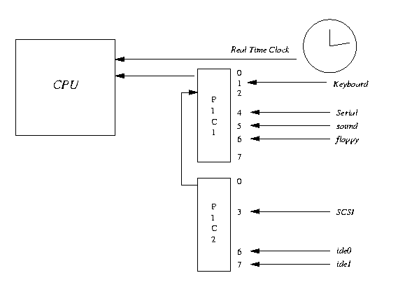
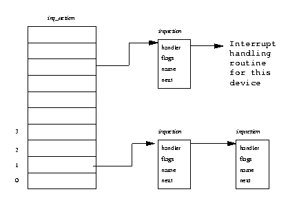

# 第七章 中断及中断处理

``本章主要描叙Linux核心的中断处理过程。尽管核心提供通用机制与接口来进行中断处理，大多数中断处理细节都是CPU体系结构相关的。

图7.1 中断路由的逻辑图

Linux通过使用多种不同硬件来执行许多不同任务。包括驱动显示器的视频设备、驱动硬盘的IDE设备等。 我们可以同步驱动这些设备，即我们可以发送一个请求执行一组操作（比如说将一块内存数据写入到磁盘）然后等待到执行完毕。这种方式虽然可以工作,但是效率很低，因为操作系统必须等待每个操作的完成,所以操作系统将花费大量时间在“忙等待”上。更为有效的方式是执行请求，然后转去执行其它任务。当设备完成请求时再通过中断通知操作系统。这样系统中可以同时存在多个未完成的任务。

不管CPU在作什么工作，为了让设备产生中断必须提供一些必要的硬件支持。几乎所有的通用处理器如 Alpha AXP都使用近似的方法。CPU的一些物理引脚被设计成可以改变电压（如从+5V变成-5V）从而引起CPU停止当前工作并开始执行处理中断的特殊代码：中断处理程序。这些引脚之一被连接到一个周期性时钟上并每隔千分之一秒就接收一次中断，其它引脚则可连接到系统中其它设备如SCSI控制器上。

系统常使用中断控制器来在向CPU中断引脚发送信号之前将设备中断进行分组。这样可以节省CPU上中断引脚个数，同时增加了系统设计的灵活性。此中断控制器通过屏蔽与状态寄存器来控制中断。通过设置屏蔽寄存器中的某些位可以使能或者关闭中断，读取状态寄存器可得到系统当前处于活动状态的中断。

系统中有些中断是通过硬连线连接的，如实时时钟的周期性定时器可能被固定连接到中断控制器的引脚3上。而其它连接到控制器的引脚只能由插到特定ISA或PCI槽中的控制卡来决定。例如中断控制器中的引脚4可能被连接到PCI槽号0，但可能某天此槽中插入一块以太网卡而过几天又会换成SCSI控制器。总之每个系统都有其自身的中断路由机制，同时操作系统还应该能灵活处理这些情况。

多数现代通用微处理器使用近似的方法来处理中断。硬件中断发生时，CPU将停止执行当前指令并将跳转到内存中包含中断处理代码或中断处理代码指令分支的位置继续执行。这些代码在一种特殊CPU模式： 中断模式下执行。通常在此模式下不会有其它中断发生。但是也有例外；有些CPU将中断的优先级进行分类，此时更高优先级的中断还可能发生。这样意味着必须认真编写第一级中断处理代码，同时中断处理过程应该拥有其自身的堆栈，以便存储转到中断处理过程前的CPU执行状态（所有CPU的普通寄存器和上下文）。一些CPU具有一组特殊的寄存器-它们仅存在于中断模式中，在中断模式下可以使用这些寄存器来保存执行所需要的执行上下文。

当中断处理完毕后CPU状态将被重储，同时中断也将被释放。CPU将继续做那些中断发生前要做的工作。中断处理代码越精炼越好，这样将减少操作系统阻塞在中断上的时间与频率。

## 7.1 可编程中断控制器

系统设计者可以自由选择中断结构，一般的IBM PC兼容将使用Intel 82C59A-2 CMOS可编程中断控制器或其派生者。这种控制器在PC诞生之前便已经产生，它的可编程性体现在那些位于众所周知ISA内存位置中的寄存器上。非Intel系统如基于Alpha AXP的PC不受这些体系结构限制，它们经常使用各种不同的中断控制器。

图7.1给出了两个级连的8位控制器，每个控制器都有一个屏蔽与中断状态寄存器：PIC1和PIC2。这两个屏蔽寄存器分别位于ISA I/O空间0x21和0xA1处，状态寄存器则位于0x20和0xA0。对此屏蔽寄存器某个特定位置位将使能某一中断，写入0则屏蔽它。但是不幸的是中断屏蔽寄存器是只写的，所以你无法读取你写入的值。这也意味着Linux必须保存一份对屏蔽寄存器写入值的局部拷贝。一般在中断使能和屏蔽例程中修改这些保存值，同时每次将这些全屏蔽码写入寄存器。

当有中断产生时，中断处理代码将读取这两个中断状态寄存器（ISR）。它将0x20中的ISR看成一个16位中断寄存器的低8位而将0xA0中的ISR看成其高8位。这样0xA0中ISR第1位上的中断将被视作系统中断9。PIC1 上的第二位由于被用来级连PIC2所以不能作其它用处，PIC2上的任何中断将导致PIC1的第二位被置位。

## 7.2 初始化中断处理数据结构

核心的中断处理数据结构在设备驱动请求系统中断控制时建立。为完成此项工作，设备驱动使用一组Linux核心函数来请求中断，使能中断和屏蔽中断。

每个设备驱动将调用这些过程来注册其中断处理例程地址。

有些中断由于传统的PC体系结构被固定下来，所以驱动仅需要在其初始化时请求它的中断。软盘设备驱动正是使用的这种方式;它的中断号总为6。有时设备驱动也可能不知道设备使用的中断号。对PCI设备驱动来说这不是什么大问题，它们总是可以知道其中断号。但对于ISA设备驱动则没有取得中断号的方便方式。Linux通过让设备驱动检测它们的中断号来解决这个问题。

设备驱动首先迫使设备引起一个中断。系统中所有未被分配的中断都被使能。此时设备引发的中断可以通过可编程中断控制器来发送出去。Linux再读取中断状态寄存器并将其内容返回给设备驱动。非0结果则表示在此次检测中有一个或多个中断发生。设备驱动然后将关闭检测并将所有未分配中断屏蔽掉。

如果ISA设备驱动成功找到了设备的IRQ号，就可以象平常一样请求对设备的控制。

基于PCI系统比基于ISA系统有更多的动态性。ISA设备使用的中断引脚通常是通过硬件设备上的跳线来设置并固定在设备驱动中。PCI设备在系统启动与初始化PCI时由PCI BIOS或PCI子系统来分配中断。每个PCI设备可以使用A，B，C或D之中的任意中断。这个中断在设备建立时确定且通常多数设备的缺省中断为 A。PCI槽中的PCI中断连线A，B，C和D被正确路由到中断控制器中。所以PCI槽4上的引脚A可能被路由到中断控制器上的引脚6，PCI槽7上的引脚B被路由到中断控制器上的引脚7等等。

如何路由PCI中断完全取决于特定的系统，一般设置代码能理解PCI中断路由拓扑。在基于Intel的PC上由系统BIOS代码在启动时作这些设置而在不带BIOS（如Alpha AXP）系统中由Linux核心来完成这个任务。

PCI设置代码将每个设备对应的中断控制器的引脚号写入PCI配置头中。通过得到PCI中断路由拓扑及设备的PCI槽号和PCI中断引脚设置代码可以确定其对应的中断引脚（或IRQ）号。设备使用的中断引脚被保存在此设备的PCI配置头中为此目的保留的中断连线域中。当运行设备驱动时这些信息被读出并用来控制来自Linux核心的中断请求。

系统中可能存在许多PCI中断源，比如在使用PCI-PCI桥接器时。这些中断源的个数可能将超出系统可编程中断控制器的引脚数。此时PCI设备必须共享中断号-中断控制器上的一个引脚可能被多个PCI设备同时使用。Linux让中断的第一个请求者申明此中断是否可以共享。中断的共享将导致irq_action数组中的一个入口同时指向几个irqaction数据结构。当共享中断发生时Linux将调用对应此中断源的所有中断处理过程。没有中断需要服务时，任何共享此中断（所有的PCI设备驱动）的设备驱动都要准备好其中断处理过程的调用。

## 7.3 中断处理

图7.2 Linux中断处理数据结构

Linux中断处理子系统的一个基本任务是将中断正确路由到中断处理代码中的正确位置。这些代码必须了解系统的中断拓扑结构。例如在中断控制器上引脚6上发生的软盘控制器中断必须被辨认出的确来自软盘并路由到系统的软盘设备驱动的中断处理代码中。Linux使用一组指针来指向包含处理系统中断的例程的调用地址。这些例程属于对应于此设备的设备驱动，同时由它负责在设备初始化时为每个设备驱动申请其请求的中断。图7.2给出了一个指向一组irqaction的irq_action指针。每个irqaction数据结构中包含了对应于此中断处理的相关信息，包括中断处理例程的地址。而中断个数以及它们被如何处理则会根据体系结构及系统的变化而变化。Linux中的中断处理代码就是和体系结构相关的。这也意味着irq_action数组的大小随于中断源的个数而变化。

中断发生时Linux首先读取系统可编程中断控制器中中断状态寄存器判断出中断源，将其转换成irq_action数组中偏移值。例如中断控制器引脚6来自软盘控制器的中断将被转换成对应于中断处理过程数组中的第7个指针。如果此中断没有对应的中断处理过程则Linux核心将记录这个错误，不然它将调用对应此中断源的所有irqaction数据结构中的中断处理例程。

当Linux核心调用设备驱动的中断处理过程时此过程必须找出中断产生的原因以及相应的解决办法。为了找到设备驱动的中断原因，设备驱动必须读取发生中断设备上的状态寄存器。设备可能会报告一个错误或者通知请求的处理已经完成。如软盘控制器可能将报告它已经完成软盘读取磁头对某个扇区的正确定位。一旦确定了中断产生的原因，设备驱动还要完成更多的工作。如果这样Linux核心将推迟这些操作。以避免了CPU在中断模式下花费太多时间。在设备驱动中断中我们将作详细讨论。