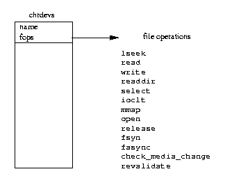
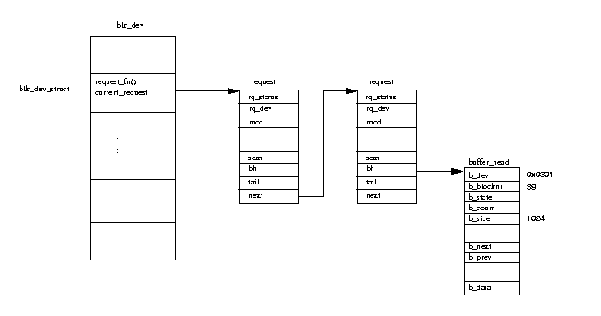
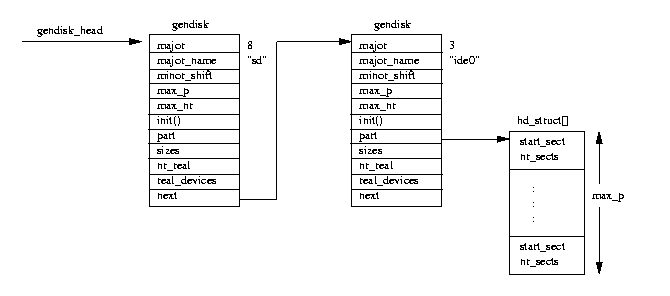
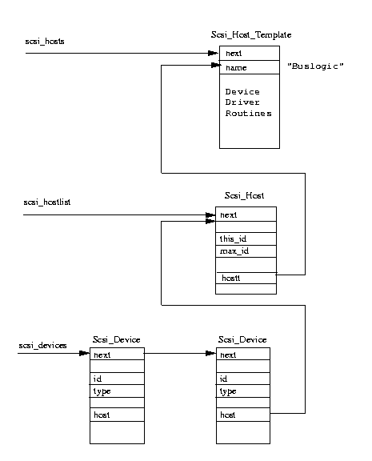

# 第八章 设备驱动


``操作系统的目的之一就是将系统硬件设备细节从用户视线中隐藏起来。例如虚拟文件系统对各种类型已安装的文件系统提供了统一的视图而屏蔽了具体底层细节。本章将描叙Linux核心对系统中物理设备的管理。

CPU并不是系统中唯一的智能设备，每个物理设备都拥有自己的控制器。键盘、鼠标和串行口由一个高级I/O芯片统一管理，IDE控制器控制IDE硬盘而SCSI控制器控制SCSI硬盘等等。每个硬件控制器都有各自的控制和状态寄存器（CSR）并且各不相同。例如Adaptec 2940 SCSI控制器的CSR与NCR 810 SCSI控制器完全不一样。这些CSR被用来启动和停止，初始化设备及对设备进行诊断。在Linux中管理硬件设备控制器的代码并没有放置在每个应用程序中而是由内核统一管理。这些处理和管理硬件控制器的软件就是设备驱动。Linux核心设备驱动是一组运行在特权级上的内存驻留底层硬件处理共享库。正是它们负责管理各个设备。

设备驱动的一个基本特征是设备处理的抽象概念。所有硬件设备都被看成普通文件；可以通过和操纵普通文件相同的标准系统调用来打开、关闭、读取和写入设备。系统中每个设备都用一种特殊的设备相关文件来表示(device special file)，例如系统中第一个IDE硬盘被表示成/dev/hda。块（磁盘）设备和字符设备的设备相关文件可以通过mknod命令来创建，并使用主从设备号来描叙此设备。网络设备也用设备相关文件来表示，但Linux寻找和初始化网络设备时才建立这种文件。由同一个设备驱动控制的所有设备具有相同的主设备号。从设备号则被用来区分具有相同主设备号且由相同设备驱动控制的不同设备。 例如主IDE硬盘的每个分区的从设备号都不相同。如/dev/hda2表示主IDE硬盘的主设备号为3而从设备号为2。Linux通过使用主从设备号将包含在系统调用中的（如将一个文件系统mount到一个块设备）设备相关文件映射到设备的设备驱动以及大量系统表格中，如字符设备表，chrdevs。

Linux支持三类硬件设备：字符、块及网络设备。字符设备指那些无需缓冲直接读写的设备，如系统的串口设备/dev/cua0和/dev/cua1。块设备则仅能以块为单位读写，典型的块大小为512或1024字节。块设备的存取是通过buffer cache来进行并且可以进行随机访问，即不管块位于设备中何处都可以对其进行读写。块设备可以通过其设备相关文件进行访问，但更为平常的访问方法是通过文件系统。只有块设备才能支持可安装文件系统。网络设备可以通过BSD套接口访问，我们将在[网络](http://www.embeddedlinux.org.cn/linuxkernel/net/net.html)一章中讨论网络子系统。

Linux核心中虽存在许多不同的设备驱动但它们具有一些共性：

- **核心代码**

  设备驱动是核心的一部分，象核心中其它代码一样，出错将导致系统的严重损伤。一个编写奇差的设备驱动甚至能使系统崩溃并导致文件系统的破坏和数据丢失。

-  

- **核心接口**

  设备驱动必须为Linux核心或者其从属子系统提供一个标准接口。例如终端驱动为Linux核心提供了一个文件I/O接口而SCSI设备驱动为SCSI子系统提供了一个SCSI设备接口，同时此子系统为核心提供了文件I/O和buffer cache接口。

- **核心机制与服务**

-  

  设备驱动可以使用标准的核心服务如内存分配、中断发送和等待队列等等。

   

- **动态可加载**

  多数Linux设备驱动可以在核心模块发出加载请求时加载，同时在不再使用时卸载。这样核心能有效地利用系统资源。

   

- **可配置**

  Linux设备驱动可以连接到核心中。当核心被编译时，哪些核心被连入核心是可配置的。

-  

- **动态性**

  当系统启动及设备驱动初始化时将查找它所控制的硬件设备。如果某个设备的驱动为一个空过程并不会有什么问题。此时此设备驱动仅仅是一个冗余的程序，它除了会占用少量系统内存外不会对系统造成什么危害。


## 8.1 轮询与中断

设备被执行某个命令时，如“将读取磁头移动到软盘的第42扇区上”，设备驱动可以从轮询方式和中断方式中选择一种以判断设备是否已经完成此命令。

轮询方式意味着需要经常读取设备的状态，一直到设备状态表明请求已经完成为止。如果设备驱动被连接进入核心，这时使用轮询方式将会带来灾难性后果：核心将在此过程中无所事事，直到设备完成此请求。但是轮询设备驱动可以通过使用系统定时器，使核心周期性调用设备驱动中的某个例程来检查设备状态。 定时器过程可以检查命令状态及Linux软盘驱动的工作情况。使用定时器是轮询方式中最好的一种，但更有效的方法是使用中断。

基于中断的设备驱动会在它所控制的硬件设备需要服务时引发一个硬件中断。如以太网设备驱动从网络上接收到一个以太数据报时都将引起中断。Linux核心需要将来自硬件设备的中断传递到相应的设备驱动。这个过程由设备驱动向核心注册其使用的中断来协助完成。此中断处理例程的地址和中断号都将被记录下来。在/proc/interrupts文件中你可以看到设备驱动所对应的中断号及类型：

```
 0:     727432   timer
 1:      20534   keyboard
 2:          0   cascade
 3:      79691 + serial
 4:      28258 + serial
 5:          1   sound blaster
11:      20868 + aic7xxx
13:          1   math error
14:        247 + ide0
15:        170 + ide1
```

对中断资源的请求在驱动初始化时就已经完成。作为IBM PC体系结构的遗产，系统中有些中断已经固定。例如软盘控制器总是使用中断6。其它中断，如PCI设备中断，在启动时进行动态分配。设备驱动必须在取得对此中断的所有权之前找到它所控制设备的中断号（IRQ）。Linux通过支持标准的PCI BIOS回调函数来确定系统中PCI设备的中断信息，包括其IRQ号。

如何将中断发送给CPU本身取决于体系结构，但是在多数体系结构中，中断以一种特殊模式发送同时还将阻止系统中其它中断的产生。设备驱动在其中断处理过程中作的越少越好，这样Linux核心将能很快的处理完中断并返回中断前的状态中。为了在接收中断时完成大量工作，设备驱动必须能够使用核心的底层处理例程或者任务队列来对以后需要调用的那些例程进行排队。


## 8.2 直接内存访问 (DMA)

数据量比较少时，使用中断驱动设备驱动程序能顺利地在硬件设备和内存之间交换数据。例如波特率为9600的modem可以每毫秒传输一个字符。如果硬件设备引起中断和调用设备驱动中断所消耗的中断时延比较大（如2毫秒）则系统的综合数据传输率会很低。则9600波特率modem的数据传输只能利用0.002%的CPU处理时间。高速设备如硬盘控制器或者以太网设备数据传输率将更高。SCSI设备的数据传输率可达到每秒40M字节。

直接内存存取（DMA）是解决此类问题的有效方法。DMA控制器可以在不受处理器干预的情况下在设备和系统内存之间高速传输数据。PC机的ISA DMA控制器有8个DMA通道，其中七个可以由设备驱动使用。每个DMA通道具有一个16位的地址寄存器和一个16位的记数寄存器。为了初始化数据传输，设备驱动将设置DMA通道地址和记数寄存器以描叙数据传输方向以及读写类型。然后通知设备可以在任何时候启动DMA操作。传输结束时设备将中断PC。在传输过程中CPU可以转去执行其他任务。

设备驱动使用DMA时必须十分小心。首先DMA控制器没有任何虚拟内存的概念，它只存取系统中的物理内存。同时用作DMA传输缓冲的内存空间必须是连续物理内存块。这意味着不能在进程虚拟地址空间内直接使用DMA。但是你可以将进程的物理页面加锁以防止在DMA操作过程中被交换到交换设备上去。另外DMA控制器所存取物理内存有限。DMA通道地址寄存器代表DMA地址的高16位而页面寄存器记录的是其余8位。所以DMA请求被限制到内存最低16M字节中。

DMA通道是非常珍贵的资源，一共才有7个并且还不能够在设备驱动间共享。与中断一样，设备驱动必须找到它应该使用那个DMA通道。有些设备使用固定的DMA通道。例如软盘设备总使用DMA通道2。有时设备的DMA通道可以由跳线来设置，许多以太网设备使用这种技术。设计灵活的设备将告诉系统它将使用哪个DMA通道，此时设备驱动仅需要从DMA通道中选取即可。

Linux通过dma_chan（每个DMA通道一个）数组来跟踪DMA通道的使用情况。dma_chan结构中包含有两个域，一个是指向此DMA通道拥有者的指针，另一个指示DMA通道是否已经被分配出去。当敲入cat /proc/dma打印出来的结果就是dma_chan结构数组。


## 8.3 内存

设备驱动必须谨慎使用内存。由于它属于核心,所以不能使用虚拟内存。系统接收到中断信号时或调度底层任务队列处理过程时，设备驱动将开始运行，而当前进程会发生改变。设备驱动不能依赖于任何运行的特定进程，即使当前是为该进程工作。与核心的其它部分一样，设备驱动使用数据结构来描叙它所控制的设备。这些结构被设备驱动代码以静态方式分配，但会增大核心而引起空间的浪费。多数设备驱动使用核心中非页面内存来存储数据。

Linux为设备驱动提供了一组核心内存分配与回收过程。核心内存以2的次幂大小的块来分配。如512或128字节，此时即使设备驱动的需求小于这个数量也会分配这么多。所以设备驱动的内存分配请求可得到以块大小为边界的内存。这样核心进行空闲块组合更加容易。

请求分配核心内存时Linux需要完成许多额外的工作。如果系统中空闲内存数量较少，则可能需要丢弃些物理页面或将其写入交换设备。一般情况下Linux将挂起请求者并将此进程放置到等待队列中直到系统中有足够的物理内存为止。不是所有的设备驱动（或者真正的Linux核心代码）都会经历这个过程，所以如分配核心内存的请求不能立刻得到满足,则此请求可能会失败。如果设备驱动希望在此内存中进行DMA，那么它必须将此内存设置为DMA使能的。这也是为什么是Linux核心而不是设备驱动需要了解系统中的DMA使能内存的原因。


## 8.4 设备驱动与核心的接口

Linux核心与设备驱动之间必须有一个以标准方式进行互操作的接口。每一类设备驱动：字符设备、块设备 及网络设备都提供了通用接口以便在需要时为核心提供服务。这种通用接口使得核心可以以相同的方式来对待不同的设备及设备驱动。如SCSI和IDE硬盘的区别很大但Linux对它们使用相同的接口。

Linux动态性很强。每次Linux核心启动时如遇到不同的物理设备将需要不同的物理设备驱动。Linux允许通过配置脚本在核心重建时将设备驱动包含在内。设备驱动在启动初始化时可能会发现系统中根本没有任何硬件需要控制。其它设备驱动可以在必要时作为核心模块动态加载到。为了处理设备驱动的动态属性，设备驱动在初始化时将其注册到核心中去。Linux维护着已注册设备驱动表作为和设备驱动的接口。这些表中包含支持此类设备例程的指针和相关信息。


### 8.4.1 字符设备



图8.1 字符设备


字符设备是Linux设备中最简单的一种。应用程序可以和存取文件相同的系统调用来打开、读写及关闭它。即使此设备是将Linux系统连接到网络中的PPP后台进程的modem也是如此。字符设备初始化时，它的设备驱动通过在device_struct结构的chrdevs数组中添加一个入口来将其注册到Linux核 心上。设备的主设备标志符用来对此数组进行索引（如对tty设备的索引4）。设备的主设备标志符是固定的。

chrdevs数组每个入口中的device_struct数据结构包含两个元素；一个指向已注册的设备驱动名称，另一个则是指向一组文件操作指针。它们是位于此字符设备驱动内部的文件操作例程的地址指针，用来处理相关的文件操作如打开、读写与关闭。/proc/devices中字符设备的内容来自chrdevs数组。

当打开代表字符设备的字符特殊文件时（如/dev/cua0），核心必须作好准备以便调用相应字符设备驱动的文件操作例程。与普通的目录和文件一样，每个字符特殊文件用一个VFS节点表示。每个字符特殊文件使用的VFS inode和所有设备特殊文件一样，包含着设备的主从标志符。这个VFS inode由底层的文件系统来建立（比如EXT2），其信息来源于设备相关文件名称所在文件系统。

每个VFS inode和一组文件操作相关联,它们根据inode代表的文件系统对象变化而不同。当创建一个代表字符相关文件的VFS inode时，其文件操作被设置为缺省的字符设备操作。

字符设备只有一个文件操作:打开文件操作。当应用打开字符特殊文件时，通用文件打开操作使用设备的主标志符来索引此chrdevs数组，以便得到那些文件操作函数指针。同时建立起描叙此字符特殊文件的file结构,使其文件操作指针指向此设备驱动中的文件操作指针集合。这样所有应用对它进行的文件操作都被映射到此字符设备的文件操作集合上。


### 8.4.2 块设备

块设备也支持以文件方式访问。系统对块设备特殊文件提供了非常类似于字符特殊文件的文件操作机制。Linux在blkdevs数组中维护所有已注册的块设备。象chrdevs数组一样，blkdevs也使用设备的主设备号进行索引。其入口也是device_struct结构。和字符设备不同的是系统有几类块设备。SCSI设备是一类而IDE设备则是另外一类。它们将以各自类别登记到Linux核心中并为核心提供文件操作功能。某类块设备的设备驱动为此类型设备提供了类别相关的接口。如SCSI设备驱动必须为SCSI子系统提供接口以便SCSI子系统能用它来为核心提供对此设备的文件操作。

和普通文件操作接口一样, 每个块设备驱动必须为buffer cache提供接口。每个块设备驱动将填充其在blk_dev数组中的blk_dev_struct结构入口。数组的索引值还是此设备的主设备号。这个blk_dev_struct结构包含请求过程的地址以及指向请求数据结构链表的指针，每个代表一个从buffer cache中来让设备进行数据读写的请求。





图8.2 buffer cache块设备请求


每当buffer cache希望从一个已注册设备中读写数据块时,它会将request结构添加到其blk_dev_struct中。图8.2表示每个请求有指向一个或多个buffer_hear结构的指针，每个请求读写一块数据。如buffer cache对buffer_head结构上锁, 则进程会等待到对此缓冲的块操作完成。每个request结构都从静态链表all_requests中分配。如果此请求被加入到空请求链表中,则将调用驱动请求函数以启动此请求队列的处理,否则该设备驱动将简单地处理请求链表上的request 。

一旦设备驱动完成了请求则它必须将每个buffer_heard结构从request结构中清除，将它们标记成已更新状态并解锁之。对buffer_head的解锁将唤醒所有等待此块操作完成的睡眠进程。如解析文件名称时,EXT2文件系统必须从包含此文件系统的设备中读取包含下个EXT2目录入口的数据块。在buffer_head上睡眠的进程在设备驱动被唤醒后将包含此目录入口。request数据结构被标记成空闲以便被其它块请求使用。


## 8.5 硬盘

磁盘驱动器提供了一个永久性存储数据的方式，将数据保存在旋转的盘片上。写入数据时磁头将磁化盘片上的一个小微粒。这些盘片被连接到一个中轴上并以3000到10，000RPM（每分钟多少转）的恒定速度旋转。而软盘的转速仅为360RPM。磁盘的读/写磁头负责读写数据，每个盘片的两侧各有一个磁头。磁头读写时并不接触盘片表面而是浮在距表面非常近的空气垫中（百万分之一英寸）。磁头由一个马达驱动在盘片表面移动。所有的磁头被连在一起，它们同时穿过盘片的表面。

盘片的每个表面都被划分成为叫做磁道的狭窄同心圆。0磁道位于最外面而最大磁道位于最靠近中央主轴。柱面指一组相同磁道号的磁道。所以每个盘片上的第五磁道组成了磁盘的第五柱面。由于柱面号与磁道号相等所以我们经常可以看到以柱面描叙的磁盘布局。每个磁道可进一步划分成扇区。它是硬盘数据读写的最小单元同时也是磁盘的块大小。一般的扇区大小为512字节并且这个大小可以磁盘制造出来后格式化时设置。

一个磁盘经常被描绘成有多少各柱面、磁头以及扇区。例如系统启动时Linux将这样描叙一个IDE硬盘：

```
hdb: Conner Peripherals 540MB - CFS540A, 516MB w/64kB Cache, CHS=1050/16/63
```

这表示此磁盘有1050各柱面（磁道），16个磁头（8个盘片）且每磁道包含63个扇区。这样我们可以通过扇区数、块数以及512字节扇区大小计算出磁盘的存储容量为529200字节。这个容量和磁盘自身声称的516M字节并不相同，这是因为有些扇区被用来存放磁盘分区信息。有些磁盘还能自动寻找坏扇区并重新索引磁盘以正常使用。

物理硬盘可进一步划分成分区。一个分区是一大组为特殊目的而分配的扇区。对磁盘进行分区使得磁盘可以同时被几个操作系统或不同目的使用。许多Linux系统具有三个分区：DOS文件系统分区，EXT2文件系统分区和交换分区。硬盘分区用分区表来描叙；表中每个入口用磁头、扇区及柱面号来表示分区的起始与结束。对于用DOS格式化的硬盘有4个主分区表。但不一定所有的四个入口都被使用。fdisk 支持3中分区类型：主分区、扩展分区及逻辑分区。扩展分区并不是真正的分区，它只不过包含了几个逻辑分区。扩展和逻辑分区用来打破四个主分区的限制。以下是一个包含两个主分区的fdisk命令的输出：

```
Disk /dev/sda: 64 heads, 32 sectors, 510 cylinders
Units = cylinders of 2048 * 512 bytes

   Device Boot   Begin    Start      End   Blocks   Id  System
/dev/sda1            1        1      478   489456   83  Linux native
/dev/sda2          479      479      510    32768   82  Linux swap

Expert command (m for help): p

Disk /dev/sda: 64 heads, 32 sectors, 510 cylinders

Nr AF  Hd Sec  Cyl  Hd Sec  Cyl   Start    Size ID
 1 00   1   1    0  63  32  477      32  978912 83
 2 00   0   1  478  63  32  509  978944   65536 82
 3 00   0   0    0   0   0    0       0       0 00
 4 00   0   0    0   0   0    0       0       0 00
```

这些内容表明第一个分区从柱面（或者磁道）0，头1和扇区1开始一直到柱面477，扇区22和头63结束。 由于每磁道有32个扇区且有64个读写磁头则此分区在大小上等于柱面数。fdisk使分区在柱面边界上对齐。 它从最外面的柱面0开始并向中间扩展478个柱面。第二个分区：交换分区从478号柱面开始并扩展到磁盘的最内圈。



图8.3 磁盘链表


在初始化过程中Linux取得系统中硬盘的拓扑结构映射。它找出有多少中硬盘以及是什么类型。另外Linux 还要找到每个硬盘的分区方式。所有这些都用由gendisk_head链指针指向的gendisk结构链表来表示。每个磁盘子系统如IDE在初始化时产生表示磁盘结构的gendisk结构。同时它将注册其文件操作例程并将此入口添加到blk_dev数据结构中。每个gendisk结构包含唯一的主设备号，它与块相关设备的主设备号相同。例如SCSI磁盘子系统创建了一个主设备号为8的gendisk入口（"sd"），这也是所有SCSI硬盘设备的主设备号。图8.3给出了两个gendisk入口，一个表示SCSI磁盘子系统而另一个表示IDE磁盘控制器。ide0表示主IDE控制器。

尽管磁盘子系统在其初始化过程中就建立了gendisk入口, 但是只有Linux作分区检查时才使用。每个磁盘子系统通过维护一组数据结构将物理硬盘上的分区与某个特殊主从特殊设备互相映射。无论何时通过 buffer cache或文件操作对块设备的读写都将被核心定向到对具有某个特定主设备号的设备文件上（如 /dev/sda2）。而从设备号的定位由各自设备驱动或子系统来映射。


### 8.5.1 IDE 硬盘

Linux系统上使用得最广泛的硬盘是集成电子磁盘或者IDE硬盘。IDE是一个硬盘接口而不是类似SCSI的I/O总线接口。每个IDE控制器支持两个硬盘，一个为主另一个为从。主从硬盘可以通过盘上的跳线来设置。系统中的第一个IDE控制器成为主IDE控制器而另一个为从属控制器。IDE可以以每秒3.3M字节的传输率传输数据且最大容量为538M字节。EIDE或增强式IDE可以将磁盘容量扩展到8.6G字节而数据传输率为16.6M字节/秒。由于IDE和EIDE都比SCSI硬盘便宜, 所以大多现代PC机在包含一个或几个板上IDE控制器。

Linux以其发现控制器的顺序来对IDE硬盘进行命名。在主控制器中的主盘为/dev/hda而从盘为/dev/hdb。/dev/hdc用来表示从属IDE控制器中的主盘。IDE子系统将向Linux核心注册IDE控制器而不是IDE硬盘。主IDE控制器的主标志符为3而从属IDE控制器的主标志符为22。如果系统中包含两个IDE控制器则IDE子系统的入口在blk_dev和blkdevs数组的第2和第22处。IDE的块设备文件反应了这种编号方式，硬盘 /dev/hda和/dev/hdb都连接到主IDE控制器上，其主标志符为3。对IDE子系统上这些块相关文件的文件或者buffer cache的操作都通过核心使用主设备标志符作为索引定向到IDE子系统上。当发出请求时，此请求由哪个IDE硬盘来完成取决于IDE子系统。为了作到这一点IDE子系统使用从设备编号对应的设备特殊标志符，由它包含的信息来将请求发送到正确的硬盘上。位于主IDE控制器上的IDE从盘/dev/hdb的设备标志符为（3，64）。而此盘中第一个分区（/dev/hdb1）的设备标志符为(3，65)。


### 8.5.2 初始化IDE子系统

IDE磁盘与IBM PC关系非常密切。在这么多年中这些设备的接口发生了变化。这使得IDE子系统的初始化过程比看上去要复杂得多。

Linux可以支持的最多IDE控制器个数为4。每个控制器用ide_hwifs数组中的ide_hwif_t结构来表示。每个ide_hwif_t结构包含两个ide_drive_t结构以支持主从IDE驱动器。在IDE子系统的初始化过程中Linux通过访问系统CMOS来判断是否有关于硬盘的信息。这种CMOS由电池供电所以系统断电时也不会遗失其中的内容。它 位于永不停止的系统实时时钟设备中。此CMOS内存的位置由系统BIOS来设置，它将通知Linux系统中有多少个IDE控制器与驱动器。Linux使用这些从BIOS中发现的磁盘数据来建立对应此驱动器的ide_hwif_t结构。 许多现代PC系统使用PCI芯片组如Intel 82430 VX芯片组将PCI EIDE控制器封装在内。IDE子系统使用PCI BIOS回调函数来定位系统中PCI （E）IDE控制器。然后对这些芯片组调用PCI特定查询例程。

每次找到一个IDE接口或控制器就有建立一个ide_hwif_t结构来表示控制器和与之相连的硬盘。在操作过程中IDE驱动器对I/O内存空间中的IDE命令寄存器写入命令。主IDE控制器的缺省控制和状态寄存器是0x1F0 - 0x1F7。这个地址由早期的IBM PC规范设定。IDE驱动器为每个控制器向Linux注册块缓冲cache和VFS节点并将其加入到blk_dev和blkdevs数组中。IDE驱动器需要申请某个中断。一般主IDE控制器中断号为14而从属IDE控制器为15。然而这些都可以通过命令行选项由核心来重载。IDE驱动器同时还将gendisk入口加入到启动时发现的每个IDE控制器的gendisk链表中去。分区检查代码知道每个IDE控制器可能包含两个IDE硬盘。


### 8.5.3 SCSI 硬盘

SCSI（小型计算机系统接口）总线是一种高效的点对点数据总线，它最多可以支持8个设备，其中包括多个主设备。每个设备有唯一的标志符并可以通过盘上的跳线来设置。在总线上的两个设备间数据可以以同步或异步方式，在32位数据宽度下传输率为40M字节来交换数据。SCSI总线上可以在设备间同时传输数据与状态信息。initiator设备和target设备间的执行步骤最多可以包括8个不同的阶段。你可以从总线上5个信号来分辨SCSI总线的当前阶段。这8个阶段是：

- **BUS FREE**

  当前没有设备在控制总线且总线上无事务发生。

- **ARBITRATION**

  一个SCSI设备试图取得SCSI总线的控制权，这时它将其SCSI标志符放置到地址引脚上。具有最高SCSI标志符编号的设备将获得总线控制权。

- **SELECTION**

  当设备通过仲裁成功地取得了对SCSI总线的控制权后它必须向它准备发送命令的那个SCSI设备发出信号。具体做法是将目标设备的SCSI标志符放置在地址引脚上进行声明。

- **RESELECTION**

  在一个请求的处理过程中SCSI设备可能会断开连接。目标（target）设备将再次选择启动设备 （initiator）。不是所有的SCSI设备都支持此阶段。

- **COMMAND**

  此阶段中initiator设备将向target设备发送6、10或12字节命令。

- **DATA IN, DATA OUT**

  此阶段中数据将在initiator设备和target设备间传输。

- **STATUS**

  所有命令完毕后将进入此阶段，此时允许target设备向initiator设备发送状态信息以指示操作成功与否。

- **MESSAGE IN, MESSAGE OUT**

  此阶段附加信息将在initiator设备和target设备间传输。

Linux SCSI子系统由两个基本部分组成，每个由一个数据结构来表示。

- **host**

  一个SCSI host即一个硬件设备：SCSI控制权。NCR 810 PCI SCSI控制权即一种SCSI host。在Linux 系统中可以存在相同类型的多个SCSI控制权，每个由一个单独的SCSI host来表示。这意味着一个SCSI设备驱动可以控制多个控制权实例。SCSI host总是SCSI命令的initiator设备。

- **Device**

  虽然SCSI支持多种类型设备如磁带机、CD-ROM等等，但最常见的SCSI设备是SCSI磁盘。SCSI设备总是SCSI命令的target。这些设备必须区别对待，例如象CD-ROM或者磁带机这种可移动设备，Linux 必须检测介质是否已经移动。不同的磁盘类型有不同的主设备号，这样Linux可以将块设备请求发送到正确的SCSI设备。


#### 初始化SCSI子系统

SCSI子系统的初始化非常复杂，它必须反映处SCSI总线及其设备的动态性。Linux在启动时初始化SCSI子系统。 如果它找到一个SCSI控制器（即SCSI hosts）则会扫描此SCSI总线来找出总线上的所有设备。然后初始化这些设备并通过普通文件和buffer cache块设备操作使Linux核心的其它部分能使用这些设备。初始化过程分成四个阶段：

首先Linux将找出在系统核心连接时被连入核心的哪种类型的SCSI主机适配器或控制器有硬件需要控制。每个 核心中的SCSI host在builtin_scsi_hosts数组中有一个Scsi_Host_Template入口。而Scsi_Host_Template结构中包含执行特定SCSI host操作, 如检测连到此SCSI host的SCSI设备的例程的入口指针。这些例程在SCSI 子系统进行自我配置时使用同时它们还是支持此host类型的SCSI设备驱动的一部分。每个被检测的SCSI host， 即与真正SCSI设备连接的host将其自身的Scsi_Host_Template结构添加到活动SCSI hosts的scsi_hosts结构链表中去。每个被检测host类型的实例用一个scsi_hostlist链表中的Scsi_Host结构来表示。例如一个包含两个NCR810 PCI SCSI控制器的系统的链表中将有两个Scsi_Host入口，每个控制器对应一个。每个Scsi_Host 指向一个代表器设备驱动的Scsi_Host_Template。





图8.4 SCSI数据结构


现在每个SCSI host已经找到，SCSI子系统必须找出哪些SCSI设备连接哪个host的总线。SCSI设备的编号是 从0到7，对于一条SCSI总线上连接的各个设备，其设备编号或SCSI标志符是唯一的。SCSI标志符可以通过设 备上的跳线来设置。SCSI初始化代码通过在SCSI总线上发送一个TEST_UNIT_READY命令来找出每个SCSI设备。 当设备作出相应时其标志符通过一个ENQUIRY命令来读取。Linux将从中得到生产厂商的名称和设备模式以及 修订版本号。SCSI命令由一个Scsi_Cmnd结构来表示同时这些命令通过调用Scsi_Host_Template结构中的设备 驱动例程传递到此SCSI host的设备驱动中。被找到的每个SCSI设备用一个Scsi_Device结构来表示，每个指向 其父Scsi_Host结构。所有这些Scsi_Device结构被添加到scsi_device链表中。图8.4给出了这些主要数据结构 间的关系。

一共有四种SCSI设备类型：磁盘，磁带机，CD-ROM和普通SCSI设备。每种类型的SCSI设备以不同的主块设备 类型单独登记到核心中。如果有多个类型的SCSI设备存在则它们只登记自身。每个SCSI设备类型，如SCSI磁盘 维护着其自身的设备列表。它使用这些表将核心块操作（file或者buffer cache）定向到正确的设备驱动或 SCSI host上。每种SCSI设备类型用一个Scsi_Device_Template结构来表示。此结构中包含此类型SCSI设备的 信息以及执行各种任务的例程的入口地址。换句话说，如果SCSI子系统希望连接一个SCSI磁盘设备它将调用 SCSI磁盘类型连接例程。如果有多个该种类型的SCSI设备被检测到则此Scsi_Type_Template结构将被添加到 scsi_devicelist链表中。

SCSI子系统的最后一个阶段是为每个已登记的Scsi_Device_Template结构调用finish函数。对于SCSI磁盘类型 设备它将驱动所有SCSI磁盘并记录其磁盘布局。同时还将添加一个表示所有连接在一起的SCSI磁盘的gendisk 结构，如图8.3。


#### 发送块设备请求

一旦SCSI子系统初始化完成这些SCSI设备就可以使用了。每个活动的SCSI设备类型将其自身登记到核心以便 Linux正确定向块设备请求。这些请求可以是通过blk_dev的buffer cache请求也可以是通过blkdevs的文件 操作。以一个包含多个EXT2文件系统分区的SCSI磁盘驱动器为例，当安装其中一个EXT2分区时系统是怎样将 核心缓冲请求定向到正确的SCSI磁盘的呢？

每个对SCSI磁盘分区的块读写请求将导致一个新的request结构被添加到对应此SCSI磁盘的blk_dev数组中的 current_request链表中。如果此request正在被处理则buffer cache无需作任何工作；否则它必须通知SCSI 磁盘子系统去处理它的请求队列。系统中每个SCSI磁盘用一个Scsi_Disk结构来表示。例如/dev/sdb1的主设备 号为8而从设备号为17；这样产生一个索引值1。每个Scsi_Disk结构包含一个指向表示此设备的Scsi_Device 结构。这样反过来又指向拥有它的Scsi_Host结果。这个来自buffer cache的request结构将被转换成一个描 叙SCSI命令的Scsi_Cmd结构，这个SCSI命令将发送到此SCSI设备同时被排入表示此设备的Scsi_Host结构。一 旦有适当的数据块需要读写，这些请求将被独立的SCSI设备驱动来处理。


## 8.6 网络设备

网络设备，即Linux的网络子系统，是一个发送与接收数据包的实体。它一般是一个象以太网卡的物理设备。 有些网络设备如loopback设备仅仅是一个用来向自身发送数据的软件。每个网络设备都用一个device结构来 表示。网络设备驱动在核心启动初始化网络时将这些受控设备登记到Linux中。device数据结构中包含有有关 设备的信息以及用来支持各种网络协议的函数地址指针。这些函数主要用来使用网络设备传输数据。设备使用 标准网络支持机制来将接收到的数据传递到适当的协议层。所有传输与接收到的网络数据用一个sk_buff结构 来表示，这些灵活的数据结构使得网络协议头可以更容易的添加与删除。网络协议层如何使用网络设备以及 如何使用sk_buff来交换数据将在网络一章中详细描叙。本章只讨论device数据结构及如何发现与初始化网络。

device数据结构包含以下有关网络设备的信息：

- **Name**

  与使用mknod命令创建的块设备特殊文件与字符设备特殊文件不同，网络设备特殊文件仅在于系统 网络设备发现与初始化时建立。它们使用标准的命名方法，每个名字代表一种类型的设备。多个 相同类型设备将从0开始记数。这样以太网设备被命名为/dev/eth0，/dev/eth1,/dev/eth2 等等。 一些常见的网络设备如下：/dev/ethN以太网设备/dev/slNSLIP设备/dev/pppNPPP 设备/dev/loLoopback 设备

-  

- **Bus Information**

  这些信息被设备驱动用来控制设备。irq号表示设备使用的中断号。base address指任何设备在I/O 内存中的控制与状态寄存器地址。DMA通道指此网络设备使用的DMA通道号。所有这些信息在设备初 始化时设置。

-  

-  

   

- **Interface Flags**

  

  它们描叙了网络设备的属性与功能：IFF_UP接口已经建立并运行IFF_BROADCAST设备中的广播地址有效IFF_DEBUG设备调试被使能IFF_LOOPBACK这是一个loopback设备IFF_POINTTOPOINT这是点到点连接（SLIP和PPP）IFF_NOTRAILERS无网络追踪者IFF_RUNNING资源已被分配IFF_NOARP不支持ARP协议IFF_PROMISC设备处于混乱的接收模式，无论包地址怎样它都将接收 IFF_ALLMULTI接收所有的IP多播帧IFF_MULTICAST可以接收IP多播帧

-  

- **Protocol Information**

  每个设备描叙它可以被网络协议层如何使用：**mtu**指不包括任何链路层头在内的，网络可传送的最大包大小。这个值被协议层用来选择适当 大小的包进行发送。**Family**这个family域表示设备支持的协议族。所有Linux网络设备的族是AF_INET，互联网地址族。**Type**这个硬件接口类型描叙网络设备连接的介质类型。Linux网络设备可以支持多种不同类型的 介质。包括以太网、X.25，令牌环，Slip，PPP和Apple Localtalk。**Addresses**结构中包含大量网络设备相关的地址，包括IP地址。

- **Packet Queue**

  指网络设备上等待传输的sk_buff包队列。

- **Support Functions**

  每个设备支持一组标准的例程，它们被协议层作为设备链路层的接口而调用。如传输建立和帧传输 例程以及添加标准帧头以及收集统计数据的例程。这些统计数据可以使用ifconfig命令来观察。


### 8.6.1 初始化网络设备

网络设备驱动可以象其它Linux设备驱动一样建立到Linux核心中来。每个潜在的网络设备由一个被dev_base 链表指针指向的网络设备链表内部的device结构表示。当网络层需要某个特定工作执行时。它将调用大量网 络服务例程中的一个，这些例程的地址被保存在device结构内部。初始化时每个device结构仅包含一个初始 化或者检测例程的地址。

对于网络设备驱动有两个问题需要解决。首先是不是每个连接到核心中的网络设备驱动都有设备要控制。其 次虽然底层的设备驱动迥然不同，但系统中的以太网设备总是命名为/dev/eth0和/dev/eth1。混淆网络设备 这个问题很容易解决。当每个网络设备的初始化例程被调用时，将得到一个指示是否存在当前控制器实例的 状态信息。如果驱动找不到任何设备，它那个由dev_base指向的device链表将被删除。如果驱动找到了设备 则它将用设备相关信息以及网络设备驱动中支撑函数的地址指针来填充此device数据结构。

第二个问题，即为以太网设备动态分配标准名称/dev/ethN设备特殊文件的工作的解决方法十分巧妙。在设备 链表中有8个标准入口；从eth0到eth7。它们使用相同的初始化例程，此初始化过程将依次尝试这些被建立到 核心中的以太网设备驱动直到找到一个设备。当驱动找到其以太网设备时它将填充对应的ethN设备结构。同时 此网络设备驱动初始化其控制的物理硬件并找出使用的IRQ号以及DMA通道等信息。如果驱动找到了此网络设备 的多个实例它将建立多个/dev/ethN device数据结构。一旦所有8个标准/dev/ethN被分配完毕则不会在检测 其它的以太网设备。


