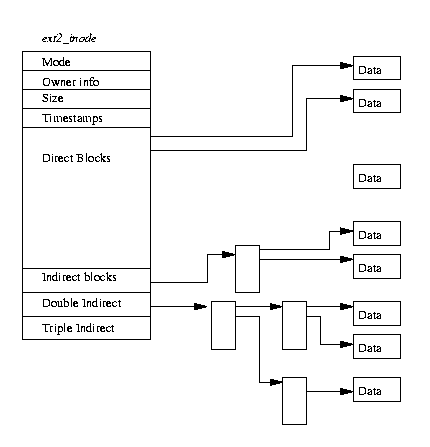
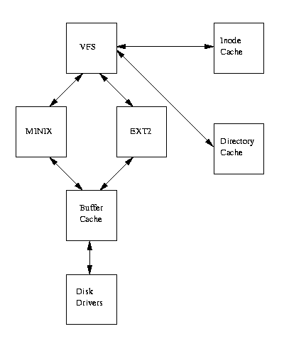

#  第九章 文件系统


本章主要描叙Linux核心对文件系统的支持, 虚拟文件系统（VFS）以及Linux核心对实际文件系统的支持。

Linux的最重要特征之一就是支持多种文件系统。这样它更加灵活并可以和许多其它种操作系统共存。在本文写作时Linux已经支持15种文件系统：ext,ext2,xia,minix,umsdos,msdos,vfat,proc,smb,ncp,iso9660,sysv,hpfs,affs以及ufs。毫无疑问,今后支持的文件系统类型还将增加。

Linux和Unix并不使用设备标志符（如设备号或驱动器名称）来访问独立文件系统，而是通过一个将整个文件系统表示成单一实体的层次树结构来访问它。Linux每安装(mount)一个文件系统时都会其加入到文件系统层次树中。不管是文件系统属于什么类型，都被连接到一个目录上且此文件系统上的文件将取代此目录中已存在的文件。这个目录被称为安装点或者安装目录。当卸载此文件系统时这个安装目录中原有的文件将再次出现。

当磁盘初始化时（使用fdisk），磁盘中将添加一个描叙物理磁盘逻辑构成的分区结构。每个分区可以拥有一个独立文件系统如EXT2。文件系统将文件组织成包含目录，软连接等存在于物理块设备中的逻辑层次结构。包含文件系统的设备叫块设备。Linux文件系统认为这些块设备是简单的线性块集合，它并不关心或理解底层的物理磁盘结构。这个工作由块设备驱动来完成，由它将对某个特定块的请求映射到正确的设备上去；此块所在硬盘的对应磁道、扇区及柱面数都被保存起来。不管哪个设备持有这个块，文件系统都必须使用相同的方式来寻找并操纵此块。Linux文件系统不管（至少对系统用户来说）系统中有哪些不同的控制器控制着哪些不同的物理介质且这些物理介质上有几个不同的文件系统。文件系统甚至还可以不在本地系统而在通过网络连接的远程硬盘上。设有一个根目录内容如下的SCSI硬盘：

```
A         E         boot      etc       lib       opt       tmp       usr

C         F         cdrom     fd        proc      root      var       sbin

D         bin       dev       home      mnt       lost+found
```

此时不管是用户还是程序都无需知道他们现在操纵的这些文件中的/C实际上是位于系统第一个IDE硬盘上并已安装VFAT文件系统。在此例中/E表示系统中第二个IDE控制器上的主IDE硬盘。至于第一个IDE控制器是PCI控制器和第二个则是控制IDE CDROM的ISA控制器无关紧要。当使用modem通过PPP网络协议来拨入网络时,可以将Alpha AXP Linux文件系统安装到/mnt/remote目录下。

文件系统中的文件是数据的集合；包含本章内容的文件是一个名叫filesystems.tex的ASCII文件。文件系统不仅包含着文件中的数据而且还有文件系统的结构。所有Linux用户和程序看到的文件、目录、软连接及文件保护信息等都存储在其中。此外文件系统中必须包含安全信息以便保持操作系统的基本完整性。没人愿意使用一个动不动就丢失数据和文件的操作系统。

Linux最早的文件系统是Minix，它受限甚大且性能低下。其文件名最长不能超过14个字符（虽然比8.3 文件名要好）且最大文件大小为64M字节。64M字节看上去很大,但实际上一个中等的数据库将超过这个尺寸。 第一个专门为Linux设计的文件系统被称为扩展文件系统（Extended File System）或EXT。它出现于1992年四月，虽然能够解决一些问题但性能依旧不好。1993年扩展文件系统第二版或EXT2被设计出来并添加到Linux中。它是本章将详细讨论的文件系统。

将EXT文件系统添加入Linux产生了重大影响。每个实际文件系统从操作系统和系统服务中分离出来，它们之间通过一个接口层：虚拟文件系统或VFS来通讯。

VFS使得Linux可以支持多个不同的文件系统，每个表示一个VFS的通用接口。由于软件将Linux文件系统的所有细节进行了转换, 所以Linux核心的其它部分及系统中运行的程序将看到统一的文件系统。 Linux的虚拟文件系统允许用户同时能透明地安装许多不同的文件系统。

虚拟文件系统的设计目标是为Linux用户提供快速且高效的文件访问服务。同时它必须保证文件及其数据的正确性。这两个目标相互间可能存在冲突。当安装一个文件系统并使用时, Linux VFS为其缓存相关信息。此缓存中数据在创建、写入和删除文件与目录时如果被修改，则必须谨慎地更新文件系统中对应内容。 如果能够在运行核心内看到文件系统的数据结构, 那么就可以看到那些正被文件系统读写的数据块。描叙文件与目录的数据结构被不断的创建与删除而设备驱动将不停地读取与写入数据。这些缓存中最重要的是Buffer Cache，它被集成到独立文件系统访问底层块设备的例程中。当进行块存取时数据块首先将被放入Buffer Cache里并根据其状态保存在各个队列中。此Buffer Cache不仅缓存数据而且帮助管理块设备驱动中的异步接口。


## 9.1 第二代扩展文件系统（EXT2）


图9.1 EXT2文件系统的物理分布


第二代扩展文件系统由Rey Card设计，其目标是为Linux提供一个强大的可扩展文件系统。它同时也是Linux界中设计最成功的文件系统。

象很多文件系统一样, EXT2建立在数据被保存在数据块中的文件内这个前提下。这些数据块长度相等且这个长度可以变化，某个EXT2文件系统的块大小在创建（使用mke2fs）时设置。 每个文件的大小和刚好大于它的块大小正数倍相等。如果块大小为1024字节而一个1025字节长的文件将占据两个1024字节大小的块。这样你不得不浪费差不多一般的空间。我们通常需要在CPU的内存利用率和磁盘空间使用上进行折中。而大多数操作系统，包括Linux在内，为了减少CPU的工作负载而被迫选择相对较低的磁盘空间利用率。并不是文件中每个块都包含数据，其中有些块被用来包含描叙此文件系统结构的信息。EXT2通过一个inode结构来描叙文件系统中文件并确定此文件系统的拓扑结构。 inode结构描叙文件中数据占据哪个块以及文件的存取权限、文件修改时间及文件类型。EXT2文件系统中的每个文件用一个inode来表示且每个inode有唯一的编号。文件系统中所有的inode都被保存在inode表中。 EXT2目录仅是一个包含指向其目录入口指针的特殊文件（也用inode表示）。

图9.1给出了占用一系列数据块的EXT2文件系统的布局。对文件系统而言文件仅是一系列可读写的数据块。文件系统并不需要了解数据块应该放置到物理介质上什么位置，这些都是设备驱动的任务。无论何时只要文件系统需要从包含它的块设备中读取信息或数据，它将请求底层的设备驱动读取一个基本块大小整数倍的数据块。EXT2文件系统将它所使用的逻辑分区划分成数据块组。每个数据块组将那些对文件系统完整性最重要的信息复制出来, 同时将实际文件和目录看作信息与数据块。为了发生灾难性事件时文件系统的修复，这些复制非常有必要。以下一节将着重描叙每个数据块组的内容。


### 9.1.1 The EXT2 Inode





图9.2 EXT2 Inode


在EXT2文件系统中inode是基本块；文件系统中的每个文件与目录由唯一的inode来描叙。每个数据块组的EXT2 inode被保存在inode表中, 同时还有一个位图被系统用来跟踪已分配和未分配的inode。图 9.2给出了EXT2 inode的格式，它包含以下几个域：


- **mode**

  它包含两类信息；inode描叙的内容以及用户使用权限。EXT2中的inode可以表示一个文件、目录、符号连接、块设备、字符设备或FIFO。

- **Owner Information**

  表示此文件或目录所有者的用户和组标志符。文件系统根据它可以进行正确的存取。

- **Size**

  以字节计算的文件尺寸。

- **Timestamps**

  inode创建及最后一次被修改的时间。

- **Datablocks**

  指向此inode描叙的包含数据的块指针。前12个指针指向包含由inode描叙的物理块, 最后三个指针包含多级间接指针。例如两级间接指针指向一块指针，而这些指针又指向一些数据块。这意味着访问文件尺寸小于或等于12个数据块的文件将比访问大文件快得多。

EXT2 inode还可以描叙特殊设备文件。虽然它们不是真正的文件, 但可以通过它们访问设备。所有那些位于/dev中的设备文件可用来存取Linux设备。例如mount程序可把设备文件作为参数。


### 9.1.2 EXT2 超块

超块中包含了描叙文件系统基本尺寸和形态的信息。文件系统管理器利用它们来使用和维护文件系统。 通常安装文件系统时只读取数据块组0中的超块，但是为了防止文件系统被破坏, 每个数据块组都包含了复制拷贝。超块包含如下信息：


- **Magic Number**

  文件系统安装软件用来检验是否是一个真正的EXT2文件系统超块。当前EXT2版本中为0xEF53。

- **Revision Level**

  这个主从修订版本号让安装代码能判断此文件系统是否支持只存在于某个特定版本文件系统中的属性。同时它还是特性兼容标志以帮助安装代码判断此文件系统的新特性是否可以安全使用。

- **Mount Count and Maximum Mount Count**

  系统使用它们来决定是否应对此文件系统进行全面检查。每次文件系统安装时此安装记数将递增，当它等于最大安装记数时系统将显示一条警告信息“maxumal mount count reached, running e2fsck is recommended”。

- **Block Group Number**

  超块的拷贝。

- **Block Size**

  以字节记数的文件系统块大小，如1024字节。

- **Blocks per Group**

  每个组中块数目。当文件系统创建时此块大小被固定下来。

- **Free Blocks**

  文件系统中空闲块数。

- **Free Inodes**

  文件系统中空闲Inode数。

- **First Inode**

  文件系统中第一个inode号。EXT2根文件系统中第一个inode将是指向'/'目录的目录入口。


### 9.1.3 EXT2 组标志符

每个数据块组都拥有一个描叙它结构。象超块一样，所有数据块组中的组描叙符被复制到每个数据块组中以防文件系统崩溃。每个组描叙符包含以下信息：

 

- **Blocks Bitmap**

  对应此数据块组的块分配位图的块号。在块分配和回收时使用。

- **Inode Bitmap**

  对应此数据块组的inode分配位图的块号。在inode分配和回收时使用。

- **Inode Table**

  对应数据块组的inode表的起始块号。每个inode用下面的EXT2 inode结构来表示。

- **Free blocks count, Free Inodes count, Used directory count**

  

组描叙符放置在一起形成了组描叙符表。每个数据块组在超块拷贝后包含整个组描叙符表。EXT2文件系统仅使用第一个拷贝（在数据块组0中）。其它拷贝都象超块拷贝一样用来防止主拷贝被破坏。


### 9.1.4 EXT2 目录


图9.3 EXT2目录


在EXT2文件系统中目录是用来创建和包含文件系统中文件存取路径的特殊文件。图9.3给出了内存中的目录入口布局。

目录文件是一组目录入口的链表，它们包含以下信息：

- **inode**

  对应每个目录入口的inode。它被用来索引储存在数据块组的Inode表中的inode数组。 在图9.3中file文件的目录入口中有一个对inode号11的引用。

- **name length**

  以字节记数的目录入口长度。

- **name**

  目录入口的名称

每个目录的前两个入口总是"."和".."。它们分别表示当前目录和父目录。


### 9.1.5 在EXT2文件系统中搜寻文件

Linux文件名的格式与Unix类似,是一系列以"./sitemep.php"隔开的目录名并以文件名结尾。/home/rusling/.cshrc中/home和/rusling都是目录名而文件名为.cshrc。象Unix系统一样，Linux并不关心文件名格式本身，它可以由任意可打印字符组成。为了寻找EXT2文件系统中表示此文件的inode，系统必须将文件名从目录名中分离出来。

我们所需要的第一个inode是根文件系统的inode，它被存放在文件系统的超块中。为读取某个EXT2 inode, 我们必须在适当数据块组的inode表中进行搜寻。如果根inode号为42则我们需要数据块组0 inode表的第42个inode。此根inode对应于一个EXT2目录，即根inode的mode域将它描叙成目录且其数据块包含EXT2目录入口。home目录是许多目录的入口同时此目录给我们提供了大量描叙/home目录的inode。我们必须读取此目录以找到rusling目录入口，此入口又提供了许多描叙/home/rusling目录的inode。最后读取由/home/rusling目录描叙的inode指向的目录入口以找出.cshrc文件的inode号并从中取得包含在文件中信息的数据块。

 

### 9.1.6 改变EXT2文件系统中文件的大小

文件系统普遍存在的一个问题是碎块化。一个文件所包含的数据块遍布整个文件系统,这使得对文件数据块的顺序访问越来越慢。EXT2文件系统试图通过分配一个和当前文件数据块在物理位置上邻接或者至少位于同一个数据块组中的新块来解决这个问题。只有在这种分配策略失败时才在其它数据块组中分配空间。

当进程准备写某文件时, Linux文件系统首先检查数据是否已经超出了文件最后一个被分配的块空间。如果是则必须为此文件分配一个新数据块。进程将一直等待到此分配完成；然后将其余数据写入此文件。EXT2块分配例程所作的第一件事是对此文件系统的EXT2超块加锁。这是因为块分配和回收将导致超块中某些域的改变，Linux文件系统不能在同一时刻为多个进程进行此类服务。如果另外一个进程需要分配更多的数据块时它必须等到此进程完成分配操作为止。 在超块上等待的进程将被挂起直到超块的控制权被其当前使用者释放。对超块的访问遵循先来先服务原则，一旦进程取得了超块的控制则它必须保持到操作结束为止。如果系统中空闲块不多则此分配的将失败，进程会释放对文件系统超块的控制。

如果EXT2文件系统被设成预先分配数据块则我们可以从中取得一个。预先分配块实际上并不存在，它们仅仅包含在已分配块的位图中。我们试图为之分配新数据块文件所对应的VFS inode包含两个EXT2特殊域：prealloc_block和prealloc_count，它们分别代表第一个预先分配数据块的块号以及各自的数目。如果没有使用预先分配块或块预先分配数据块策略，则EXT2文件系统必须分配一个新块。它首先检查此文件最后一个块后的数据块是否空闲。从逻辑上来说这是让其顺序访问更快的最有效块分配策略。如果此块已被使用则它会在理想块周围64个块中选择一个。这个块虽然不是最理想但和此文件的其它数据块都位于同一个数据块组中。

如果此块还是不空闲则进程将在所有其它数据块组中搜寻，直到找到一空闲块。块分配代码将在某个数据块组中寻找一个由8个空闲数据块组成的簇。如果找不到那么它将取更小的尺寸。如果使用了块预先分配则它将更新相应的prealloc_block和prealloc_count。

找到空闲块后块分配代码将更新数据块组中的位图并在buffer cache中为它分配一个数据缓存。这个数据缓存由文件系统支撑设备的标志符以及已分配块的块号来标志。缓存中的数据被置0且缓存被标记成dirty以显示其内容还没有写入物理磁盘。最后超块也被标记为dirty以表示它已被更新并解锁了。如果有进程在等待这个超块则队列中的第一个进程将得到运行并取得对超块的独占控制。如果数据块被填满则进程的数据被写入新数据块中，以上的整个过程将重复且另一个数据块被分配。


## 9.2 虚拟文件系统(VFS)





图9.4 虚拟文件系统的逻辑示意图


图9.4给出了Linux核心中虚拟文件系统和实际文件系统间的关系。此虚拟文件系统必须能够管理在任何时刻mount到系统的不同文件系统。它通过维护一个描叙整个虚拟文件系统和实际已安装文件系统的结构来完成这个工作。

容易让人混淆的是VFS使用了和EXT2文件系统类似的方式：超块和inode来描叙文件系统。象EXT2 inode一样 VFS inode描叙系统中的文件和目录以及VFS中的内容和拓扑结构。从现在开始我将用VFS inode和VFS超块来将它们和EXT2 inode和超块进行区分。

文件系统初始化时将其自身注册到VFS中。它发生在系统启动和操作系统初始化时。这些实际文件系统可以构造到核心中也可以设计成可加载模块。文件系统模块可以在系统需要时进行加载，例如VFAT就被实现成一个核心模块，当mount VFAT文件系统时它将被加载。mount一个基于块设备且包含根文件系统的文件系统时，VFS必须读取其超块。每个文件系统类型的超块读取例程必须了解文件系统的拓扑结构并将这些信息映射到VFS超块结构中。VFS在系统中保存着一组已安装文件系统的链表及其VFS超块。每个VFS 超块包含一些信息以及一个执行特定功能的函数指针。例如表示一个已安装EXT2文件系统的超块包含一个指向EXT2相关inode读例程的指针。这个EXT2 inode读例程象所有文件系统相关读例程一样填充了VFS inode中的域。每个VFS超块包含此文件系统中第一个VFS inode的指针。对于根文件系统此inode表示的是"./sitemep.php"目录。这种信息映射方式对EXT2文件系统非常有效但是对其它文件系统要稍差。

系统中进程访问目录和文件时将使用系统调用遍历系统的VFS inode。

例如键入ls或cat命令则会引起虚拟文件系统对表示此文件系统的VFS inode的搜寻。由于系统中每个文件与目录都使用一个VFS inode来表示，所以许多inode会被重复访问。这些inode被保存在inode cache中以加快访问速度。如果某个inode不在inode cache中则必须调用一个文件系统相关例程来读取此inode。对这个inode 的读将把此它放到inode cache中以备下一次访问。不经常使用的VFS inode将会从cache中移出。

所有Linux文件系统使用一个通用buffer cache来缓冲来自底层设备的数据以便加速对包含此文件系统的物理 设备的存取。

这个buffer cache与文件系统无关并被集成到Linux核心分配与读写数据缓存的机制中。让Linux文件系统独立于底层介质和设备驱动好处很多。所有的块结构设备将其自身注册到Linux核心中并提供基于块的一致性异步接口。象SCSI设备这种相对复杂的块设备也是如此。当实际文件系统从底层物理磁盘读取数据时，块设备驱动将从它们所控制的设备中读取物理块。buffer cache也被集成到了块设备接口中。 当文件系统读取数据块时它们将被保存在由所有文件系统和Linux核心共享的全局buffer cache中。这些buffer由其块号和读取设备的设备号来表示。所以当某个数据块被频繁使用则它很可能能从buffer cache而不是磁盘中读取出来，后者显然将花费更长的时间。有些设备支持通过预测将下一次可能使用的数据提前读取出来。

VFS还支持一种目录cache以便对经常使用的目录对应的inode进行快速查找。我们可以做一个这样的实验，首先我们对一个最近没有执行过列目录操作的目录进行列目录操作。第一次列目录时你可能发现会有较短的停顿但第二次操作时结果会立刻出现。目录cache不存储目录本身的inode；这些应该在inode cache中，目录cache 仅仅保存全目录名和其inode号之间的映射关系。


### 9.2.1 VFS 超块

每个已安装的文件系统由一个VFS超块表示；它包含如下信息：


- **Device**

  表示文件系统所在块设备的设备标志符。例如系统中第一个IDE硬盘的设备标志符为0x301。

- **Inode pointers**

  这个mounted inode指针指向文件系统中第一个inode。而covered inode指针指向此文件系统安装目录的inode。根文件系统的VFS超块不包含covered指针。

- **Blocksize**

  以字节记数的文件系统块大小，如1024字节。

- **Superblock operations**

  指向此文件系统一组超块操纵例程的指针。这些例程被VFS用来读写inode和超块。

- **File System type**

  这是一个指向已安装文件系统的file_system_type结构的指针。

- **File System specific**

  指向文件系统所需信息的指针。


### 9.2.2 The VFS Inode

和EXT2文件系统相同，VFS中的每个文件、目录等都用且只用一个VFS inode表示。每个VFS inode中的信息通过文件系统相关例程从底层文件系统中得到。VFS inode仅存在于核心内存并且保存只要对系统有用，它们就会被保存在在VFS inode cache中。每个VFS inode包含下列域：

- **device**

  包含此文件或此VFS inode代表的任何东西的设备的设备标志符。

- **inode number**

  文件系统中唯一的inode号。在虚拟文件系统中device和inode号的组合是唯一的。

- **mode**

  和EXT2中的相同, 表示此VFS inode的存取权限。

- **user ids**

  所有者的标志符。

- **times**

  VFS inode 创建、修改和写入时间。

- **block size**

  以字节计算的文件块大小，如1024字节。

- **inode operations**

  指向一组例程地址的指针。这些例程和文件系统相关且对此inode执行操作，如截断此inode表示的文件。

- **count**

  使用此VFS inode的系统部件数。一个count为0的inode可以被自由的丢弃或重新使用。

- **lock**

  用来对某个VFS inode加锁，如用于读取文件系统时。

- **dirty**

  表示这个VFS inode是否已经被写过，如果是则底层文件系统需要更新。

- **file system specific information**

  


### 9.2.3 注册文件系统


图9.5 已注册文件系统


当重新建立Linux核心时安装程序会询问是否需要所有可支持的文件系统。核心重建时文件系统启动代码包含了所有那些编入核心的文件系统的初始化例程。

Linux文件系统可构造成模块, 此时它们会仅在需要时加载或者使用insmod来载入。当文件系统模块被加载时, 它将向核心注册并在卸载时撤除注册。每个文件系统的初始化例程还将向虚拟文件系统注册，它用一个包含文件系统名称和指向其VFS超块读例程的指针的file_system_type结构表示。每个file_system_type结构包含下列信息：


- **Superblock read routine**

  此例程载文件系统的一个实例被安装时由VFS调用。

- **File System name**

  文件系统的名称如ext2。

- **Device needed**

  文件系统是否需要设备支持。并不是所有的文件系统都需要设备来保存它。例如/proc文件系统不需要块设备支持。

你可以通过查阅/proc/filesystems可找出已注册的文件系统，如：

```
      ext2

nodev proc

      iso9660
```


### 9.2.4 安装文件系统

当超级用户试图安装一个文件系统时，Linux核心首先使系统调用中的参数有效化。尽管mount程序会做一些基本的检查, 但是它并不知道核心构造时已经支持那些文件系统,同时那些建议的安装点的确存在。看如下的一个mount命令：

```
$ mount -t iso9660 -o ro /dev/cdrom /mnt/cdrom
```

mount命令将传递三个参数给核心：文件系统名，包含文件系统的物理块设备以及此新文件系统要安装到的已存在的目录名。

虚拟文件系统首先必须做的是找到此文件系统。它将通过由链指针file_systems指向的file_system_type结 构来在所有已知文件系统中搜寻。

如果找到了一个相匹配的文件系统名,那么它就知道核心支持此文件系统并可得到读取此文件系统超块相关例程的指针。如果找不到,但文件系统使用了可动态加载核心模块,则操作仍可继续。此时核心将请求核心后台进程加载相应的文件系统模块。

接下来如果由mount传递的物理设备还没有安装, 则必须找到新文件系统将要安装到的那个目录的VFS inode。 这个VFS inode可能在inode cache中也可能在支撑这个安装点所在文件系统的块设备中。一旦找到这个inode则将对它进行检查以确定在此目录中是否已经安装了其它类型的文件系统。多个文件系统不能使用相同目录作为安装点。

此时VFS安装代码必须分配一个VFS超块并将安装信息传递到此文件系统的超块读例程中。系统中所有的VFS 超块都被保存在由super_block结构构成的super_blocks数组中, 并且对应此安装应有一个这种结构。超块读 例程将基于这些从物理设备中读取的信息来填充这些VFS超块域。对于EXT2文件系统此信息的转化过程十分 简便，仅需要读取EXT2超块并填充VFS超块。但其它文件系统如MS-DOS文件系统就不那么容易了。不管哪种文件系统，对VFS超块的填充意味着文件系统必须从支持它的块设备中读取描叙它的所有信息。如果块设备驱动不能从中读取或不包含这种类型文件系统则mount命令会失败。


图9.6 一个已安装的文件系统


每个文件系统用一个vfsmount结构来描叙。如图9.6所示。它们被排入由vfsmntlist指向的的链表中。

另外一个指针：vfsmnttail指向链表的最后一个入口, 同时mru_vfsmnt指针指向最近使用最多的文件系统。 每个vfsmount结构中由以下部分组成：包含此文件系统的块设备的设备号，此文件系统安装的目录以及文件 系统安装时分配的VFS超块指针。VFS超块指向这种类型文件系统和此文件系统根inode的file_system_type结构。一旦此文件系统被加载, 这个inode将一直驻留在VFS inod cache中。


### 9.2.5 在虚拟文件系统中搜寻文件

为了在虚拟文件系统中找到某个文件的VFS inode，VFS必须依次解析此文件名字中的间接目录直到找到此VFS inode。每次目录查找包括一个对包含在表示父目录VFS inode中的查找函数的调用。由于我们总是让每个文件系统的根可用并且由此系统的VFS 超块指向它，所以这是一个可行方案。每次在实际文件系统中寻找inode 时，文件系统将在目录cache中寻找相应目录。如果在目录cache中无相应入口则文件系统必须从底层文件系统或inode cache中取得此VFS inode。


### 9.2.6 Creating a File in the Virtual File System


### 9.2.7 卸载文件系统

如果已安装文件系统中有些文件还在被系统使用则不能卸载此文件系统。例如有进程使用/mnt/cdrom或其子目录时将不能卸载此文件系统。如果将要卸载的文件系统中有些文件还在被使用，那么在VFS inode cache中有与其对应的VFS inode。通过在inode链表中查找此文件系统占用设备的inode来完成此工作。对应此已安装文件系统的VFS超块为dirty，表示它已被修改过所以必须写回到磁盘的文件系统中。一旦写入磁盘,VFS超块占用的内存将归还到核心的空闲内存池中。最后对应的vfsmount结构将从vfsmntlist中释放。


### 9.2.8 The VFS Inode Cache

操纵已安装文件系统时，它们的VFS inode将被连续读写。虚拟文件系统通过维护一个inode cache来加速对所有已安装文件系统的访问。每次VFS inode都可从inode cache中读取出来以加速对物理设备的访问。

VFS inode cache以散列表形式实现，其入口时指向具有相同散列值的VFS inode链表。每个inode的散列值可通过包含此文件系统的底层物理设备标志符和inode号计算出来。每当虚拟文件系统访问一个inode时,系统将首先在VFS inode cache中查找。为了在cache中寻找inode，系统先计算出其散列值然后将其作为inode散列表的索引。这样将得到指向一系列相同散列值的inode链表。然后依次读取每个inode直到找到那个具有相同inode号以及设备标志符的inode为止。

如果在cache中找到了此inode则它的count值递增以表示用户增加了一个,同时文件操作将继续进行。否则必须找到一个空闲VFS inode以便文件系统能从内存中读取此inode。VFS有许多种选择来取得空闲inode。如果系统可以分配多个VFS inode则它将按如下步骤进行：首先分配核心页面并将其打碎成新的空闲inode并将其放入inode链表中。系统所有的VFS inode都被放到由first_inode指向的链表和inode散列表中。如果系统已经拥有所有inode, 则它必须找到便于重新使用的inode。那些inode最好count记数为0；因为这种inode没有谁在使用。很重要的VFS inode，如文件系统的根inode，其count 域总是大于0，所以它所使用的inode是不能被重新使用的。一旦找到可重用inode则应清除之: 其VFS inode可能为dirty,必须要写入到文件系统中或者需要加锁，此时系统必须等到解锁时才能继续运行。

找到新的VFS inode后必须调用文件系统相关例程使用从底层实际文件系统中读出的内容填充它。在填充过程 中，此新VFS inode的count记数为1并被加锁以排斥其它进程对它的使用直到此inode包含有效信息为止。

为了取得真正需要的VFS inode，文件系统可能需要存取几类其它inode。我们读取一个目录时虽然只需要最后一级目录但是所有的中间目录也被读了出来。由于使用了VFS inode cache，较少使用的inode将被丢弃而较多使用的inode将保存在cache中。


### 9.2.9 目录 Cache

为了加速对常用目录的访问，VFS维护着一个目录入口cache。

当在实际文件系统寻找目录时，有关此目录的细节将被存入目录cache中。当再次寻找此目录时，例如在此目录中列文件名或打开文件，则这些信息就可以在目录cache中找到。在实际实现中只有短目录入口（最多15个字 符）被缓存，这是因为那些较短目录名的目录正是使用最频繁的。例如/usr/X11R6/bin这个短目录经常被X server所使用。

目录cache也由散列表组成，每个入口指向具有相同散列值的目录cache人口链表。散列函数使用包含此文件系统的设备号以及目录名称来计算在此散列表中的偏移值或者索引值, 这样能很快找到被缓存的目录。 如果在cache中的搜寻消耗的时间太长或者甚至没有找到则使用此cache用处不大。

为了保证cache的有效性和及时更新，VFS保存着一个最近最少使用（LRU）的目录cache人口链表。当首次查找此目录时其目录入口被首次放入cache中并添加到第一级LRU链表的尾部。在已经充满的cache 中它代替位于LRU链表最前端的现存入口。此目录入口被再次使用时它将被放到第二级LRU cache链表的最后。此时需要将位于第二级LRU cache链表的最前端的那个替换掉。入口在链表前端的唯一原因是它们已经很久没被访问过了。如果被访问过那么它们将位于此链表的尾部附近。位于第二级LRU cache链表中的入口要比位于第一级LRU cache链表中的安全一些。


## 9.3 The Buffer Cache


图9.7 Buffer Cache示意图


操纵已安装文件系统将产生大量对此块设备的读写请求。这些块读写请求都是通过标准核心例程调用以buffer_head结构形式传递到设备驱动中。它们提供了设备驱动所需的所有信息：表示设备的设备标志符以及请求的块号。所有块设备都被看成相同块大小的线性块集合。为了加速对物理块设备的访问，Linux 使用了一个块buffer cache。系统中全部的块缓冲，包括那些没使用过的新缓冲都保存在此buffer cache中。这个cache被多个物理块设备共享；任何时刻此cache中都有许多属于不同系统块设备且状态不同的块缓冲。如果有效数据可以从buffer cache中找到则将节省大量访问物理设备的时间。任何对块设备读写的块缓冲都被放入此cache中。随时间的变化有些块缓冲可能将会被此cache中删除以为更需要它的缓冲腾出空间，如果它被频繁使用则可以一直保存在此cache中。

此cache中的块缓冲由设备标志符以及缓冲对应的块号来唯一的表示。它由两个功能部分组成。其一是空闲块缓冲链表。它为每个可支持的块大小提供了一个链表并且系统中的空闲块缓冲在创建或者被丢弃时都被排入此链表中。当前可支持的块大小为512、1024、2048、4096与8192字节。其二是cache自身。它是用一组指向具有相同散列索引值的缓冲链的散列表。这个散列索引值通过其自身的设备标志符与数据块设备的块号来产生。图9.7给出了一个带有一些入口的散列表。块缓冲要么在空闲链表中要么在此buffer cache中。如果在buffer cache中则它们按照最近最少使用（LRU）链表来排列。 对于每种缓冲类型都有一个LRU链表，系统使用它们来对某种缓冲进行操作，如将带新数据的缓冲写入到磁盘上。缓冲的类型表示其当前状态，Linux现在支持以下集中类型：

- **clean**

  未使用的新缓冲

- **locked**

  等待写入且加锁的缓冲

- **dirty**

  dirty缓冲。它们包含新的有效数据，但目前没被调度执行写操作。

- **shared**

  共享缓冲

- **unshared**

  以前被共享但现在没有被共享的缓冲

当文件系统需要从其底层物理设备读取一个缓冲块时，它将首先在buffer cache里寻找。如果在此buffer cache中找不到则它将从适当大小的空闲链表中取得一个clean状态的节点, 同时将新缓冲添加到buffer cache 中去。如果所需的缓冲位于buffer cache中，那么它可能已经或没有更新。如果没有被更新或者它为新块则文件系统必须请求相应的数据驱动从磁盘中读取该数据块。

为了让此buffer cache运行更加有效并且在使用此buffer cache的块设备之间合理的分配cache入口，系统必须对其进行维护。Linux使用bdflush核心后台进行来对此cache执行许多琐碎工作,但有时作为使用cache 的结构自动进行。


### 9.3.1 bdflush 核心后台进程

bdflush是对过多的dirty缓冲系统提供动态响应的简单核心后台进程；这些缓冲块中包含必须被写入到硬盘上的数据。它在系统启动时作为一个核心线程运行，其名字叫"kflushd"。你可以使用ps命令看到此系统进程。通常情况下此进程一直在睡眠直到系统中的dirty缓冲数目增大到一定数目。当分配与丢弃缓冲时,系统中dirty缓冲的数目将做一个统计。如果其数目超过某个数值则唤醒bdflush进程。缺省的阀值为60%， 但是如果系统急需缓冲则任何时刻都可能唤醒bdflush。使用update命令可以看到和改变这个数值。

```
# update -d


bdflush version 1.4

0:    60 Max fraction of LRU list to examine for dirty blocks

1:   500 Max number of dirty blocks to write each time bdflush activated

2:    64 Num of clean buffers to be loaded onto free list by refill_freelist

3:   256 Dirty block threshold for activating bdflush in refill_freelist

4:    15 Percentage of cache to scan for free clusters

5:  3000 Time for data buffers to age before flushing

6:   500 Time for non-data (dir, bitmap, etc) buffers to age before flushing

7:  1884 Time buffer cache load average constant

8:     2 LAV ratio (used to determine threshold for buffer fratricide).
```

但有数据写入缓冲使之变成dirty时，所有的dirty缓冲被连接到一个BUF_DIRTY LRU链表中，bdflush会将适当数目的缓冲块写到磁盘上。这个数值的缺省值为500。


### 9.3.2 update进程

update命令不仅仅是一个命令；它还是一个后台进程。当作为超级用户运行时（在系统初始化时）它将周期性调用系统服务例程将老的dirty缓冲冲刷到磁盘上去。它所完成的这个工作与bdflush类似。当一个dirty缓冲完成此操作后, 它将把本应写入到各自磁盘上的时间标记到其中。update每次运行时它将在系统的所有dirty缓冲中查找那些冲刷时间已过期的。这些过期缓冲都被写入到磁盘。


## 9.4 /proc文件系统

/proc文件系统真正显示了Linux虚拟文件系统的能力。事实上它并不存在-不管时/proc目录还是其子目录和文件都不真正的存在。但是我们是如何能够执行cat /proc/devices命令的？/proc文件系统象一个真正的文 件系统一样将向虚拟文件系统注册。然而当有对/proc中的文件和目录的请求发生时, VFS系统将从核心中的数据中临时构造这些文件和目录。例如核心的/proc/devices文件是从描叙其设备的内核数据结构中产生出来。/proc文件系统提供给用户一个核心内部工作的可读窗口。几个Linux子系统，如在[modules](http://www.embeddedlinux.org.cn/linuxkernel/modules/modules.html)一章描叙的Linux核心模块都在/proc文件系统中创建入口。

 


## 9.5 设备特殊文件

和所有Unix版本一样Linux将硬件设备看成特殊的文件。如/dev/null表示一个空设备。设备文件不使用文件 系统中的任何数据空间，它仅仅是对设备驱动的访问入口点。EXT2文件系统和Linux VFS都将设备文件实现成特殊的inode类型。有两种类型的设备文件：字符与块设备特殊文件。在核心内部设备驱动实现了类似文件的操作过程：我们可以对它执行打开、关闭等工作。字符设备允许以字符模式进行I/O操作而块设备的I/O操作需要通过buffer cache。当对一个设备文件发出的I/O请求将被传递到相应的设备驱动。常常这种设备文件并不是一个真正的设备驱动而仅仅是一个伪设备驱动，如SCSI设备驱动层。设备文件通过表示设备类型的主类型标志符和表示单元或主类型实例的从类型来引用。例如在系统中第一个IDE控制器上的IDE硬盘的主设备号为3而其第一个分区的从标志符为1。所以执行ls -l /dev/hda1将有如下结果：


```
$ brw-rw----   1 root    disk       3,    1  Nov 24  15:09 /dev/hda1
```

在核心内部每个设备由唯一的kdev_t结构来表示，其长度为两字节，首字节包含从设备号而尾字节包含主设备号。 上例中的核心IDE设备为0x0301。表示块或者字符设备的EXT2 inode在其第一个直接块指针包含了设备的主从设备号。当VFS读取它时，表示它的VFS inode结构的i_rdev域被设置成相应的设备标志符。

