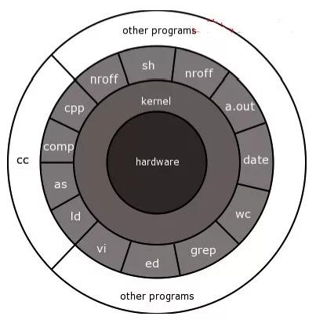
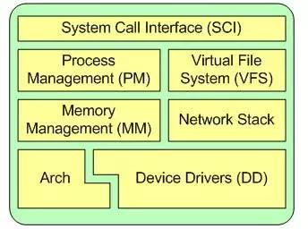
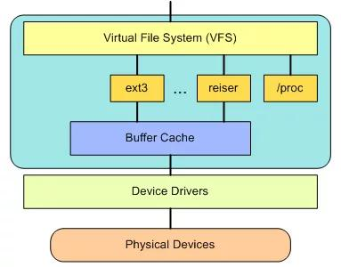
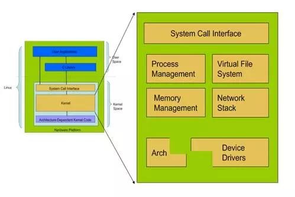
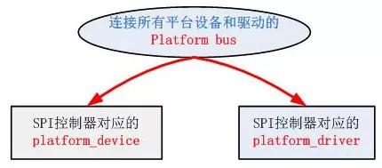
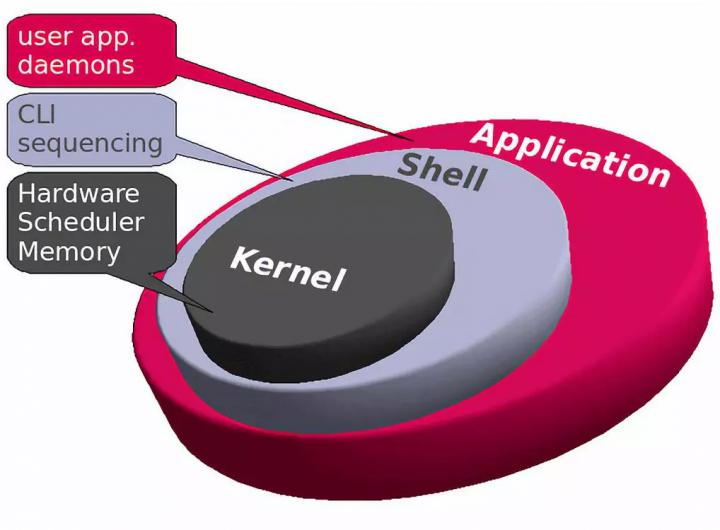

#### 简介

作用是将应用层序的请求传递给硬件，并充当底层驱动程序，对系统中的各种设备和组件进行寻址。目前支持模块的动态装卸(裁剪)。Linux内核就是基于这个策略实现的。Linux进程1.采用层次结构，每个进程都依赖于一个父进程。内核启动init程序作为第一个进程。该进程负责进一步的系统初始化操作。init进程是进程树的根，所有的进程都直接或者间接起源于该进程。virt/ ---- 提供虚拟机技术的支持。


**全文导读**

[Linux内核预备工作](http://www.openpcba.com/web/contents/get?id=4638&tid=15#1)

[Linux内核体系结构简析简析](http://www.openpcba.com/web/contents/get?id=4638&tid=15#2)

[Linux体系结构和内核结构区别](http://www.openpcba.com/web/contents/get?id=4638&tid=15#3)

[Linux驱动的platform机制](http://www.openpcba.com/web/contents/get?id=4638&tid=15#4)

[Linux内核体系结构](http://www.openpcba.com/web/contents/get?id=4638&tid=15#5)

[内核模块](http://www.openpcba.com/web/contents/get?id=4638&tid=15#6)

[Linux 内核学习经验总结](http://www.openpcba.com/web/contents/get?id=4638&tid=15#7)

[结尾](http://www.openpcba.com/web/contents/get?id=4638&tid=15#8)

------

# **Linux内核预备工作**

**理解Linux内核最好预备的知识点：**

懂C语言
懂一点操作系统的知识
熟悉少量相关算法
懂计算机体系结构

**Linux内核的特点：**

结合了unix操作系统的一些基础概念





**Linux内核的任务：**

1.从技术层面讲，内核是硬件与软件之间的一个中间层。作用是将应用层序的请求传递给硬件，并充当底层驱动程序，对系统中的各种设备和组件进行寻址。

2.从应用程序的层面讲，应用程序与硬件没有联系，只与内核有联系，内核是应用程序知道的层次中的最底层。在实际工作中内核抽象了相关细节。

3.内核是一个资源管理程序。负责将可用的共享资源(CPU时间、磁盘空间、网络连接等)分配得到各个系统进程。

4.内核就像一个库，提供了一组面向系统的命令。系统调用对于应用程序来说，就像调用普通函数一样。

**内核实现策略：**

1.微内核。最基本的功能由中央内核（微内核）实现。所有其他的功能都委托给一些独立进程，这些进程通过明确定义的通信接口与中心内核通信。

2.宏内核。内核的所有代码，包括子系统（如内存管理、文件管理、设备驱动程序）都打包到一个文件中。内核中的每一个函数都可以访问到内核中所有其他部分。目前支持模块的动态装卸(裁剪)。Linux内核就是基于这个策略实现的。

**哪些地方用到了内核机制？**

1.进程（在cpu的虚拟内存中分配地址空间，各个进程的地址空间完全独立;同时执行的进程数最多不超过cpu数目）之间进行通  信，需要使用特定的内核机制。

2.进程间切换(同时执行的进程数最多不超过cpu数目)，也需要用到内核机制。

进程切换也需要像FreeRTOS任务切换一样保存状态，并将进程置于闲置状态/恢复状态。

3.进程的调度。确认哪个进程运行多长的时间。

**Linux进程**

1.采用层次结构，每个进程都依赖于一个父进程。内核启动init程序作为第一个进程。该进程负责进一步的系统初始化操作。init进程是进程树的根，所有的进程都直接或者间接起源于该进程。

2.通过pstree命令查询。实际上得系统第一个进程是systemd，而不是init（这也是疑问点）

3.系统中每一个进程都有一个唯一标识符(ID),用户（或其他进程）可以使用ID来访问进程。

**Linux内核源代码的目录结构**

Linux内核源代码包括三个主要部分：

\1. 内核核心代码，包括第3章所描述的各个子系统和子模块，以及其它的支撑子系统，例如电源管理、Linux初始化等

\2. 其它非核心代码，例如库文件（因为Linux内核是一个自包含的内核，即内核不依赖其它的任何软件，自己就可以编译通过）、固件集合、KVM（虚拟机技术）等

\3. 编译脚本、配置文件、帮助文档、版权说明等辅助性文件

使用ls命令看到的内核源代码的顶层目录结构，具体描述如下。

include/ ---- 内核头文件，需要提供给外部模块（例如用户空间代码）使用。

kernel/ ---- Linux内核的核心代码，包含了3.2小节所描述的进程调度子系统，以及和进程调度相关的模块。

mm/ ---- 内存管理子系统（3.3小节）。

fs/ ---- VFS子系统（3.4小节）。

net/ ---- 不包括网络设备驱动的网络子系统（3.5小节）。

ipc/ ---- IPC（进程间通信）子系统。

arch// ---- 体系结构相关的代码，例如arm, x86等等。
  arch//mach- ---- 具体的machine/board相关的代码。
  arch//include/asm ---- 体系结构相关的头文件。
  arch//boot/dts ---- 设备树（Device Tree）文件。

init/ ---- Linux系统启动初始化相关的代码。
block/ ---- 提供块设备的层次。
sound/ ---- 音频相关的驱动及子系统，可以看作“音频子系统”。
drivers/ ---- 设备驱动（在Linux kernel 3.10中，设备驱动占了49.4的代码量）。

lib/ ---- 实现需要在内核中使用的库函数，例如CRC、FIFO、list、MD5等。
crypto/ ----- 加密、解密相关的库函数。
security/ ---- 提供安全特性（SELinux）。
virt/ ---- 提供虚拟机技术（KVM等）的支持。
usr/ ---- 用于生成initramfs的代码。
firmware/ ---- 保存用于驱动第三方设备的固件。

samples/ ---- 一些示例代码。
tools/ ---- 一些常用工具，如性能剖析、自测试等。

Kconfig, Kbuild, Makefile, scripts/ ---- 用于内核编译的配置文件、脚本等。

COPYING ---- 版权声明。
MAINTAINERS ----维护者名单。
CREDITS ---- Linux主要的贡献者名单。
REPORTING-BUGS ---- Bug上报的指南。

Documentation, README ---- 帮助、说明文档。

# **Linux内核体系结构简析**简析

图1 Linux系统层次结构

最上面是用户（或应用程序）空间。这是用户应用程序执行的地方。用户空间之下是内核空间，Linux 内核正是位于这里。GNU C Library （glibc）也在这里。它提供了连接内核的系统调用接口，还提供了在用户空间应用程序和内核之间进行转换的机制。这点非常重要，因为内核和用户空间的应用程序使用的是不同的保护地址空间。每个用户空间的进程都使用自己的虚拟地址空间，而内核则占用单独的地址空间。

Linux 内核可以进一步划分成 3 层。最上面是系统调用接口，它实现了一些基本的功能，例如 read 和 write。系统调用接口之下是内核代码，可以更精确地定义为独立于体系结构的内核代码。这些代码是 Linux 所支持的所有处理器体系结构所通用的。在这些代码之下是依赖于体系结构的代码，构成了通常称为 BSP（Board Support Package）的部分。这些代码用作给定体系结构的处理器和特定于平台的代码。

Linux 内核实现了很多重要的体系结构属性。在或高或低的层次上，内核被划分为多个子系统。Linux 也可以看作是一个整体，因为它会将所有这些基本服务都集成到内核中。这与微内核的体系结构不同，后者会提供一些基本的服务，例如通信、I/O、内存和进程管理，更具体的服务都是插入到微内核层中的。每种内核都有自己的优点，不过这里并不对此进行讨论。 

随着时间的流逝，Linux 内核在内存和 CPU 使用方面具有较高的效率，并且非常稳定。但是对于 Linux 来说，最为有趣的是在这种大小和复杂性的前提下，依然具有良好的可移植性。Linux 编译后可在大量处理器和具有不同体系结构约束和需求的平台上运行。一个例子是 Linux 可以在一个具有内存管理单元（MMU）的处理器上运行，也可以在那些不提供 MMU 的处理器上运行。

Linux 内核的 uClinux 移植提供了对非 MMU 的支持。

图2是Linux内核的体系结构




图2 Linux内核体系结构

Linux内核的主要组件有：系统调用接口、进程管理、内存管理、虚拟文件系统、网络堆栈、设备驱动程序、硬件架构的相关代码。

**（1）系统调用接口**

SCI 层提供了某些机制执行从用户空间到内核的函数调用。正如前面讨论的一样，这个接口依赖于体系结构，甚至在相同的处理器家族内也是如此。SCI 实际上是一个非常有用的函数调用多路复用和多路分解服务。在 ./linux/kernel 中您可以找到 SCI 的实现，并在 ./linux/arch 中找到依赖于体系结构的部分。

**（2）进程管理**

进程管理的重点是进程的执行。在内核中，这些进程称为线程，代表了单独的处理器虚拟化（线程代码、数据、堆栈和 CPU 寄存器）。在用户空间，通常使用进程 这个术语，不过 Linux 实现并没有区分这两个概念（进程和线程）。内核通过 SCI 提供了一个应用程序编程接口（API）来创建一个新进程（fork、exec 或 Portable Operating System Interface [POSIX] 函数），停止进程（kill、exit），并在它们之间进行通信和同步（signal 或者 POSIX 机制）。

进程管理还包括处理活动进程之间共享 CPU 的需求。内核实现了一种新型的调度算法，不管有多少个线程在竞争 CPU，这种算法都可以在固定时间内进行操作。这种算法就称为 O(1) 调度程序，这个名字就表示它调度多个线程所使用的时间和调度一个线程所使用的时间是相同的。O(1) 调度程序也可以支持多处理器（称为对称多处理器或 SMP）。您可以在 ./linux/kernel 中找到进程管理的源代码，在 ./linux/arch 中可以找到依赖于体系结构的源代码。

**（3）内存管理**

内核所管理的另外一个重要资源是内存。为了提高效率，如果由硬件管理虚拟内存，内存是按照所谓的内存页 方式进行管理的（对于大部分体系结构来说都是 4KB）。Linux 包括了管理可用内存的方式，以及物理和虚拟映射所使用的硬件机制。不过内存管理要管理的可不止 4KB 缓冲区。Linux 提供了对 4KB 缓冲区的抽象，例如 slab 分配器。这种内存管理模式使用 4KB 缓冲区为基数，然后从中分配结构，并跟踪内存页使用情况，比如哪些内存页是满的，哪些页面没有完全使用，哪些页面为空。这样就允许该模式根据系统需要来动态调整内存使用。为了支持多个用户使用内存，有时会出现可用内存被消耗光的情况。由于这个原因，页面可以移出内存并放入磁盘中。这个过程称为交换，因为页面会被从内存交换到硬盘上。内存管理的源代码可以在 ./linux/mm 中找到。

**（4）虚拟文件系统**

虚拟文件系统（VFS）是 Linux 内核中非常有用的一个方面，因为它为文件系统提供了一个通用的接口抽象。VFS 在 SCI 和内核所支持的文件系统之间提供了一个交换层（请参看图4）。



图3 Linux文件系统层次结构

在 VFS 上面，是对诸如 open、close、read 和 write 之类的函数的一个通用 API 抽象。在 VFS 下面是文件系统抽象，它定义了上层函数的实现方式。它们是给定文件系统（超过 50 个）的插件。文件系统的源代码可以在 ./linux/fs 中找到。文件系统层之下是缓冲区缓存，它为文件系统层提供了一个通用函数集（与具体文件系统无关）。这个缓存层通过将数据保留一段时间（或者随即预先读取数据以便在需要是就可用）优化了对物理设备的访问。缓冲区缓存之下是设备驱动程序，它实现了特定物理设备的接口。

**（5）网络堆栈**

网络堆栈在设计上遵循模拟协议本身的分层体系结构。回想一下，Internet Protocol (IP) 是传输协议（通常称为传输控制协议或 TCP）下面的核心网络层协议。TCP 上面是 socket 层，它是通过 SCI 进行调用的。socket 层是网络子系统的标准 API，它为各种网络协议提供了一个用户接口。从原始帧访问到 IP 协议数据单元（PDU），再到 TCP 和 User Datagram Protocol (UDP)，socket 层提供了一种标准化的方法来管理连接，并在各个终点之间移动数据。内核中网络源代码可以在 ./linux/net 中找到。

**（6）设备驱动程序**

Linux 内核中有大量代码都在设备驱动程序中，它们能够运转特定的硬件设备。Linux 源码树提供了一个驱动程序子目录，这个目录又进一步划分为各种支持设备，例如 Bluetooth、I2C、serial 等。设备驱动程序的代码可以在 ./linux/drivers 中找到。

**（7）依赖体系结构的代码**

尽管 Linux 很大程度上独立于所运行的体系结构，但是有些元素则必须考虑体系结构才能正常操作并实现更高效率。./linux/arch 子目录定义了内核源代码中依赖于体系结构的部分，其中包含了各种特定于体系结构的子目录（共同组成了 BSP）。对于一个典型的桌面系统来说，使用的是 x86 目录。每个体系结构子目录都包含了很多其他子目录，每个子目录都关注内核中的一个特定方面，例如引导、内核、内存管理等。这些依赖体系结构的代码可以在 ./linux/arch 中找到。

如果 Linux 内核的可移植性和效率还不够好，Linux 还提供了其他一些特性，它们无法划分到上面的分类中。作为一个生产操作系统和开源软件，Linux 是测试新协议及其增强的良好平台。Linux 支持大量网络协议，包括典型的 TCP/IP，以及高速网络的扩展（大于 1 Gigabit Ethernet [GbE] 和 10 GbE）。Linux 也可以支持诸如流控制传输协议（SCTP）之类的协议，它提供了很多比 TCP 更高级的特性（是传输层协议的接替者）。

Linux 还是一个动态内核，支持动态添加或删除软件组件。被称为动态可加载内核模块，它们可以在引导时根据需要（当前特定设备需要这个模块）或在任何时候由用户插入。

Linux 最新的一个增强是可以用作其他操作系统的操作系统（称为系统管理程序）。最近，对内核进行了修改，称为基于内核的虚拟机（KVM）。这个修改为用户空间启用了一个新的接口，它可以允许其他操作系统在启用了 KVM 的内核之上运行。除了运行 Linux 的其他实例之外， Microsoft Windows也可以进行虚拟化。惟一的限制是底层处理器必须支持新的虚拟化指令。

# **Linux体系结构和内核结构区别**

1．当被问到Linux体系结构（就是Linux系统是怎么构成的）时，我们可以参照下图这么回答：从大的方面讲，Linux体系结构可以分为两块：

（1）用户空间：用户空间中又包含了，用户的应用程序，C库

（2）内核空间：内核空间包括，系统调用，内核，以及与平台架构相关的代码


2．Linux体系结构要分成用户空间和内核空间的原因：

1）现代CPU通常都实现了不同的工作模式，

以ARM为例：ARM实现了7种工作模式，不同模式下CPU可以执行的指令或者访问的寄存器不同：

（1）用户模式 usr 

（2）系统模式  sys

（3）管理模式 svc

（4）快速中断  fiq

（5）外部中断  irq

（6）数据访问终止 abt

（7）未定义指令异常

以（2）X86为例：X86实现了4个不同级别的权限，Ring0—Ring3 ;Ring0下可以执行特权指令，可以访问IO设备；Ring3则有很多的限制  

2）所以，Linux从CPU的角度出发，为了保护内核的安全，把系统分成了2部分；

3．用户空间和内核空间是程序执行的两种不同状态，我们可以通过“系统调用”和“硬件中断“来完成用户空间到内核空间的转移

4．Linux的内核结构（注意区分LInux体系结构和Linux内核结构）



# **Linux驱动的platform机制**

Linux的这种platform driver机制和传统的device_driver机制相比，一个十分明显的优势在于platform机制将本身的资源注册进内核，由内核统一管理，在驱动程序中使用这些资源时通过platform_device提供的标准接口进行申请并使用。这样提高了驱动和资源管理的独立性，并且拥有较好的可移植性和安全性。下面是SPI驱动层次示意图，Linux中的SPI总线可理解为SPI控制器引出的总线：



和传统的驱动一样，platform机制也分为三个步骤：

**1、总线注册阶段：**

内核启动初始化时的main.c文件中的kernel_init()→do_basic_setup()→driver_init()→platform_bus_init()→bus_register(&platform_bus_type)，注册了一条platform总线（虚拟总线，platform_bus）。

**2、添加设备阶段：**

设备注册的时候Platform_device_register()→platform_device_add()→(pdev→dev.bus = &platform_bus_type)→device_add()，就这样把设备给挂到虚拟的总线上。

**3、驱动注册阶段：**

Platform_driver_register()→driver_register()→bus_add_driver()→driver_attach()→bus_for_each_dev(), 对在每个挂在虚拟的platform bus的设备作__driver_attach()→driver_probe_device(),判断drv→bus→match()是否执行成功，此时通过指针执行platform_match→strncmp(pdev→name , drv→name , BUS_ID_SIZE),如果相符就调用really_probe(实际就是执行相应设备的platform_driver→probe(platform_device)。)开始真正的探测，如果probe成功，则绑定设备到该驱动。

从上面可以看出，platform机制最后还是调用了bus_register() , device_add() , driver_register()这三个关键的函数。

下面看几个结构体：

```
struct platform_device           
(/include/linux/Platform_device.h)
{        
const char    * name;        
int        id;        
struct device    dev;        
u32        num_resources;        
struct resource    * resource;
};
```

Platform_device结构体描述了一个platform结构的设备，在其中包含了一般设备的结构体struct device  dev;设备的资源结构体struct resource  * resource;还有设备的名字const char * name。（注意，这个名字一定要和后面platform_driver.driver àname相同，原因会在后面说明。）

该结构体中最重要的就是resource结构，这也是之所以引入platform机制的原因。

```
struct resource                            
( /include/linux/ioport.h)
{        
resource_size_t start;        
resource_size_t end;        
const char *name;        
unsigned long flags;        
struct resource *parent, *sibling, *child;
};
其中 flags位表示该资源的类型，start和end分别表示该资源的起始地址和结束地址(/include/linux/Platform_device.h)：
struct platform_driver              
{        
int (*probe)(struct platform_device *);        
int (*remove)(struct platform_device *);        
void (*shutdown)(struct platform_device *);        
int (*suspend)(struct platform_device *, pm_message_t state);        
int (*suspend_late)(struct platform_device *, pm_message_t state);        
int (*resume_early)(struct platform_device *);        
int (*resume)(struct platform_device *);        
struct device_driver driver;
};
Platform_driver结构体描述了一个platform结构的驱动。其中除了一些函数指针外，还有一个一般驱动的device_driver结构。
```

名字要一致的原因：

上面说的驱动在注册的时候会调用函数bus_for_each_dev(), 对在每个挂在虚拟的platform bus的设备作__driver_attach()→driver_probe_device(),在此函数中会对dev和drv做初步的匹配，调用的是drv->bus->match所指向的函数。platform_driver_register函数中drv->driver.bus = &platform_bus_type，所以drv->bus->match就为platform_bus_type→match,为platform_match函数，该函数如下：

```
static int platform_match(struct device * dev, struct device_driver * drv)   
{       
struct platform_device *pdev = container_of(dev, struct platform_device, dev);
return (strncmp(pdev->name, drv->name, BUS_ID_SIZE) == 0);
}
```


是比较dev和drv的name，相同则会进入really_probe（）函数，从而进入自己写的probe函数做进一步的匹配。所以dev→name和driver→drv→name在初始化时一定要填一样的。

不同类型的驱动，其match函数是不一样的，这个platform的驱动，比较的是dev和drv的名字，还记得usb类驱动里的match吗？它比较的是Product ID和Vendor ID。

个人总结Platform机制的好处：

1、提供platform_bus_type类型的总线，把那些不是总线型的soc设备都添加到这条虚拟总线上。使得，总线——设备——驱动的模式可以得到普及。

2、提供platform_device和platform_driver类型的数据结构，将传统的device和driver数据结构嵌入其中，并且加入resource成员，以便于和Open Firmware这种动态传递设备资源的新型bootloader和kernel 接轨。

<iframe id="a169df1c" name="a169df1c" src="http://hm.eeioe.com/delivery/afr.php?zoneid=56&amp;cb=INSERT_RANDOM_NUMBER_HERE" frameborder="0" scrolling="no" width="1000" height="620" style="box-sizing: border-box; outline: none !important; width: 660px; height: 409.2px;"></iframe>

# **Linux内核体系结构**

因为Linux内核是单片的，所以它比其他类型的内核占用空间最大，复杂度也最高。这是一个设计特性，在Linux早期引起了相当多的争论，并且仍然带有一些与单内核固有的相同的设计缺陷。



为了解决这些缺陷，Linux内核开发人员所做的一件事就是使内核模块可以在运行时加载和卸载，这意味着您可以动态地添加或删除内核的特性。这不仅可以向内核添加硬件功能，还可以包括运行服务器进程的模块，比如低级别虚拟化，但也可以替换整个内核，而不需要在某些情况下重启计算机。
想象一下，如果您可以升级到Windows服务包，而不需要重新启动……

# **内核模块**

如果Windows已经安装了所有可用的驱动程序，而您只需要打开所需的驱动程序怎么办?这本质上就是内核模块为Linux所做的。内核模块，也称为可加载内核模块(LKM)，对于保持内核在不消耗所有可用内存的情况下与所有硬件一起工作是必不可少的。


模块通常向基本内核添加设备、文件系统和系统调用等功能。lkm的文件扩展名是.ko，通常存储在/lib/modules目录中。由于模块的特性，您可以通过在启动时使用menuconfig命令将模块设置为load或not load，或者通过编辑/boot/config文件，或者使用modprobe命令动态地加载和卸载模块，轻松定制内核。

第三方和封闭源码模块在一些发行版中是可用的，比如Ubuntu，默认情况下可能无法安装，因为这些模块的源代码是不可用的。该软件的开发人员(即nVidia、ATI等)不提供源代码，而是构建自己的模块并编译所需的.ko文件以便分发。虽然这些模块像beer一样是免费的，但它们不像speech那样是免费的，因此不包括在一些发行版中，因为维护人员认为它通过提供非免费软件“污染”了内核。

内核并不神奇，但对于任何正常运行的计算机来说，它都是必不可少的。Linux内核不同于OS X和Windows，因为它包含内核级别的驱动程序，并使许多东西“开箱即用”。希望您能对软件和硬件如何协同工作以及启动计算机所需的文件有更多的了解。

# **Linux 内核学习经验总结**

**开篇**

学习内核，每个人都有自己的学习方法，仁者见仁智者见智。以下是我在学习过程中总结出来的东西，对自身来说，我认为比较有效率，拿出来跟大家交流一下。

内核学习，一偏之见；疏漏难免，恳请指正。

**为什么写这篇博客**

刚开始学内核的时候，不要执着于一个方面，不要专注于一个子系统就一头扎到实际的代码行中去，因为这样的话，牵涉的面会很广，会碰到很多困难，容易产生挫败感，一个函数体中（假设刚开始的时候正在学习某个方面的某个具体的功能函数）很可能掺杂着其他各个子系统方面设计理念（多是大量相关的数据结构或者全局变量，用于支撑该子系统的管理工作）下相应的代码实现，这个时候看到这些东西，纷繁芜杂，是没有头绪而且很不理解的，会产生很多很多的疑问，（这个时候如果对这些疑问纠缠不清，刨根问底，那么事实上就是在学习当前子系统的过程中频繁的去涉足其他子系统，这时候注意力就分散了），而事实上等了解了各个子系统后再回头看这些东西的话，就简单多了，而且思路也会比较清晰。所以，要避免 “只见树木，不见森林”，不要急于深入到底层代码中去，不要过早研究底层代码。

我在大二的时候刚开始接触内核，就犯了这个错误，一头扎到内存管理里头，去看非常底层的实现代码，虽然也是建立在内存管理的设计思想的基础上，但是相对来说，比较孤立，因为此时并没有学习其它子系统，应该说无论是视野还是思想，都比较狭隘，所以代码中牵涉到的其它子系统的实现我都直接跳过了，这一点还算聪明，当然也是迫不得已的。

**我的学习方法**

刚开始，我认为主要的问题在于你知道不知道，而不是理解不理解，某个子系统的实现采用了某种策略、方法，而你在学习中需要做的就是知道有这么一回事儿，然后才是理解所描述的策略或者方法。

根据自己的学习经验，刚开始学习内核的时候，我认为要做的是在自己的脑海中建立起内核的大体框架，理解各个子系统的设计理念和构建思想，这些理念和思想会从宏观上呈献给你清晰的脉络，就像一个去除了枝枝叶叶的大树的主干，一目了然；当然，肯定还会涉及到具体的实现方法、函数，但是此时接触到的函数或者方法位于内核实现的较高的层次，是主（要）函数，已经了解到这些函数，针对的是哪些设计思想，实现了什么样的功能，达成了什么样的目的，混个脸熟的说法在这儿也是成立的。至于该主函数所调用的其它的辅助性函数就等同于枝枝叶叶了，不必太早就去深究。此时，也就初步建立起了内核子系统框架和代码实现之间的关联，关联其实很简单，比如一看到某个函数名字，就想起这个函数是针对哪个子系统的，实现了什么功能。

我认为此时要看的就是LKD3，这本书算是泛泛而谈，主要就是从概念，设计，大的实现方法上描述各个子系统，而对于具体的相关的函数实现的代码讲解很少涉及(对比于ULK3，此书主要就是关于具体函数代码的具体实现的深入分析，当然，你也可以看，但是过早看这本书，会感觉很痛苦，很枯燥无味，基本上都是函数的实现)，很少，但不是没有，这就很好，满足我们当前的需求，还避免我们过早深入到实际的代码中去。而且本书在一些重要的点上还给出了写程序时的注意事项，算是指导性建议。主要的子系统包括：内存管理，进程管理和调度，系统调用，中断和异常，内核同步，时间和定时器管理，虚拟文件系统，块I/O层，设备和模块。（这里的先后顺序其实就是LKD3的目录的顺序）。

我学习的时候是三本书交叉着看的，先看LKD3，专于一个子系统，主要就是了解设计的原理和思想，当然也会碰到对一些主要函数的介绍，但大多就是该函数基于前面介绍的思想和原理完成了什么样的功能，该书并没有就函数本身的实现进行深入剖析。然后再看ULK3和PLKA上看同样的子系统，但是并不仔细分析底层具体函数的代码，只是粗略地、不求甚解地看，甚至不看。因为，有些时候，在其中一本书的某个点上，卡壳了，不是很理解了，在另外的书上你可能就碰到对同一个问题的不同角度的描述，说不准哪句话就能让你豁然开朗，如醍醐灌顶。我经常碰到这种情况。

并不是说学习过程中对一些函数体的实现完全就忽略掉，只要自己想彻底了解其代码实现，没有谁会阻止你。我是在反复阅读过程中慢慢深入的。比如VFS中文件打开需要对路径进行分析，需要考虑的细节不少(.././之类的)，但是其代码实现是很好理解的。再比如，CFS调度中根据shedule latency、队列中进程个数及其nice值(使用的是动态优先级)计算出分配给进程的时间片，没理由不看的，这个太重要了，而且也很有意思。

ULK3也会有设计原理与思想之类的概括性介绍，基本上都位于某个主题的开篇段落。但是更多的是对支持该原理和思想的主要函数实现的具体分析，同样在首段，一句话综述函数的功能，然后对函数的实现以1、2、3，或者a、b、c步骤的形式进行讲解。我只是有选择性的看，有时候对照着用source insight打开的源码，确认一下代码大体上确实是按书中所描述的步骤实现的，就当是增加感性认识。由于步骤中掺杂着各种针对不同实现目的安全性、有效性检查，如果不理解就先跳过。这并不妨碍你对函数体功能实现的整体把握。

PLKA介于LKD3和ULK3之间。我觉得PLKA的作者（看照片，真一德国帅小伙，技术如此了得）肯定看过ULK，无论他的本意还是有意，总之PLKA还是跟ULK有所不同，对函数的仔细讲解都做补充说明，去掉函数体中边边角角的情况，比如一些特殊情况的处理，有效性检查等，而不妨碍对整个函数体功能的理解，这些他都有所交代，做了声明；而且，就像LKD3一样，在某些点上也给出了指导性编程建议。作者们甚至对同一个主要函数的讲解的着重点都不一样。这样的话，对我们学习的人而言，有助于加深理解。另外，我认为很重要的一点就是PLKA针对的2.6.24的内核版本，而ULK是2.6.11，LKD3是2.6.34。在某些方面PLKA比较接近现代的实现。其实作者们之所以分别选择11或者24，都是因为在版本发行树中，这两个版本在某些方面都做了不小的变动，或者说是具有标志性的转折点（这些信息大多是在书中的引言部分介绍的，具体的细节我想不起来了）。

Intel V3，针对X86的CPU，本书自然是系统编程的权威。内核部分实现都可以在本书找到其根源。所以，在读以上三本书某个子系统的时候，不要忘记可以在V3中相应章节找到一些基础性支撑信息。

在读书过程中，会产生相当多的疑问，这一点是确信无疑的。大到搞不明白一个设计思想，小到不理解某行代码的用途。各个方面，各种疑问，你完全可以把不理解的地方都记录下来(不过，我并没有这么做，没有把疑问全部记下来，只标记了很少一部分我认为很关键的几个问题)，专门写到一张纸上，不对，一个本上，我确信会产生这么多的疑问，不然内核相关的论坛早就可以关闭了。其实，大部分的问题（其中很多问题都是你知道不知道有这么一回事的问题）都可以迎刃而解，只要你肯回头再看，书读百遍，其义自现。多看几遍，前前后后的联系明白个七七八八是没有问题的。我也这么做了，针对某些子系统也看了好几遍，切身体会。

当你按顺序学习这些子系统的时候，前面的章节很可能会引用后面的章节，就像PLKA的作者说的那样，完全没有向后引用是不可能的，他能做的只是尽量减少这种引用而又不损害你对当前问题的理解。不理解，没关系，跳过就行了。后面的章节同样会有向前章节的引用，不过这个问题就简单一些了 ，你可以再回头去看相应的介绍，当时你不太理解的东西，很可能这个时候就知道了它的设计的目的以及具体的应用。不求甚解只是暂时的。比如说，内核各个子系统之间的交互和引用在代码中的体现就是实现函数穿插调用，比如你在内存管理章节学习了的内存分配和释放的函数，而你是了解内存在先的，在学习驱动或者模块的时候就会碰到这些函数的调用，这样也就比较容易接受，不至于太过茫然；再比如，你了解了系统时间和定时器的管理，再回头看中断和异常中bottom half的调度实现，你对它的理解就会加深一层。

子系统进行管理工作需要大量的数据结构。子系统之间交互的一种方式就是各个子系统各自的主要数据结构通过指针成员相互引用。学习过程中，参考书上在讲解某个子系统的时候会对数据结构中主要成员的用途解释一下，但肯定不会覆盖全部（成员比较多的情况，例如task_struct），对其它子系统基于某个功能实现的引用可能解释了，也可能没做解释，还可能说这个变量在何处会做进一步说明。所以，不要纠结于一个不理解的点上，暂且放过，回头还可以看的。之间的联系可以在对各个子系统都有所了解之后再建立起来。其实，我仍然在强调先理解概念和框架的重要性。

等我们完成了建立框架这一步，就可以选择一个比较感兴趣的子系统，比如驱动、网络，或者文件系统之类的。这个时候你再去深入了解底层代码实现，相较于一开始就钻研代码，更容易一些，而且碰到了不解之处，或者忘记了某个方面的实现，此时你完全可以找到相应的子系统，因为你知道在哪去找，查漏补缺，不仅完成了对当前函数的钻研，而且可以回顾、温习以前的内容，融会贯通的时机就在这里了。

《深入理解linux虚拟内存》(2.4内核版本)，LDD3，《深入理解linux网络技术内幕》，几乎每一个子系统都需要一本书的容量去讲解，所以说，刚开始学习不宜对某个模块太过深入，等对各个子系统都有所了解了，再有针对性的去学习一个特定的子系统。这时候对其它系统的援引都可以让我们不再感到茫然、复杂，不知所云。

比如，LDD3中的以下所列章节：构造和运行模块，并发和竞态，时间、延迟及延缓操作,分配内存，中断处理等，都属于驱动开发的支撑性子系统，虽说本书对这些子系统都专门开辟一个章节进行讲解，但是详细程度怎么能比得上PLKA，ULK3，LKD3这三本书，看完这三本书，你会发现读LDD3这些章节的时候简直跟喝白开水一样，太随意了，因为LDD3的讲解比之LKD3更粗略。打好了基础，PCI、USB、TTY驱动，块设备驱动，网卡驱动，需要了解和学习的东西就比较有针对性了。这些子系统就属于通用子系统，了解之后，基于这些子系统的子系统的开发—驱动(需进一步针对硬件特性)和网络(需进一步理解各种协议)—相对而言，其学习难度大大降低，学习进度大大加快，学习效率大大提升。说着容易做来难。达到这样一种效果的前提就是：必须得静下心来，认真读书，要看得进去，PLKA，ULK3厚得都跟砖头块儿一样，令人望之生畏，如果没有兴趣，没有热情，没有毅力，无论如何都是不行，因为需要时间，需要很长时间。我并不是说必须打好了基础才可以进行驱动开发，只是说打好了基础的情况下进行开发会更轻松，更有效率，而且自己对内核代码的驾驭能力会更强大。这只是我个人见解，我自己的学习方式，仅供参考。

**语言**

PLKA是个德国人用德语写的，后来翻译成英文，又从英文翻译成中文，我在网上书店里没有找到它的纸质英文版，所以就买了中文版的。ULK3和LKD3都是英文版的。大牛们写的书，遣词造句真的是简洁，易懂，看原版对我们学习计算机编程的程序员来说完全不成问题，最好原汁原味。如果一本书确实翻译地很好，我们当然可以看中文版的，用母语进行学习，理解速度和学习进度当然是很快的，不作他想。看英文的时候不要脑子里想着把他翻译成中文，没必要。

**API感想**

“比起知道你所用技术的重要性，成为某一个特别领域的专家是不重要的。知道某一个具体API调用一点好处都没有，当你需要他的时候只要查询下就好了。”这句话源于我看到的一篇翻译过来的博客。我想强调的就是，这句话针应用型编程再合适不过，但是内核API就不完全如此。

内核相当复杂，学习起来很不容易，但是当你学习到一定程度，你会发现，如果自己打算写内核代码，到最后要关注的仍然是API接口，只不过这些API绝大部分是跨平台的，满足可移植性。内核黑客基本上已经标准化、文档化了这些接口，你所要做的只是调用而已。当然，在使用的时候，最好对可移植性这一话题在内核中的编码约定烂熟于心，这样才会写出可移植性的代码。就像应用程序一样，可以使用开发商提供的动态库API，或者使用开源API。同样是调用API，不同点在于使用内核API要比使用应用API了解的东西要多出许多。

当你了解了操作系统的实现—这些实现可都是对应用程序的基础性支撑啊—你再去写应用程序的时候，应用程序中用到的多线程，定时器，同步锁机制等等等等，使用共享库API的时候，联系到操作系统，从而把对该API的文档描述同自己所了解到的这些方面在内核中的相应支撑性实现结合起来进行考虑，这会指导你选择使用哪一个API接口，选出效率最高的实现方式。对系统编程颇有了解的话，对应用编程不无益处，甚至可以说是大有好处。

**设计实现的本质，知道还是理解**

操作系统是介于底层硬件和应用软件之间的接口，其各个子系统的实现很大程度上依赖于硬件特性。书上介绍这些子系统的设计和实现的时候，我们读过了，也就知道了，如果再深入考虑一下，为什么整体架构要按照这种方式组织，为什么局部函数要遵循这样的步骤处理，知其然，知其所以然，如果你知道了某个功能的实现是因为芯片就是这么设计的，CPU就是这么做的，那么你的疑问也就基本上到此为止了。再深究，就是芯片架构方面的设计与实现，对于程序员来讲，无论是系统还是应用程序员，足迹探究到这里，已经解决了很多疑问，因为我们的工作性质偏软，而这些东西实在是够硬。

比如，ULK3中讲解的中断和异常的实现，究其根源，那是因为Intel x86系列就是这么设计的，去看看Intel V3手册中相应章节介绍，都可以为ULK3中描述的代码实现方式找到注解。还有时间和定时器管理，同样可以在Intel V3 对APIC的介绍中获取足够的信息，操作系统就是依据这些硬件特性来实现软件方法定义的。

又是那句话，不是理解不理解的问题，而是知道不知道的问题。有时候，知道了，就理解了。在整个学习过程中，知道，理解，知道，理解，知道……，交叉反复。为什么开始和结尾都是知道，而理解只是中间步骤呢？世界上万事万物自有其规律，人类只是发现而已，实践是第一位的，实践就是知道的过程，实践产生经验，经验的总结就是理论，理论源于实践，理论才需要理解。我们学习内核，深入研究，搞来搞去，又回到了芯片上，芯片是物质的，芯片的功用基于自然界中物质本有的物理和电子特性。追本溯源，此之谓也。

**动手写代码**

纸上得来终觉浅，绝知此事要躬行。只看书是绝对不行的，一定要结合课本给出的编程建议自己敲代码。刚开始就以模块形式测试好了，或者自己编译一个开发版本的内核。一台机器的话，使用UML方式调试，内核控制路走到哪一步，单步调试看看程序执行过程，比书上的讲解更直观明了。一定要动手实际操作。

**参考书**

LDD3      Linux Device Driver 3rd

LKD3      Linux Kernel Development 3rd

ULK3      Understanding the Linux Kernel 3rd

PLKA      Professional Linux Kernel Architecture

UML       User Mode Linux

Intel V3    Intel? 64 and IA-32 Architectures Software Developer’s Manual Volume 3 (3A, 3B & 3C): System Programming Guide

作者在写书的时候，都是以自己的理解组织内容，从自己的观点看待一个主题，关注点跟作者自身有很大的关系。出书的时间有先后，后来人针对同一个主题想要出书而又不落入窠臼，最好有自己的切入方式，从自己的角度讲解相关问题，这才值得出这本书，千篇一律是个掉价的行为，书就不值钱了。

尽信书不如无书。     

http://lwn.net/Articles/419855/ 此处是一篇关于LKD3的书评，指出了其中的错误，当你读完的时候，不妨去找找，看一下自己在其中所描述的地方有什么特别的印象。  

http://lwn.net/Articles/161190/此处是一篇对ULK3的介绍，我认为其中很关键的几句话就可以给本书定位：   

> Many of the key control paths in the kernel are described, step by step;
>
> 一步一步地讲述内核控制路径的实现。
>
> The level of detail sometimes makes it hard to get a sense for the big picture, but it does help somebody trying to figure out how a particular function works.
>
> 对代码讲解的详细程度有时候很难让读者把握住它的主旨大意，但是确实有助于读者理解一个特定的函数到底是如何工作的。
>
> Indeed, that is perhaps the key feature which differentiates this book. It is very much a “how it works” book, designed to help people understand the code.
>
> 事实上，这也正是本书与众不同的地方。更像一个“如何工作”的书，帮助读者理解代码实现。
>
> It presents kernel functions and data structures, steps the reader through them, but does not, for example, emphasize the rules for using them. UTLK is a study guide, not a programming manual.
>
> 本书描述了内核函数和数据结构，引导读者穿行于其间，但是，并没有着重强调使用它们的法则。UTLK是一本学习指南，而不是编程手册。

这几句话对本书的描述非常到位。基于此，作为指导性原则，我们就可以很有效率地使用它了。

看一本技术书籍，书中的序言部分绝对是首先应该翻阅的，其次就是目录。我发现在阅读过程中我会频繁的查看目录，甚至是喜欢看目录。

# **结尾**

兴趣的力量是无穷的。兴趣能带来激情，如果工作可以和兴趣结合到一起，工作起来才会有热情，那么工作就不只是工作了，更是一种享受。

Linux，我的兴趣，我的动力，我的方向，我的未来！


文章来源于嵌入式ARM